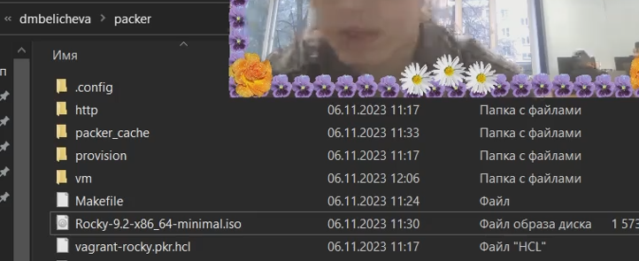
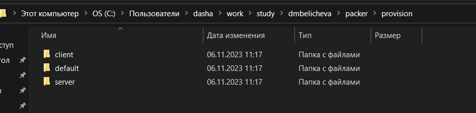
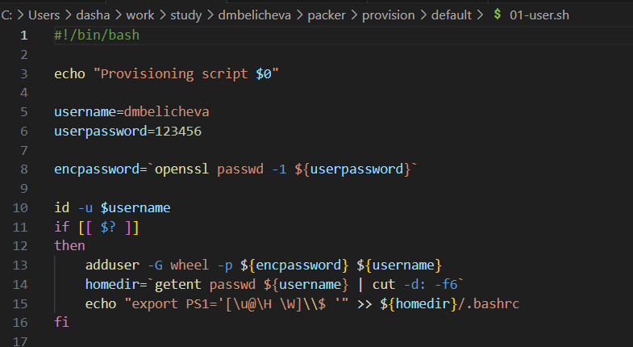
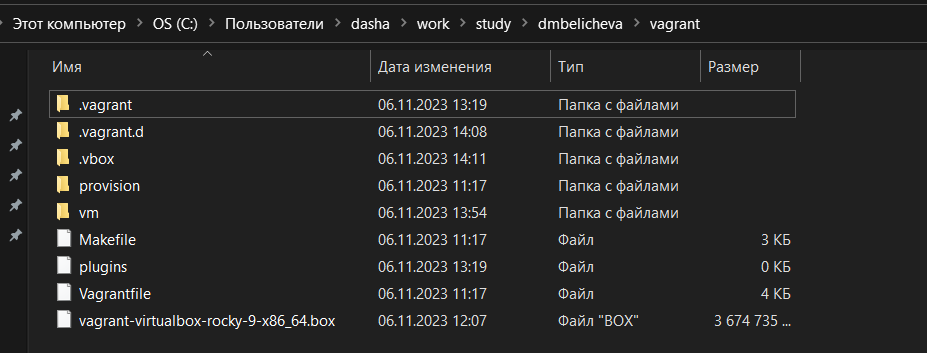
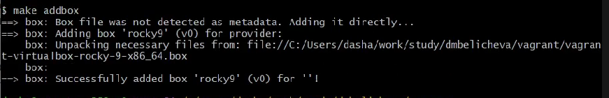
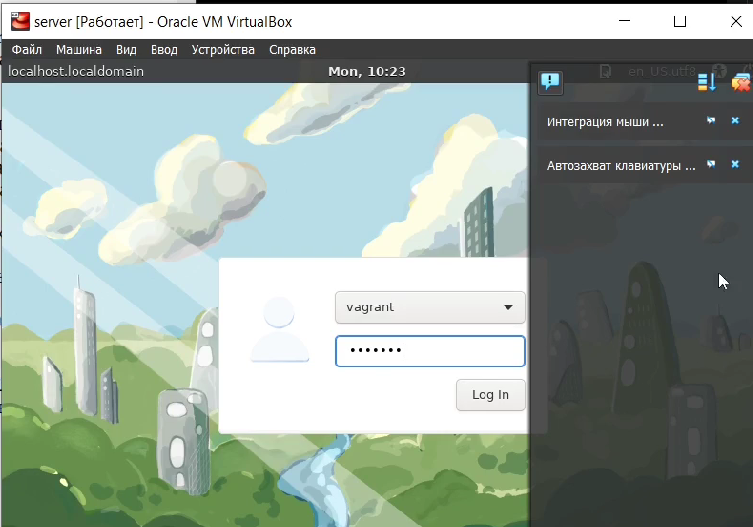
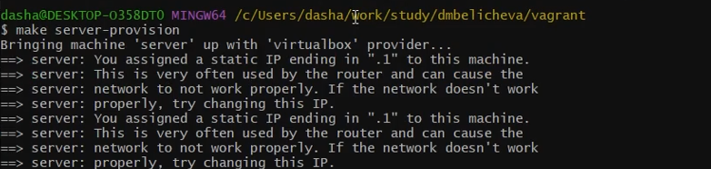
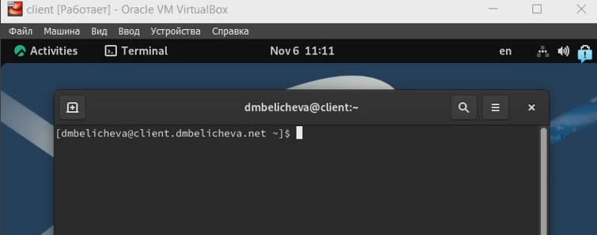
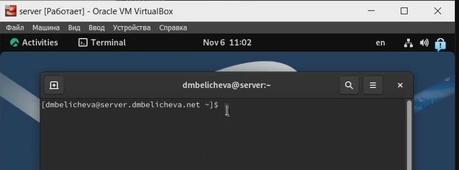

---
## Front matter
lang: ru-RU
title: Лабораторная работа №1
subtitle: Подготовка лабораторного стенда
author:
  - Беличева Дарья Михайловна
institute:
  - Российский университет дружбы народов, Москва, Россия

## i18n babel
babel-lang: russian
babel-otherlangs: english

## Formatting pdf
toc: false
toc-title: Содержание
slide_level: 2
aspectratio: 169
section-titles: true
theme: metropolis
header-includes:
 - \metroset{progressbar=frametitle,sectionpage=progressbar,numbering=fraction}
 - '\makeatletter'
 - '\beamer@ignorenonframefalse'
 - '\makeatother'
---

## Цель работы

Приобрести практические навыки установки Rocky Linux на виртуальную машину с помощью инструмента Vagrant.

## Задание

1. Сформируйте box-файл с дистрибутивом Rocky Linux для VirtualBox.
2. Запустите виртуальные машины сервера и клиента и убедитесь в их работоспособности.
3. Внесите изменения в настройки загрузки образов виртуальных машин server и client, добавив пользователя с правами администратора и изменив названия хостов.

## Выполнение лабораторной работы

В ОС Windows создадим каталог для проекта, разместим там образ варианта операционной системы Rocky Linux и подготовленные заранее для работы с Vagrant файлы.

{#fig:001 width=70%} 

## Выполнение лабораторной работы

В этом же каталоге создадим каталог provision с подкаталогами default, server и client.

{#fig:003 width=70%}

## Выполнение лабораторной работы

В каталоге default разместим заранее подготовленный скрипт 01-user.sh по изменению названия виртуальной машины:

{#fig:005 width=70%}

## Выполнение лабораторной работы

**Развёртывание лабораторного стенда на ОС Linux**

Перейдем в каталог с проектом:

```
cd C:\Users\dasha\work\study\dmbelicheva\packer\
```

Для формирования box-файла с дистрибутивом Rocky Linux для VirtualBox в терминале наберем:

```bash
make box
```

## Выполнение лабораторной работы

{#fig:007 width=70%}

## Выполнение лабораторной работы

Для регистрации образа виртуальной машины в Vagrant в терминале в каталоге `C:\Users\dasha\work\study\dmbelicheva\vagrant\` наберем

```
make addbox
```

{#fig:008 width=50%}

## Выполнение лабораторной работы

Запустим виртуальные машины Server и  Client, введя `make client-up`, `make server-up`

## Выполнение лабораторной работы

Убедимся, что запуск обеих виртуальных машин прошёл успешно, залогинемся под пользователем vagrant с паролем vagrant.

{#fig:010 width=55%}

## Выполнение лабораторной работы

**Внесение изменений в настройки внутреннего окружения виртуальной машины**

Зафиксируем внесённые изменения для внутренних настроек виртуальных машин, введя в терминале `make client-provision`,`make server-provision`

{#fig:013 width=70%}

## Выполнение лабораторной работы

Залогинемся на сервере и клиенте под созданным пользователем. Убедимся, что в терминале приглашение отображается в виде user@server.user.net на сервере и в виде user@client.user.net на клиенте, где вместо user указан мой логин - dmbelicheva.

{#fig:015 width=70%}

## Выполнение лабораторной работы

{#fig:016 width=70%}

## Выводы

В процессе выполнения данной лабораторной я приобрела практические навыки установки Rocky Linux на виртуальную машину с помощью инструмента Vagrant.
