---
## Front matter
lang: ru-RU
title: Лабораторная работа №2
subtitle: Настройка DNS-сервера
author:
  - Беличева Дарья Михайловна
institute:
  - Российский университет дружбы народов, Москва, Россия

## i18n babel
babel-lang: russian
babel-otherlangs: english

## Formatting pdf
toc: false
toc-title: Содержание
slide_level: 2
aspectratio: 169
section-titles: true
theme: metropolis
header-includes:
 - \metroset{progressbar=frametitle,sectionpage=progressbar,numbering=fraction}
 - '\makeatletter'
 - '\beamer@ignorenonframefalse'
 - '\makeatother'
---

## Цель работы

Приобрести практические навыки по установке и конфигурированию DNS-сервера, усвоить принципы работы системы доменных имён.

## Задание

1. Установите на виртуальной машине server DNS-сервер bind и bind-utils.
2. Сконфигурируйте на виртуальной машине server кэширующий DNS-сервер.
3. Сконфигурируйте на виртуальной машине server первичный DNS-сервер.
4. При помощи утилит dig и host проанализируйте работу DNS-сервера.
5. Напишите скрипт для Vagrant, фиксирующий действия по установке и конфигурированию DNS-сервера во внутреннем окружении виртуальной машины server. Соответствующим образом внесите изменения в Vagrantfile

## Выполнение лабораторной работы

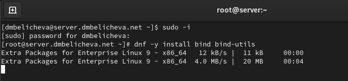{#fig:002 width=70%}

## Выполнение лабораторной работы

C помощью утилиты dig сделаем запрос к DNS-адресу www.yandex.ru:

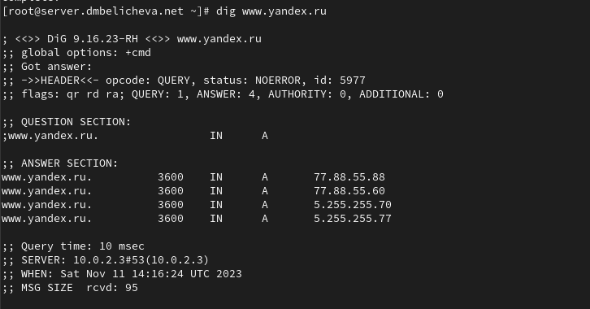{#fig:003 width=70%}

## Выполнение лабораторной работы

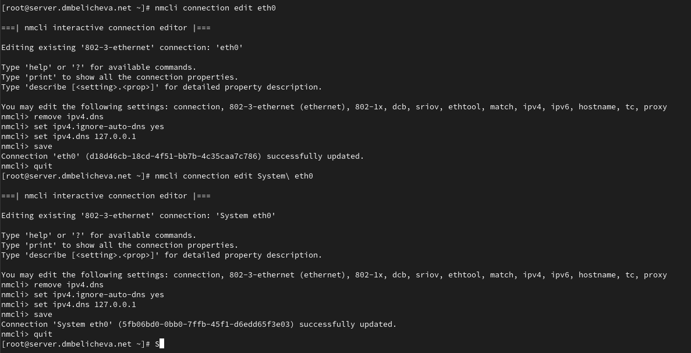{#fig:008 width=60%}

## Выполнение лабораторной работы

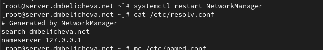{#fig:009 width=60%}

## Выполнение лабораторной работы

Настроим направление DNS-запросов от всех узлов внутренней сети, включая запросы от узла server, через узел server. Для этого внесем изменения в файл /etc/named.conf:

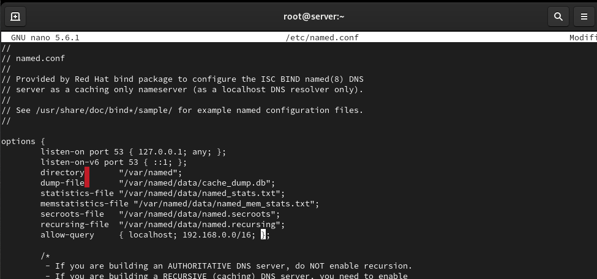{#fig:010 width=60%}

## Выполнение лабораторной работы

Внесем изменения в настройки межсетевого экрана узла server, разрешив работу с DNS и убедимся, что DNS-запросы идут через узел server, который прослушивает порт 53:

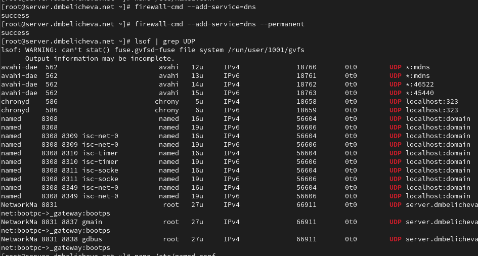{#fig:011 width=60%}

## Выполнение лабораторной работы

В случае возникновения в сети ситуации, когда DNS-запросы от сервера
фильтруются сетевым оборудованием, следует добавить перенаправление
DNS-запросов на конкретный вышестоящий DNS-сервер. Для этого в конфигура-
ционный файл named.conf в секцию options следует добавить:

## Выполнение лабораторной работы

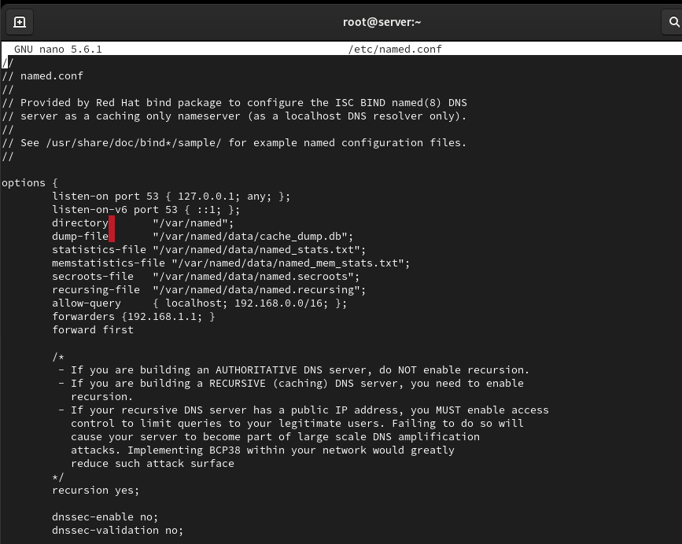{#fig:012 width=70%}

## Выполнение лабораторной работы

**Конфигурирование первичного DNS-сервера**

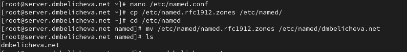{#fig:014 width=70%}

## Выполнение лабораторной работы

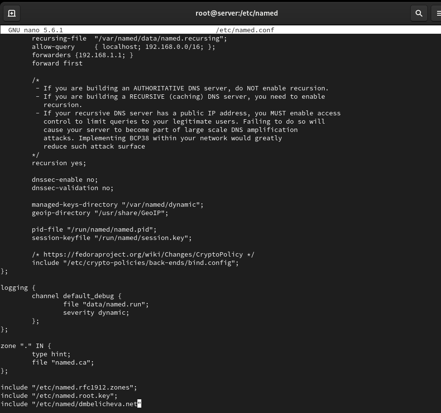{#fig:015 width=60%}

## Выполнение лабораторной работы

Внесём изменения в файл dmbelicheva.net:

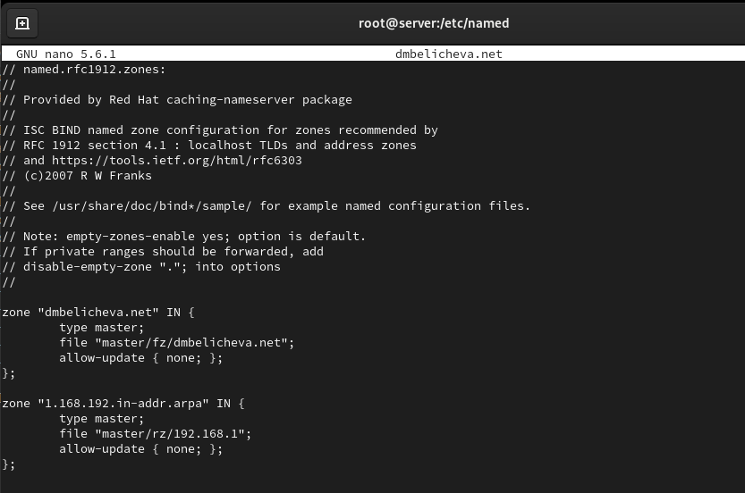{#fig:016 width=50%}

## Выполнение лабораторной работы

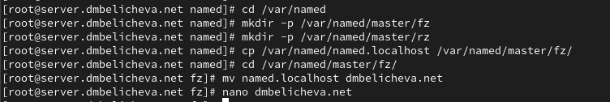{#fig:017 width=70%}

## Выполнение лабораторной работы

Изменим файл /var/named/master/fz/user.net, указав необходимые DNS-записи для прямой зоны:

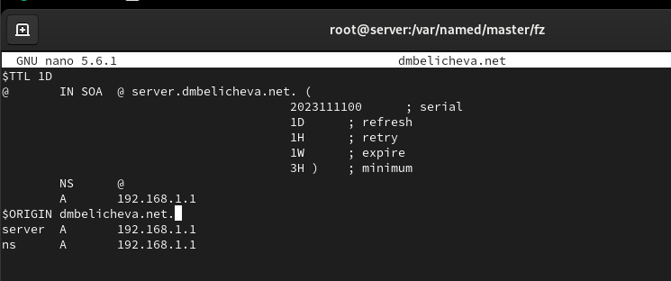{#fig:018 width=60%}

## Выполнение лабораторной работы

Скопируем шаблон обратной DNS-зоны named.loopback из каталога /var/named
в каталог /var/named/master/rz и переименуем его в 192.168.1, а также изменим файл:

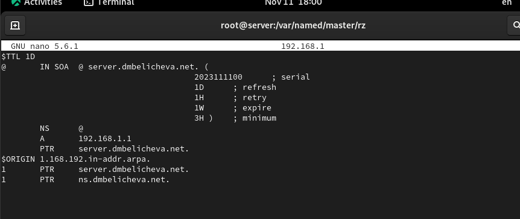{#fig:019 width=50%}

## Выполнение лабораторной работы

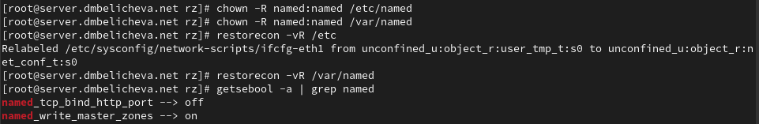{#fig:020 width=70%}

## Выполнение лабораторной работы

В дополнительном терминале запустим в режиме реального времени расширенный лог системных сообщений, чтобы проверить корректность работы системы:

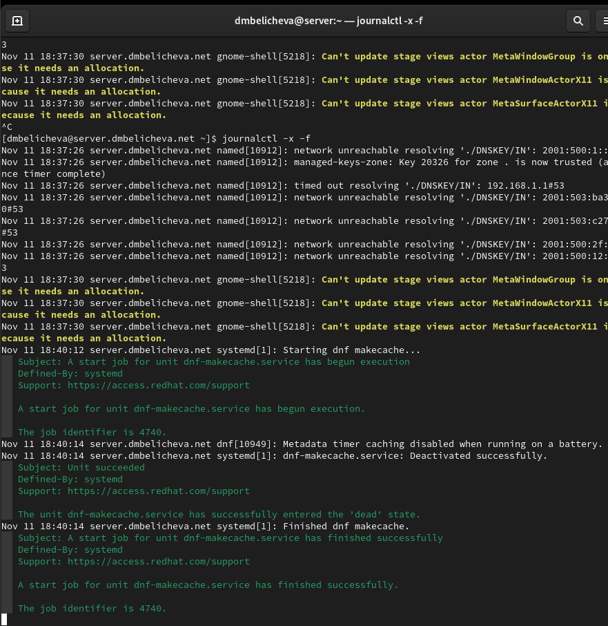{#fig:021 width=50%}

## Выполнение лабораторной работы

В случае ошибок перезапустим DNS-сервер:

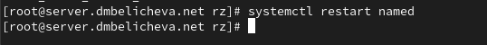{#fig:022 width=70%}

## Выполнение лабораторной работы

**Анализ работы DNS-сервера**

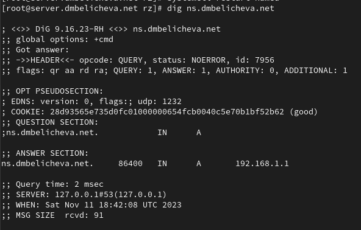{#fig:023 width=60%}

## Выполнение лабораторной работы

При помощи утилиты host проанализируем корректность работы DNS-сервера, можно увидеть, что все внесённые нами изменения в работу сервера учтены:

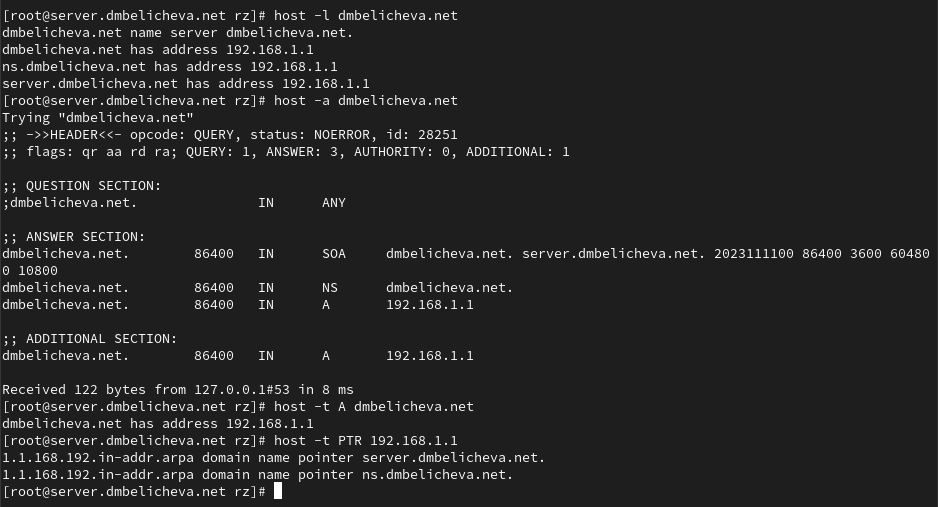{#fig:024 width=60%}

## Выполнение лабораторной работы

**Внесение изменений в настройки внутреннего окружения виртуальной машины**

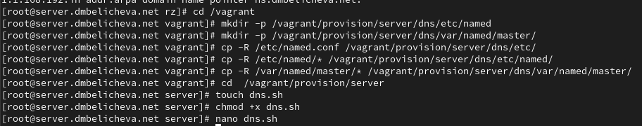{#fig:026 width=70%}

## Выполнение лабораторной работы

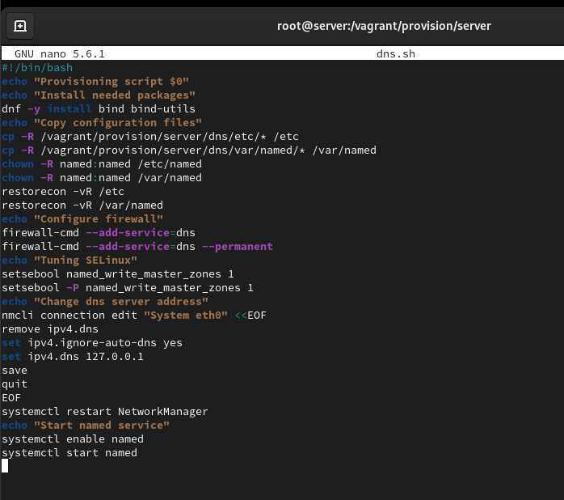{#fig:025 width=60%}

## Выполнение лабораторной работы

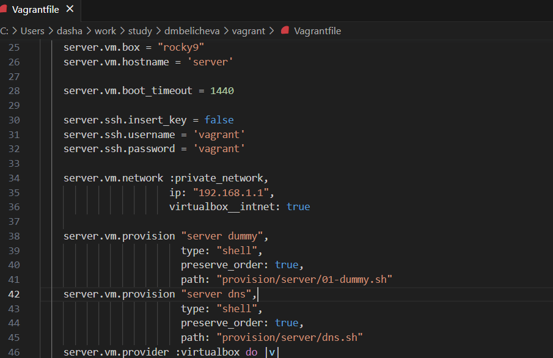{#fig:027 width=70%}

## Выводы

В процессе выполнения данной лабораторной работы я приобрела практические навыки по установке и конфигурированию DNS-сервера, усвоила принципы работы системы доменных имён.
