---
## Front matter
title: "Лабораторная работа №2"
subtitle: "Настройка DNS-сервера"
author: "Беличева Дарья Михайловна"

## Generic otions
lang: ru-RU
toc-title: "Содержание"

## Bibliography
bibliography: bib/cite.bib
csl: pandoc/csl/gost-r-7-0-5-2008-numeric.csl

## Pdf output format
toc: true # Table of contents
toc-depth: 2
lof: true # List of figures
lot: false # List of tables
fontsize: 12pt
linestretch: 1.5
papersize: a4
documentclass: scrreprt
## I18n polyglossia
polyglossia-lang:
  name: russian
  options:
	- spelling=modern
	- babelshorthands=true
polyglossia-otherlangs:
  name: english
## I18n babel
babel-lang: russian
babel-otherlangs: english
## Fonts
mainfont: PT Serif
romanfont: PT Serif
sansfont: PT Sans
monofont: PT Mono
mainfontoptions: Ligatures=TeX
romanfontoptions: Ligatures=TeX
sansfontoptions: Ligatures=TeX,Scale=MatchLowercase
monofontoptions: Scale=MatchLowercase,Scale=0.9
## Biblatex
biblatex: true
biblio-style: "gost-numeric"
biblatexoptions:
  - parentracker=true
  - backend=biber
  - hyperref=auto
  - language=auto
  - autolang=other*
  - citestyle=gost-numeric
## Pandoc-crossref LaTeX customization
figureTitle: "Рис."
tableTitle: "Таблица"
listingTitle: "Листинг"
lofTitle: "Список иллюстраций"
lotTitle: "Список таблиц"
lolTitle: "Листинги"
## Misc options
indent: true
header-includes:
  - \usepackage{indentfirst}
  - \usepackage{float} # keep figures where there are in the text
  - \floatplacement{figure}{H} # keep figures where there are in the text
---

# Цель работы

Приобрести практические навыки по установке и конфигурированию DNS-сервера, усвоить принципы работы системы доменных имён.

# Задание

1. Установите на виртуальной машине server DNS-сервер bind и bind-utils.
2. Сконфигурируйте на виртуальной машине server кэширующий DNS-сервер.
3. Сконфигурируйте на виртуальной машине server первичный DNS-сервер.
4. При помощи утилит dig и host проанализируйте работу DNS-сервера.
5. Напишите скрипт для Vagrant, фиксирующий действия по установке и конфигурированию DNS-сервера во внутреннем окружении виртуальной машины server. Соответствующим образом внесите изменения в Vagrantfile


# Выполнение лабораторной работы

Загрузим операционную систему и перейдем в рабочий каталог с проектом: `cd C:\Users\dasha\work\study\dmbelicheva\vagrant\`
Затем запустим виртуальную машину server с помощью команды: `make server-up`
На виртуальной машине server войдем под созданным в предыдущей работе пользователем и откроем терминал. Перейдем в режим суперпользователя и установим bind и bind-utils:

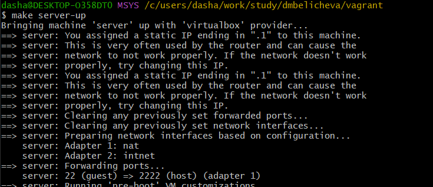{#fig:001 width=70%}

{#fig:002 width=70%}

C помощью утилиты dig сделаем запрос к DNS-адресу www.yandex.ru:

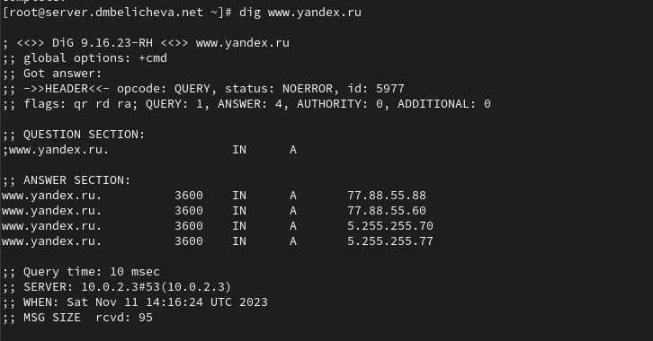{#fig:003 width=70%}

Давайте рассмотрим разделы данного вывода подробней:

- HEADER (заголовок): показывает версию dig, глобальные опции используемые с командой и другую дополнительную информацию
  
- QUESTION SECTION (секция запроса): Показывает наш запрос, то есть мы запросили показать A-запись (команда dig без параметров) для домена www.yandex.ru
  
- ANSWER SECTION (секция ответа): Показывает ответ полученный от DNS, в нашем случае показывает A-запись для www.yandex.ru
Последняя секция это статистика по запросу (служебная информация)- время выполнения запроса (10 мс), имя DNS-сервера который запрашивался, когда был создан запрос и размер сообщения

**Конфигурирование кэширующего DNS-сервера**

В отчёте проанализируем построчно содержание файлов /etc/resolv.conf, /etc/named.conf, /var/named/named.ca, /var/named/named.localhost, /var/named/named.loopback.
Рассмотрим /etc/resolv.conf. В нём указано имя сервера и его адрес:

```
# Generated by NetworkManager
search dmbelicheva.net
nameserver 10.0.2.3
```
Рассмотрим содержимое файле `/var/named/named.localhost`. В нём есть:

- Запись начала полномочий (SOA), которая указывает начало зоны и включает имя хоста, на котором находится файл данных name.local.

- Запись сервера имен (NS), идентифицирующая главный и подчиненные
серверы имен DNS.

- Указаны адреса IPv4 и IPv6 локального хоста.

В файле `/var/named/named.loopback` все аналогично, только добавляется:

- PTR-запись для локального хоста

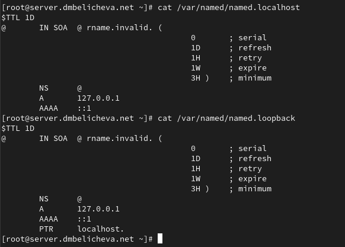{#fig:006 width=70%}

Далее запустим DNS-сервер, включим запуск DNS-сервера в автозапуск при загрузке системы. Проанализируем отличие в выведенной на экран информации при выполнении команд `dig www.yandex.ru` и `dig @127.0.0.1 www.yandex.ru`:

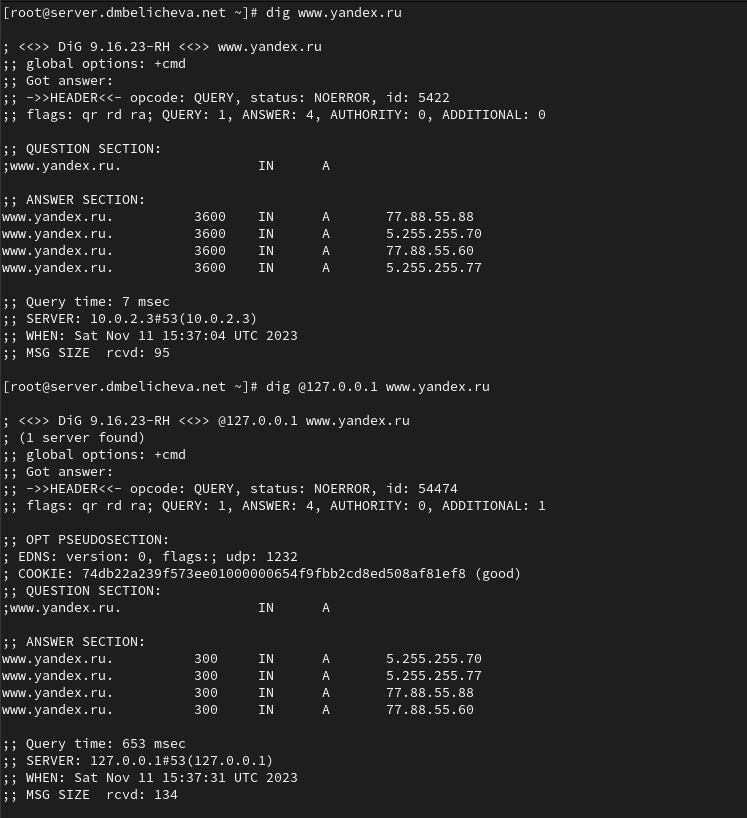{#fig:007 width=70%}

При указании опрашиваемого адреса в строке с адресом сервера написан адрес, который указывали, также указаны куки, а время запроса увеличилось.

Сделаем DNS-сервер сервером по умолчанию для хоста server и внутренней виртуальной сети. Для этого требуется изменить настройки сетевого соединения eth0 в NetworkManager, переключив его на работу с внутренней сетью и указав для него в качестве DNS-сервера по умолчанию адрес 127.0.0.1, затем сделаем тоже
самое для соединения System eth0. Затем запустим NetworkManager и проверим наличие изменений в файле etc/resolv.conf(адрес сервера изменился на заданный нами):

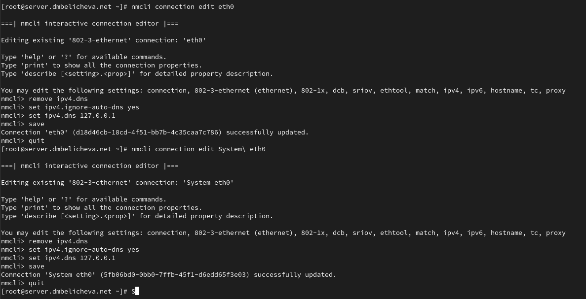{#fig:008 width=70%}

{#fig:009 width=70%}

Настроим направление DNS-запросов от всех узлов внутренней сети, включая запросы от узла server, через узел server. Для этого внесем изменения в файл /etc/named.conf:

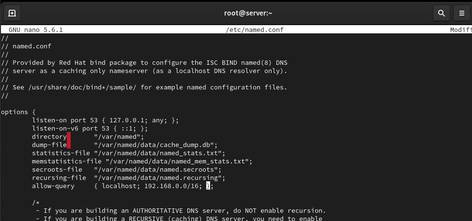{#fig:010 width=70%}

Внесем изменения в настройки межсетевого экрана узла server, разрешив работу с DNS и убедимся, что DNS-запросы идут через узел server, который прослушивает порт 53:

{#fig:011 width=70%}

**Конфигурирование кэширующего DNS-сервера при наличии фильтрации DNS-запросов маршрутизаторами**

В случае возникновения в сети ситуации, когда DNS-запросы от сервера
фильтруются сетевым оборудованием, следует добавить перенаправление
DNS-запросов на конкретный вышестоящий DNS-сервер. Для этого в конфигура-
ционный файл named.conf в секцию options следует добавить:

```bash
forwarders { список DNS-серверов };
forward first;
```

Текущий список DNS-серверов можно получить, введя на локальном хосте (на
котором развёртывается образ виртуальной машины) следующую команду:

```bash
cat /etc/resolv.conf
```

Мы получили следующие данные для конфигурационного файла named.conf
виртуальной машины server:

```bash
forwarders { 198.168.1.1; };
forward first;
```

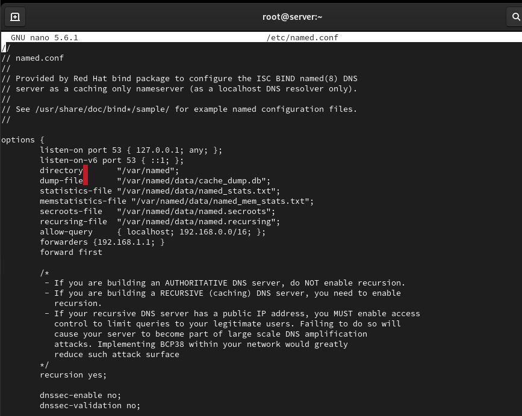{#fig:012 width=70%}

**Конфигурирование первичного DNS-сервера**

Скопируем шаблон описания DNS-зон named.rfc1912.zones из каталога /etc в каталог /etc/named и переименуеме его в eademidova.net:

{#fig:014 width=70%}

Включим файл описания зоны /etc/named/dmbelicheva.net в конфигурационном файле DNS /etc/named.conf, добавив в нём в конце строку:

```bash
include "/etc/named/dmbelicheva.net";
```

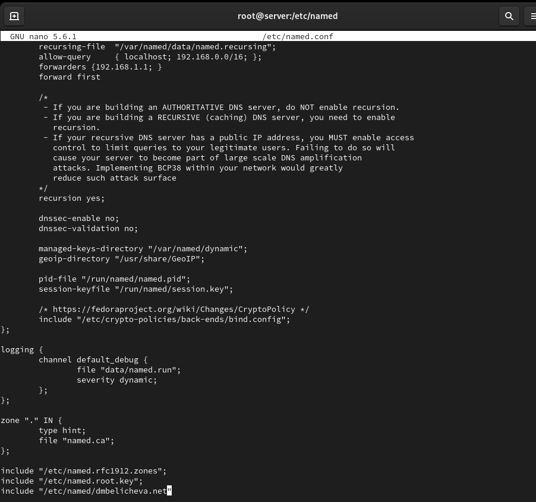{#fig:015 width=70%}

Внесём изменения в файл dmbelicheva.net:

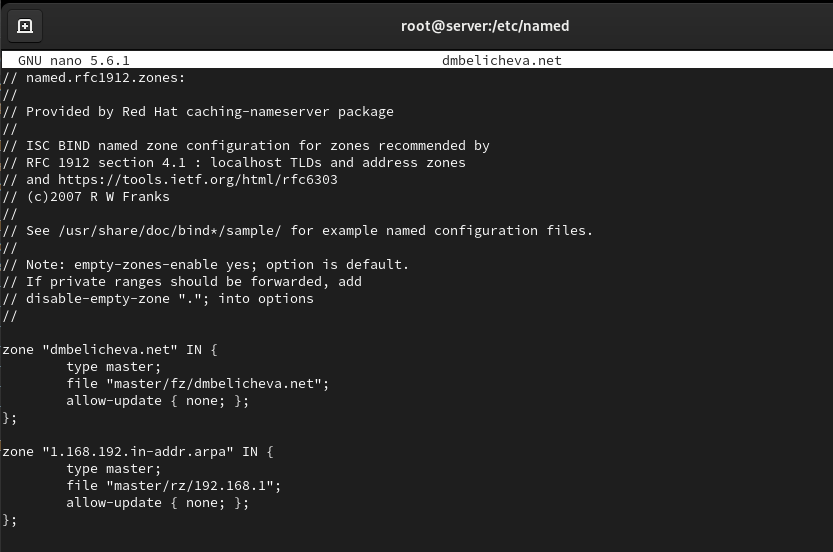{#fig:016 width=70%}

В каталоге /var/named создадим подкаталоги master/fz и master/rz, в которых будут располагаться файлы прямой и обратной зоны соответственно, а затем скопируем шаблон прямой DNS-зоны named.localhost из каталога /var/named в каталог /var/named/master/fz и переименуем его в eademidova.net:

{#fig:017 width=70%}

Изменим файл /var/named/master/fz/user.net, указав необходимые DNS-записи для прямой зоны:

{#fig:018 width=70%}

Скопируем шаблон обратной DNS-зоны named.loopback из каталога /var/named
в каталог /var/named/master/rz и переименуем его в 192.168.1, а также изменим файл:

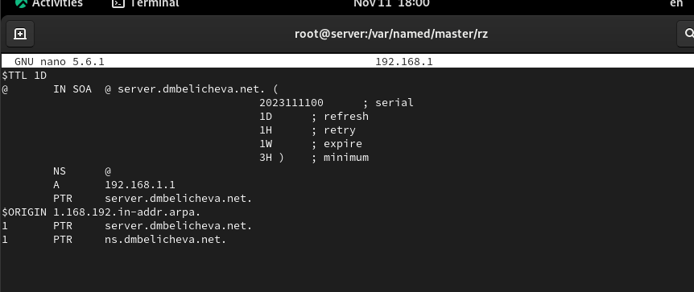{#fig:019 width=70%}

После изменения доступа к конфигурационным файлам named корректно восстановим специальные метки безопасности в SELinux, затем проверим состояние переключателей:

{#fig:020 width=70%}

В дополнительном терминале запустим в режиме реального времени расширенный лог системных сообщений, чтобы проверить корректность работы системы:

{#fig:021 width=70%}

В случае ошибок перезапустим DNS-сервер:

{#fig:022 width=70%}

**Анализ работы DNS-сервера**

При помощи утилиты dig получим описание DNS-зоны с сервера ns.dmbelicheva.net:

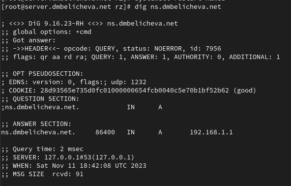{#fig:023 width=70%}

При помощи утилиты host проанализируем корректность работы DNS-сервера, можно увидеть, что все внесённые нами изменения в работу сервера учтены:

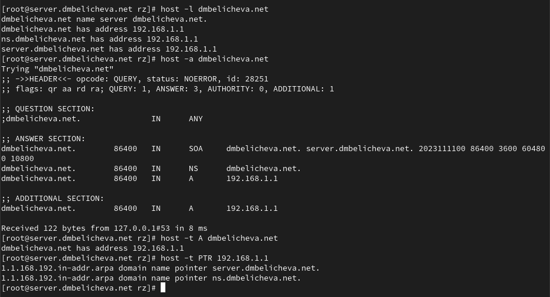{#fig:024 width=70%}

**Внесение изменений в настройки внутреннего окружения виртуальной машины**

На виртуальной машине server перейдем в каталог для внесения изменений в
настройки внутреннего окружения /vagrant/provision/server/, создадим в нём каталог dns, в который поместим в соответствующие каталоги конфигурационные файлы DNS, а затем в каталоге /vagrant/provision/server создадим исполняемый файл dns.sh:

{#fig:026 width=70%}

Запишем в dns.sh следующий скрипт:

{#fig:025 width=70%}

Для отработки созданного скрипта во время загрузки виртуальной машины server в конфигурационном файле Vagrantfile добавим в разделе конфигурации для сервера:

{#fig:027 width=70%}


# Выводы

В процессе выполнения данной лабораторной работы я приобрела практические навыки по установке и конфигурированию DNS-сервера, усвоила принципы работы системы доменных имён.
