---
## Front matter
lang: ru-RU
title: Лабораторная работа №3
subtitle: Настройка DHCP-сервера
author:
  - Беличева Д. М.
institute:
  - Российский университет дружбы народов, Москва, Россия

## i18n babel
babel-lang: russian
babel-otherlangs: english

## Formatting pdf
toc: false
toc-title: Содержание
slide_level: 2
aspectratio: 169
section-titles: true
theme: metropolis
header-includes:
 - \metroset{progressbar=frametitle,sectionpage=progressbar,numbering=fraction}
 - '\makeatletter'
 - '\beamer@ignorenonframefalse'
 - '\makeatother'
---


## Цель работы

Приобрести практические навыки по установке и конфигурированию DHCP-сервера.

## Задание

1. Установить на виртуальной машине server DHCP-сервер.
2. Настроить виртуальную машину server в качестве DHCP-сервера для виртуальной внутренней сети.
3. Проверить корректность работы DHCP-сервера в виртуальной внутренней сети путём запуска виртуальной машины client и применения соответствующих утилит диагностики.
4. Настроить обновление DNS-зоны при появлении в виртуальной внутренней сети новых узлов.
5. Проверить корректность работы DHCP-сервера и обновления DNS-зоны в виртуальной внутренней сети путём запуска виртуальной машины client и применения соответствующих утилит диагностики.
6. Написать скрипт для Vagrant, фиксирующий действия по установке и настройке DHCPсервера во внутреннем окружении виртуальной машины server. Соответствующим образом внести изменения в Vagrantfile.

## Выполнение лабораторной работы

**Установка DHCP-сервера**

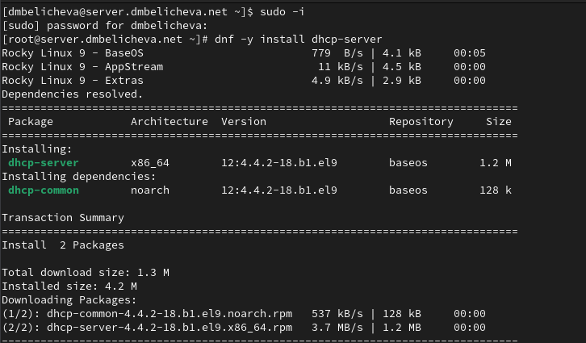{#fig:001 width=70%}

## Выполнение лабораторной работы

**Конфигурирование DHCP-сервера**

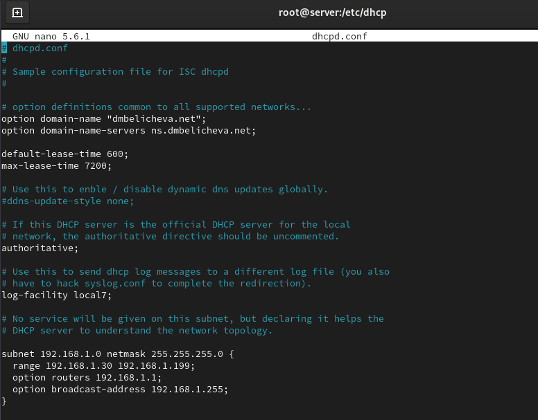{#fig:003 width=50%}

## Выполнение лабораторной работы

Настроим привязку dhcpd к интерфейсу eth1 виртуальной машины server.

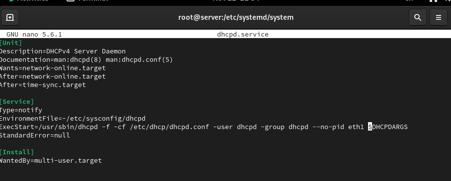{#fig:004 width=70%}

## Выполнение лабораторной работы

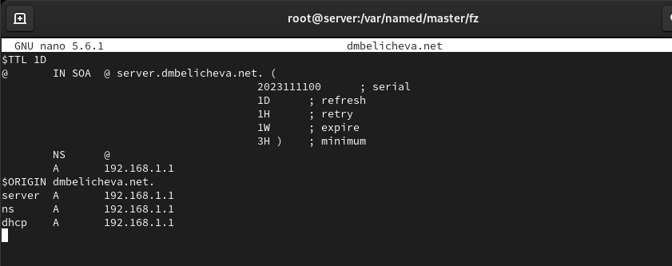{#fig:006 width=70%}

## Выполнение лабораторной работы

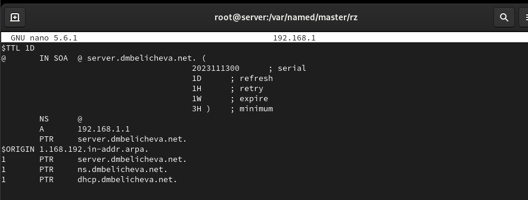{#fig:007 width=70%}

## Выполнение лабораторной работы

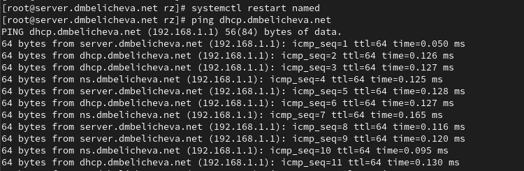{#fig:008 width=70%}

## Выполнение лабораторной работы

**Анализ работы DHCP-сервера**

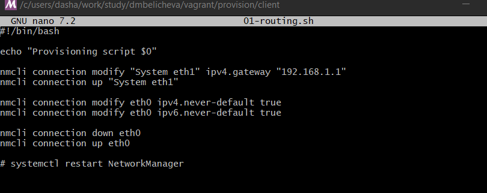{#fig:013 width=70%}

## Выполнение лабораторной работы

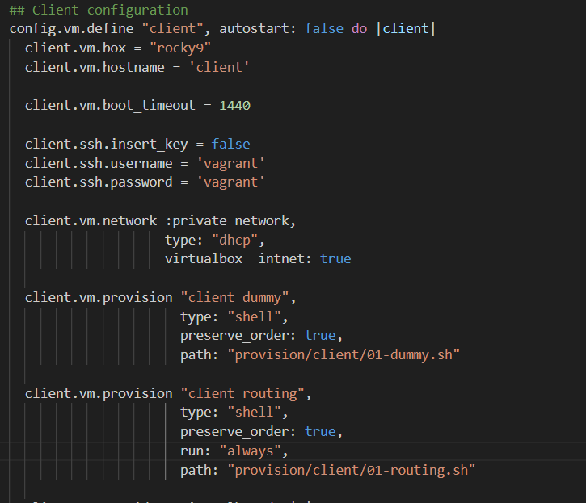{#fig:014 width=40%}

Зафиксируем внесённые изменения для внутренних настроек виртуальной машины client и запустим её, введя в терминале `client-provision`.

## Выполнение лабораторной работы

```

lease 192.168.1.30 {            //указан выданный ip-адрес
  starts 1 2023/11/13 21:22:54; //указаны дата и время начала аренды
  ends 1 2023/11/13 21:32:54;   //указаны дата и время начала аренды
  tstp 1 2023/11/13 21:32:54;   //инструкция tstp присутствует, если 
  используется протокол отработки отказа
  cltt 1 2023/11/13 21:22:54;   //время последней транзакции клиента
  binding state free;           //объявляет состояние привязки аренды
  hardware ethernet 08:00:27:ab:7b:01; //mac-адрес сетевого интерфейса, 
  на котором будет использоваться аренда 
  uid "\001\010\000'\253{\001"; //идентификатор клиента
}
```

## Выполнение лабораторной работы

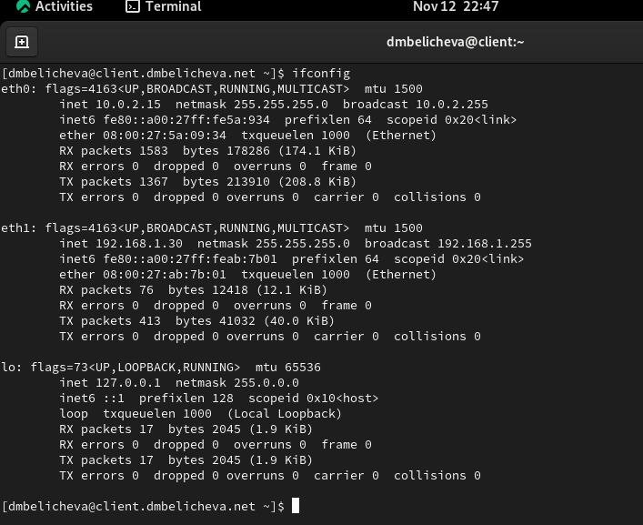{#fig:016 width=50%}

## Выполнение лабораторной работы

**Настройка обновления DNS-зоны**

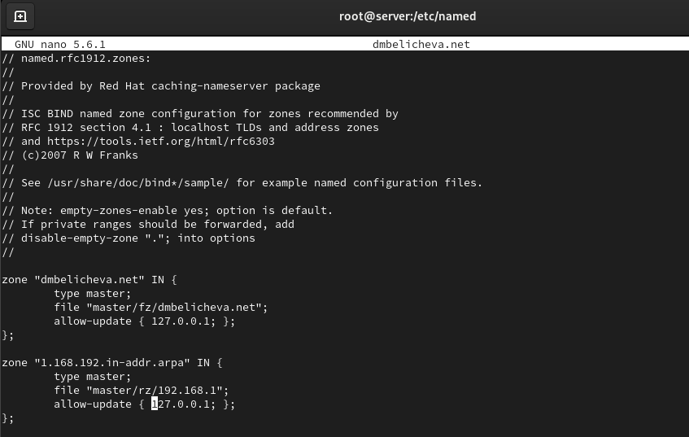{#fig:017 width=50%}

Перезапустим DHCP-сервер: `systemctl restart dhcpd`

## Выполнение лабораторной работы

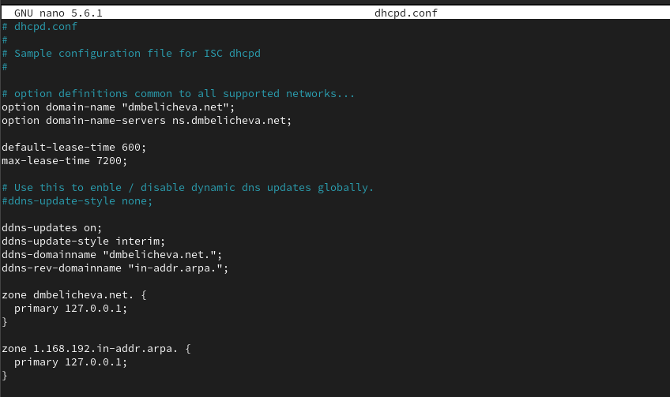{#fig:018 width=70%}

## Выполнение лабораторной работы

**Анализ работы DHCP-сервера после настройки обновления DNS-зоны**

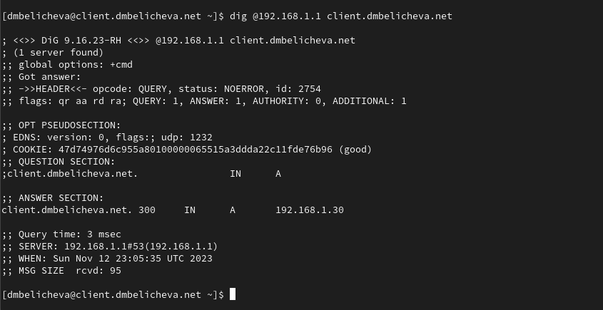{#fig:021 width=70%}

## Выполнение лабораторной работы

**Внесение изменений в настройки внутреннего окружения виртуальной машины**

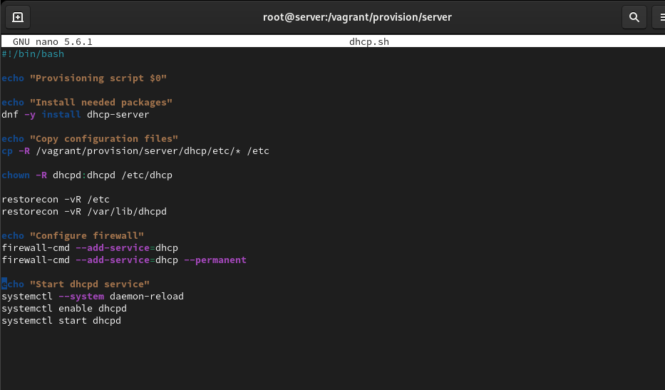{#fig:023 width=70%}

## Выполнение лабораторной работы

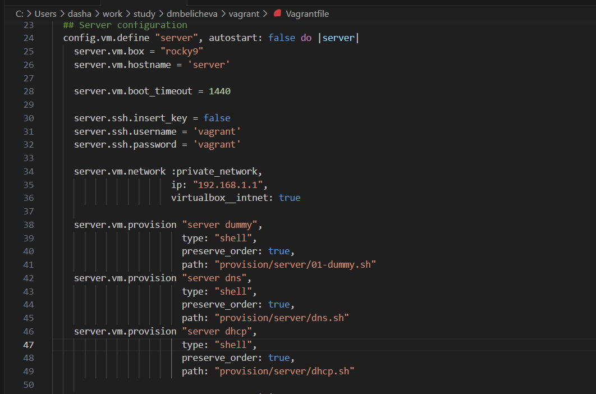{#fig:024 width=70%}

## Выводы

В процессе выполнения этой лабораторной работы я приобрела практические навыки по установке и конфигурированию DHCP-сервера.
