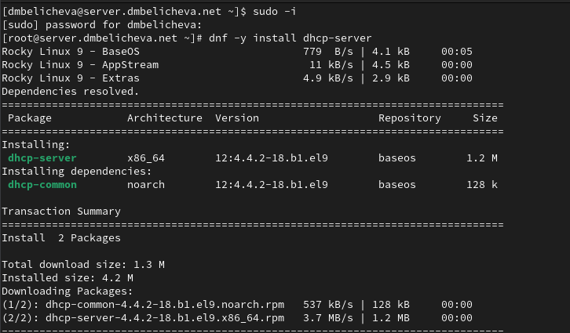
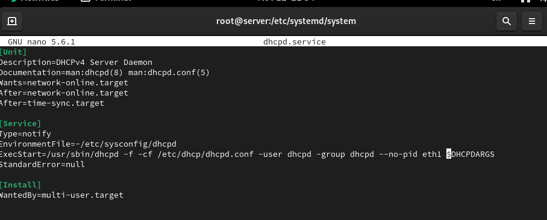
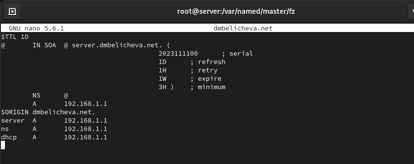
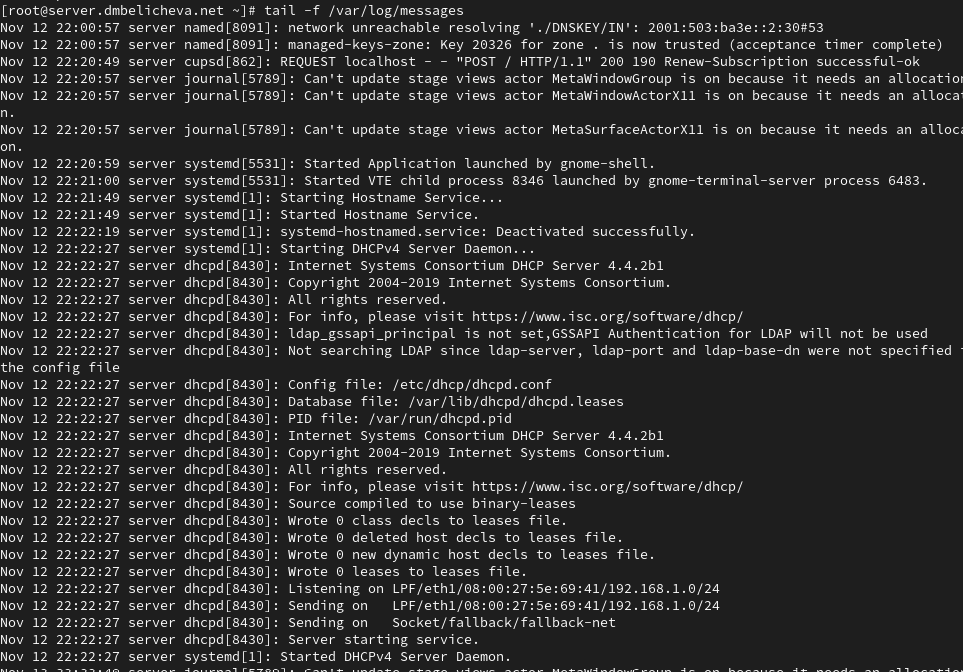
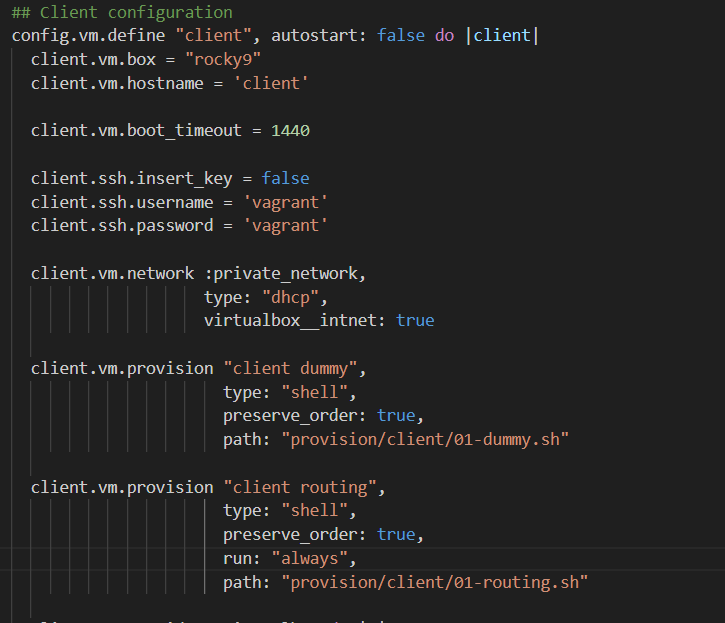
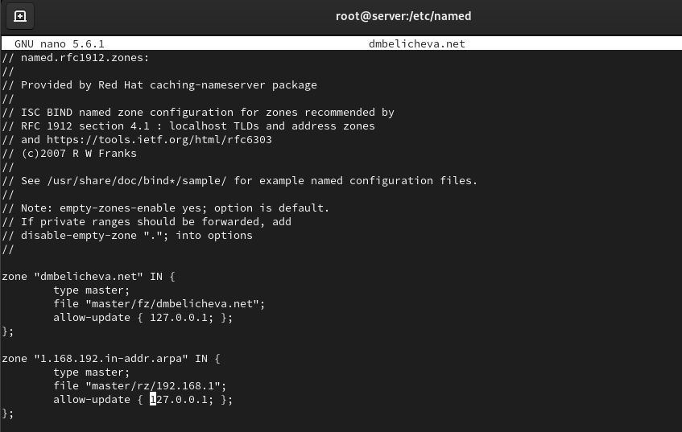
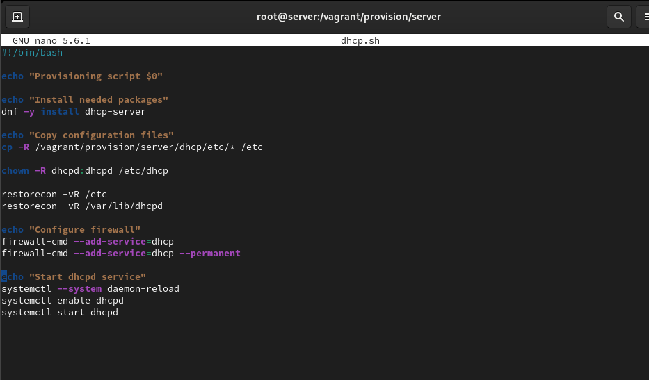

---
## Front matter
title: "Лабораторная работа №3"
subtitle: "Настройка DHCP-сервера"
author: "Беличева Дарья Михайловна"

## Generic otions
lang: ru-RU
toc-title: "Содержание"

## Bibliography
bibliography: bib/cite.bib
csl: pandoc/csl/gost-r-7-0-5-2008-numeric.csl

## Pdf output format
toc: true # Table of contents
toc-depth: 2
lof: true # List of figures
lot: false # List of tables
fontsize: 12pt
linestretch: 1.5
papersize: a4
documentclass: scrreprt
## I18n polyglossia
polyglossia-lang:
  name: russian
  options:
	- spelling=modern
	- babelshorthands=true
polyglossia-otherlangs:
  name: english
## I18n babel
babel-lang: russian
babel-otherlangs: english
## Fonts
mainfont: PT Serif
romanfont: PT Serif
sansfont: PT Sans
monofont: PT Mono
mainfontoptions: Ligatures=TeX
romanfontoptions: Ligatures=TeX
sansfontoptions: Ligatures=TeX,Scale=MatchLowercase
monofontoptions: Scale=MatchLowercase,Scale=0.9
## Biblatex
biblatex: true
biblio-style: "gost-numeric"
biblatexoptions:
  - parentracker=true
  - backend=biber
  - hyperref=auto
  - language=auto
  - autolang=other*
  - citestyle=gost-numeric
## Pandoc-crossref LaTeX customization
figureTitle: "Рис."
tableTitle: "Таблица"
listingTitle: "Листинг"
lofTitle: "Список иллюстраций"
lotTitle: "Список таблиц"
lolTitle: "Листинги"
## Misc options
indent: true
header-includes:
  - \usepackage{indentfirst}
  - \usepackage{float} # keep figures where there are in the text
  - \floatplacement{figure}{H} # keep figures where there are in the text
---

# Цель работы

Приобрести практические навыки по установке и конфигурированию DHCP-сервера.

# Задание

1. Установить на виртуальной машине server DHCP-сервер.
2. Настроить виртуальную машину server в качестве DHCP-сервера для виртуальной внутренней сети.
3. Проверить корректность работы DHCP-сервера в виртуальной внутренней сети путём запуска виртуальной машины client и применения соответствующих утилит диагностики.
4. Настроить обновление DNS-зоны при появлении в виртуальной внутренней сети новых узлов.
5. Проверить корректность работы DHCP-сервера и обновления DNS-зоны в виртуальной внутренней сети путём запуска виртуальной машины client и применения соответствующих утилит диагностики.
6. Написать скрипт для Vagrant, фиксирующий действия по установке и настройке DHCPсервера во внутреннем окружении виртуальной машины server. Соответствующим образом внести изменения в Vagrantfile.

# Выполнение лабораторной работы

**Установка DHCP-сервера**

После загрузки своей операционной системы перейдем в рабочий каталог с проектом:cd `C:\Users\dasha\work\study\dmbelicheva\vagrant`

Запустим виртуальную машину server командой `make server-up`.

На виртуальной машине server войдем под своим пользователем и откроем терминал. Перейдем в режим суперпользователя: `sudo -i`

Установим dhcp: `dnf -y install dhcp-server` (рис. @fig:001).

{#fig:001 width=70%}

**Конфигурирование DHCP-сервера**

Скопируем файл примера конфигурации DHCP dhcpd.conf.example из каталога /usr/share/doc/dhcp* в каталог /etc/dhcp и переименуйте его в файл с названием dhcpd.conf (рис. @fig:002):

{#fig:002 width=70%}

Откроем файл /etc/dhcp/dhcpd.conf на редактирование. В этом файле:

- заменим строку `option domain-name "example.org"`; 
на строку `option domain-name "user.net"`;

- заменим строку `option domain-name-servers ns1.example.org, ns2.example.org`;
на строку `option domain-name-servers ns.user.net`;

- раскомментируем строку `authoritative`;

- на базе одного из приведённых в файле примеров конфигурирования подсети зададим собственную конфигурацию dhcp-сети, задав адрес подсети, диапазон адресов для распределения клиентам, адрес маршрутизатора и broadcast-адрес:

```bash
subnet 192.168.1.0 netmask 255.255.255.0 {
  range 192.168.1.30 192.168.1.199;
  option routers 192.168.1.1;
  option broadcast-address 192.168.1.255;
}
```

Остальные примеры задания конфигураций подсетей удалим.

Получим файл следующего содержания (рис. @fig:003):

{#fig:003 width=70%}

Настроим привязку dhcpd к интерфейсу eth1 виртуальной машины server. Для этого скопируем файл dhcpd.service из каталога /lib/systemd/system в каталог
/etc/systemd/system: `cp /lib/systemd/system/dhcpd.service /etc/systemd/system/`

Откроем файл /etc/systemd/system/dhcpd.service на редактирование и замените в нём строку
`ExecStart=/usr/sbin/dhcpd -f -cf /etc/dhcp/dhcpd.conf -user dhcpd -group dhcpd --no-pid`
на строку
`ExecStart=/usr/sbin/dhcpd -f -cf /etc/dhcp/dhcpd.conf -user dhcpd -group dhcpd --no-pid eth1`

Получим файл следующего содержания (рис. @fig:004):

{#fig:004 width=70%}

Перезагрузим конфигурацию dhcpd и разрешим загрузку DHCP-сервера при запуске виртуальной машины server (рис. @fig:005):

{#fig:005 width=70%}

Добавим запись для DHCP-сервера в конце файла прямой DNS-зоны /var/named/master/fz/user.net (рис. @fig:006):
`dhcp A 192.168.1.1`
и в конце файла обратной зоны /var/named/master/rz/192.168.1 (рис. @fig:007):
`1 PTR dhcp.user.net.`

В обоих файлах изменим серийный номер файла зоны, указав текущую дату в нотации ГГГГММДДВВ.

{#fig:006 width=70%}

{#fig:007 width=70%}

Перезапустим named и проверим, что можно обратиться к DHCP-серверу по имени с помощью команды ping (рис. @fig:008).

{#fig:008 width=70%}

Пигнование сервера успешно, пакеты отправлены и получены назад.

Далее внесем изменения в настройки межсетевого экрана узла server, разрешив работу с DHCP (рис. @fig:009):

{#fig:009 width=70%}

Восстановим контекст безопасности в SELinux (рис. @fig:010):

{#fig:010 width=70%}

В дополнительном терминале запустим мониторинг происходящих в системе процессов в реальном времени (рис. @fig:011):

{#fig:011 width=70%}

А в основном рабочем терминале запустим DHCP-сервер: `systemctl start dhcpd`

Запуск DHCP-сервера прошёл успешно, поэтому не выключая виртуальной машины server и не прерывая на ней мониторинга происходящих в системе процессов, приступим к анализу работы DHCP-сервера на клиенте.

**Анализ работы DHCP-сервера**

Перед запуском виртуальной машины client в каталоге с проектом в вашей операционной системе в подкаталоге vagrant/provision/client создадим файл 01-routing.sh (рис. @fig:012):

{#fig:012 width=70%}

Пропишем в нём следующий скрипт (рис. @fig:013):

{#fig:013 width=70%}

Этот скрипт изменяет настройки NetworkManager так, чтобы весь трафик на виртуальной машине client шёл по умолчанию через интерфейс eth1.

В Vagrantfile подключим этот скрипт в разделе конфигурации для клиента (рис. @fig:014):

{#fig:014 width=70%}

Зафиксируем внесённые изменения для внутренних настроек виртуальной машины client и запустим её, введя в терминале (рис. @fig:015):

{#fig:015 width=70%}

После загрузки виртуальной машины client можно увидеть на виртуальной машине server на терминале с мониторингом происходящих в системе процессов записи о подключении к виртуальной внутренней сети узла client и выдачи
ему IP-адреса из соответствующего диапазона адресов. Также информацию о работе DHCP-сервера можно наблюдать в файле /var/lib/dhcpd/dhcpd.leases:

```
# The format of this file is documented in the dhcpd.leases(5) manual page.
# This lease file was written by isc-dhcp-4.4.2b1

# authoring-byte-order entry is generated, DO NOT DELETE
authoring-byte-order little-endian;

lease 192.168.1.30 {            //указан выданный ip-адрес
  starts 1 2023/11/13 21:22:54; //указаны дата и время начала аренды
  ends 1 2023/11/13 21:32:54;   //указаны дата и время начала аренды
  tstp 1 2023/11/13 21:32:54;   //инструкция tstp присутствует, если 
  используется протокол отработки отказа
  cltt 1 2023/11/13 21:22:54;   //время последней транзакции клиента
  binding state free;           //объявляет состояние привязки аренды
  hardware ethernet 08:00:27:ab:7b:01; //mac-адрес сетевого интерфейса, 
  на котором будет использоваться аренда 
  uid "\001\010\000'\253{\001"; //идентификатор клиента
  set ddns-fwd-name = "client.dmbelicheva.net.";
  set ddns-txt = "3197659e2c40e26a0e15932b7c018329f7";
  set ddns-rev-name = "30.1.168.192.in-addr.arpa.";
}
server-duid "\000\001\000\001,\347\334\307\010\000'^iA";
```

Войдем в систему виртуальной машины client под своим пользователем и откроем терминал. В терминале введем  `ifconfig` (рис. @fig:016).

{#fig:016 width=70%}

**Настройка обновления DNS-зоны**

На виртуальной машине server под пользователем с правами суперпользователя отредактируем файл /etc/named/dmbelicheva.net, разрешив обновление зоны с локального адреса, т.е. заменив в этом файле в строке allow-update слово none на 127.0.0.1 (рис. @fig:017):

{#fig:017 width=70%}

Перезапустим DHCP-сервер: `systemctl restart dhcpd`

Внесем изменения в конфигурационный файл /etc/dhcp/dhcpd.conf, добавив в него разрешение на динамическое обновление DNS-записей с локального узла прямой и обратной зон (рис. @fig:018):

{#fig:018 width=70%}

Перезапуск DHCP-сервера прошёл успешно, и в каталоге прямой DNS-зоны /var/named/master/fz появился файл dmbelicheva.net.jnl, в котором в бинарном файле автоматически вносятся изменения записей зоны (рис. @fig:019-@fig:020).

{#fig:019 width=70%}

{#fig:020 width=70%}

**Анализ работы DHCP-сервера после настройки обновления DNS-зоны**

На виртуальной машине client под своим пользователем откроем терминал и с помощью утилиты dig убедимся в наличии DNS-записи о клиенте в прямой DNS-зоне (рис. @fig:021):

{#fig:021 width=70%}

**Внесение изменений в настройки внутреннего окружения виртуальной машины**

На виртуальной машине server перейдем в каталог для внесения изменений в настройки внутреннего окружения /vagrant/provision/server/, создадим в нём каталог dhcp, в который поместим в соответствующие подкаталоги конфигурационные файлы DHCP. Заменим конфигурационные файлы DNS-сервера. В каталоге /vagrant/provision/server создадим исполняемый файл dhcp.sh (рис. @fig:022).

{#fig:022 width=70%}

Открыв его на редактирование, пропишем в нём следующий скрипт (рис. @fig:023):

{#fig:023 width=70%}

Этот скрипт, по сути, повторяет произведённые действия по установке и настройке DHCP-сервера.

Для отработки созданного скрипта во время загрузки виртуальной машины server
в конфигурационном файле Vagrantfile необходимо добавить в разделе конфигурации для сервера (рис. @fig:024):

{#fig:024 width=70%}

# Выводы

В процессе выполнения этой лабораторной работы я приобрела практические навыки по установке и конфигурированию DHCP-сервера.
