---
## Front matter
lang: ru-RU
title: Лабораторная работа №4
subtitle: Базовая настройка HTTP-сервера Apache
author:
  - Беличева Д. М.
institute:
  - Российский университет дружбы народов, Москва, Россия

## i18n babel
babel-lang: russian
babel-otherlangs: english

## Formatting pdf
toc: false
toc-title: Содержание
slide_level: 2
aspectratio: 169
section-titles: true
theme: metropolis
header-includes:
 - \metroset{progressbar=frametitle,sectionpage=progressbar,numbering=fraction}
 - '\makeatletter'
 - '\beamer@ignorenonframefalse'
 - '\makeatother'
---

## Цель работы

Приобрести практические навыки по установке и базовому конфигурированию HTTP-сервера Apache.


## Задание

1. Установить необходимые для работы HTTP-сервера пакеты.
2. Запустить HTTP-сервер с базовой конфигурацией и проанализируйте его работу.
3. Настроить виртуальный хостинг.
4. Написать скрипт для Vagrant, фиксирующий действия по установке и настройке HTTPсервера во внутреннем окружении виртуальной машины server. Соответствующим образом внесите изменения в Vagrantfile

## Выполнение лабораторной работы

**Установка HTTP-сервера**

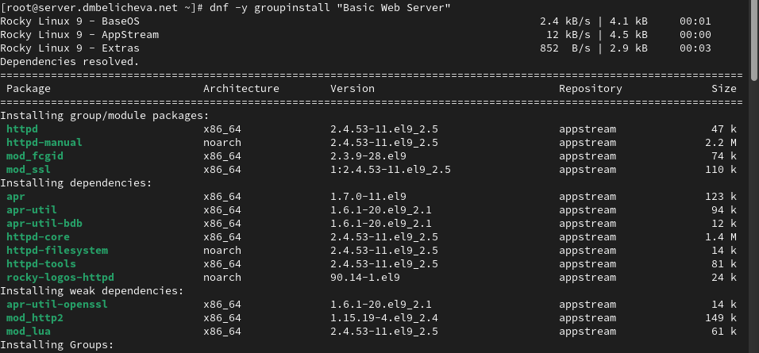{#fig:002 width=70%}

## Выполнение лабораторной работы

**Базовое конфигурирование HTTP-сервера**

Внесем изменения в настройки межсетевого экрана узла server, разрешив работу с http:

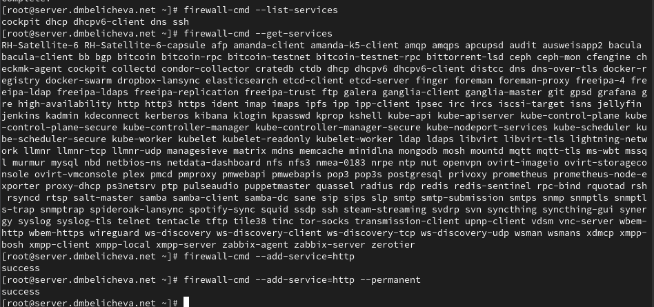{#fig:003 width=60%}

## Выполнение лабораторной работы

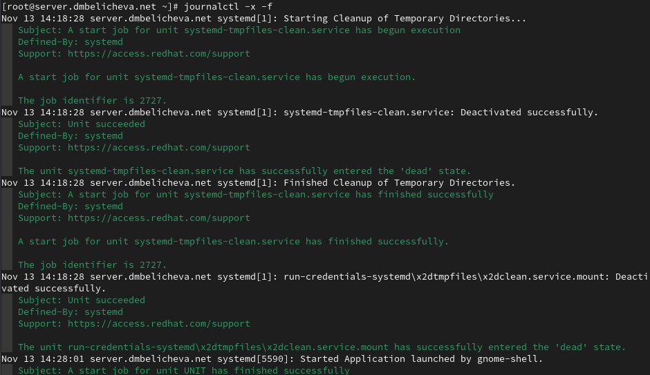{#fig:004 width=70%}

## Выполнение лабораторной работы

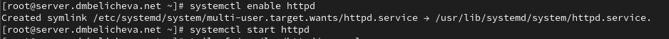{#fig:005 width=70%}

## Выполнение лабораторной работы

**Анализ работы HTTP-сервера**

Запустим виртуальную машину client: `make client-up`.

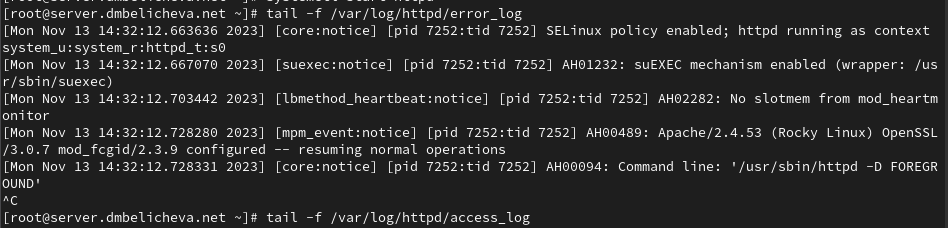{#fig:006 width=60%}

## Выполнение лабораторной работы

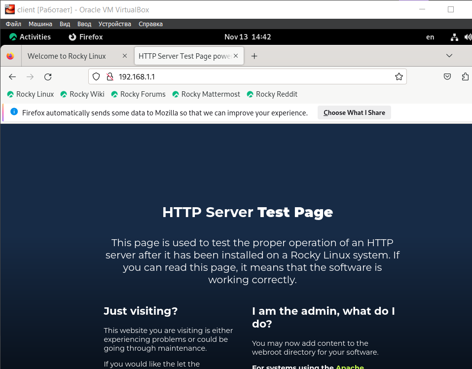{#fig:007 width=60%}

## Выполнение лабораторной работы

**Настройка виртуального хостинга для HTTP-сервера**

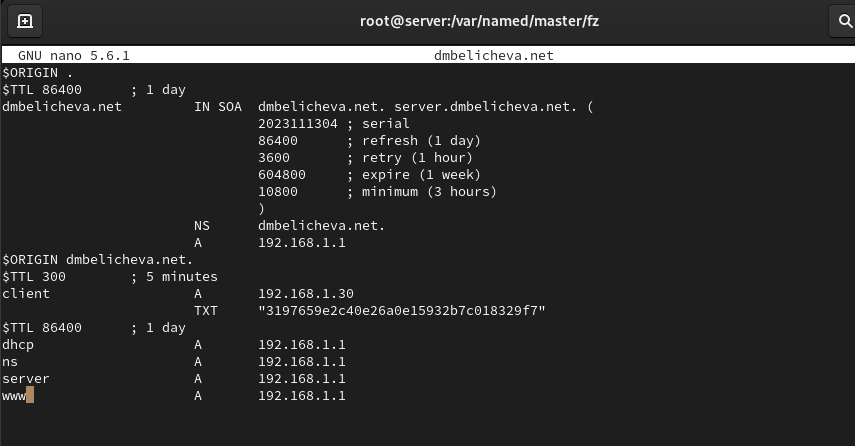{#fig:009 width=70%}

## Выполнение лабораторной работы

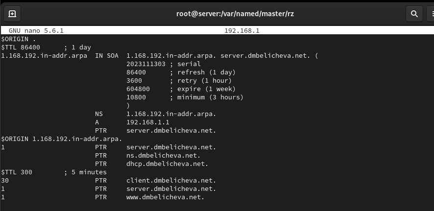{#fig:010 width=70%}


## Выполнение лабораторной работы

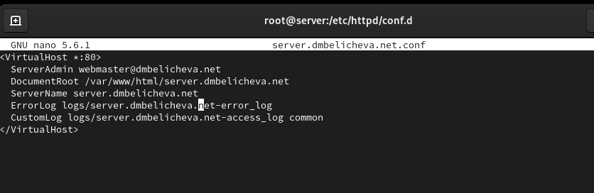{#fig:012 width=70%}

## Выполнение лабораторной работы

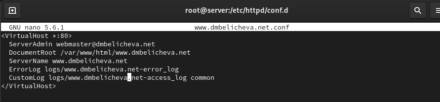{#fig:013 width=70%}

## Выполнение лабораторной работы

```
cd /var/www/html
mkdir server.dmbelicheva.net
cd /var/www/html/server.dmbelicheva.net
touch index.html
```

Откроем на редактирование файл index.html и внесем следующее содержание:
`Welcome to the server.dmbelicheva.net server.`

## Выполнение лабораторной работы

Для виртуального веб-сервера www.dmbelicheva.net:

```
cd /var/www/html
mkdir www.dmbelicheva.net
cd /var/www/html/www.dmbelicheva.net
touch index.html
```

Откроем на редактирование файл index.html и внесем следующее содержание:
`Welcome to the www.dmbelicheva.net server.`

## Выполнение лабораторной работы

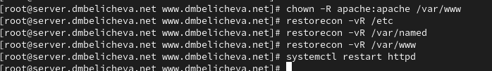{#fig:016 width=70%}

## Выполнение лабораторной работы

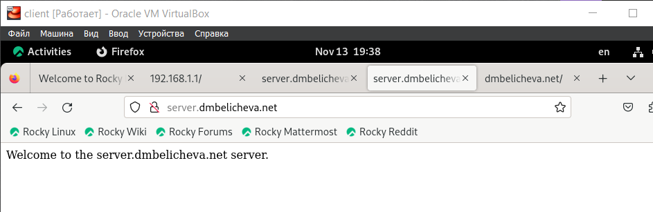{#fig:017 width=70%}

## Выполнение лабораторной работы

**Внесение изменений в настройки внутреннего окружения виртуальной машины**

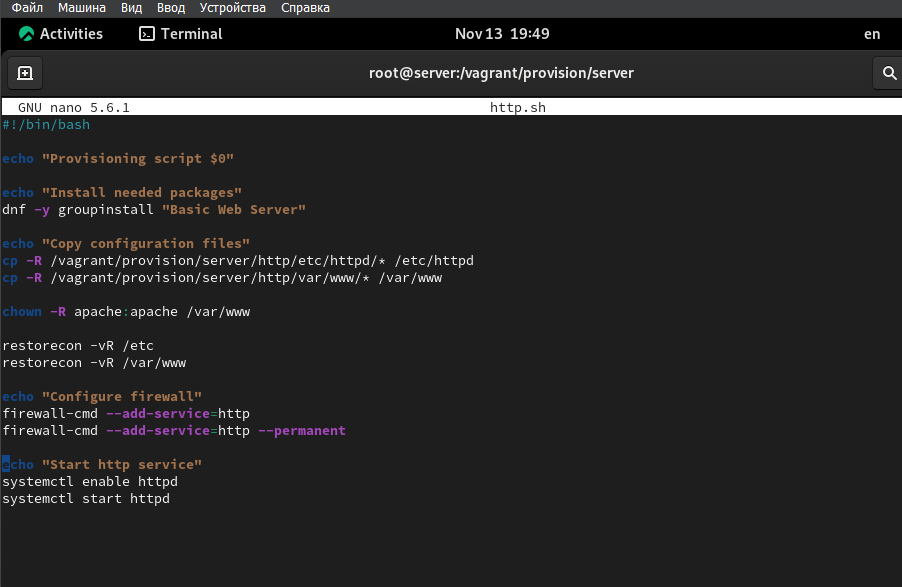{#fig:020 width=50%}

## Выполнение лабораторной работы

Для отработки созданного скрипта во время загрузки виртуальных машин в конфигурационном файле Vagrantfile необходимо добавить в конфигурации сервера
следующую запись:

```
server.vm.provision "server http",
type: "shell",
preserve_order: true,
path: "provision/server/http.sh"
```
 
## Выводы

В процессе выполнения лабораторной работы я приобрела пра  ктические навыки по установке и базовому конфигурированию HTTP-сервера Apache.