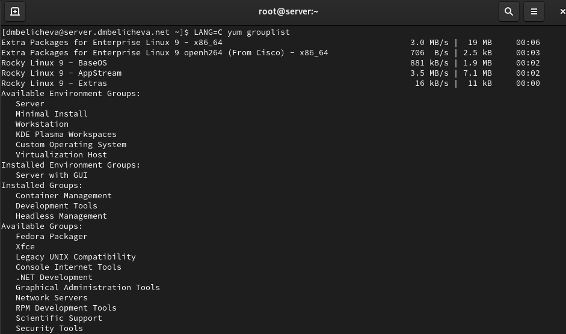
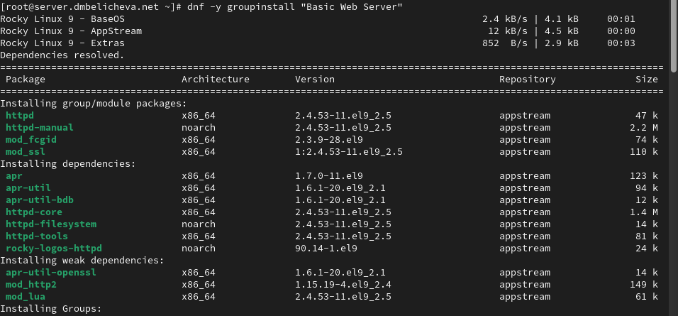
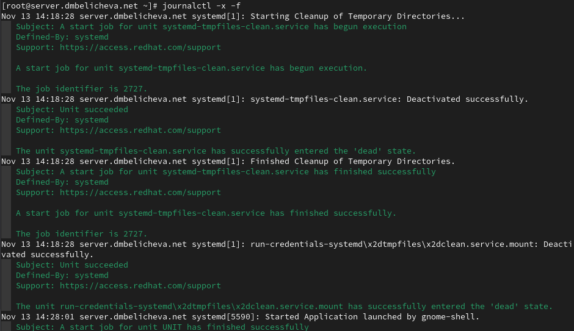
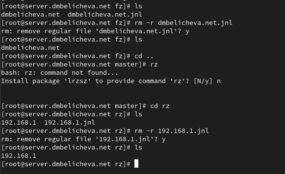

---
## Front matter
title: "Лабораторная работа №4"
subtitle: "Базовая настройка HTTP-сервера Apache"
author: "Беличева Дарья Михайловна"

## Generic otions
lang: ru-RU
toc-title: "Содержание"

## Bibliography
bibliography: bib/cite.bib
csl: pandoc/csl/gost-r-7-0-5-2008-numeric.csl

## Pdf output format
toc: true # Table of contents
toc-depth: 2
lof: true # List of figures
lot: false # List of tables
fontsize: 12pt
linestretch: 1.5
papersize: a4
documentclass: scrreprt
## I18n polyglossia
polyglossia-lang:
  name: russian
  options:
	- spelling=modern
	- babelshorthands=true
polyglossia-otherlangs:
  name: english
## I18n babel
babel-lang: russian
babel-otherlangs: english
## Fonts
mainfont: PT Serif
romanfont: PT Serif
sansfont: PT Sans
monofont: PT Mono
mainfontoptions: Ligatures=TeX
romanfontoptions: Ligatures=TeX
sansfontoptions: Ligatures=TeX,Scale=MatchLowercase
monofontoptions: Scale=MatchLowercase,Scale=0.9
## Biblatex
biblatex: true
biblio-style: "gost-numeric"
biblatexoptions:
  - parentracker=true
  - backend=biber
  - hyperref=auto
  - language=auto
  - autolang=other*
  - citestyle=gost-numeric
## Pandoc-crossref LaTeX customization
figureTitle: "Рис."
tableTitle: "Таблица"
listingTitle: "Листинг"
lofTitle: "Список иллюстраций"
lotTitle: "Список таблиц"
lolTitle: "Листинги"
## Misc options
indent: true
header-includes:
  - \usepackage{indentfirst}
  - \usepackage{float} # keep figures where there are in the text
  - \floatplacement{figure}{H} # keep figures where there are in the text
---

# Цель работы

Приобрести практические навыки по установке и базовому конфигурированию HTTP-сервера Apache.


# Задание

1. Установить необходимые для работы HTTP-сервера пакеты.
2. Запустить HTTP-сервер с базовой конфигурацией и проанализируйте его работу.
3. Настроить виртуальный хостинг.
4. Написать скрипт для Vagrant, фиксирующий действия по установке и настройке HTTPсервера во внутреннем окружении виртуальной машины server. Соответствующим образом внесите изменения в Vagrantfile

# Выполнение лабораторной работы

**Установка HTTP-сервера**

Загрузим операционную систему и перейдем в рабочий каталог с проектом: `cd C:\Users\dasha\work\study\dmbelicheva\vagrant`

Запустим виртуальную машину server: `make server-up`.

На виртуальной машине server войдем под своим пользователем и откроем терминал. Перейдем в режим суперпользователя.

Установим из репозитория стандартный веб-сервер (HTTP-сервер и утилиты httpd, криптоутилиты и пр.):

{#fig:001 width=70%}

{#fig:002 width=70%}

**Базовое конфигурирование HTTP-сервера**

Внесем изменения в настройки межсетевого экрана узла server, разрешив работу
с http:

{#fig:003 width=70%}

В дополнительном терминале запустим в режиме реального времени расширенный
лог системных сообщений, чтобы проверить корректность работы системы:

{#fig:004 width=70%}

В первом терминале активируем и запустим HTTP-сервер:

{#fig:005 width=70%}

**Анализ работы HTTP-сервера**

Запустим виртуальную машину client: `make client-up`.

На виртуальной машине server просмотрим лог ошибок работы веб-сервера и мониторинг доступа к веб-серверу:

{#fig:006 width=70%}

На виртуальной машине client запустии браузер и в адресной строке введите
192.168.1.1. 

{#fig:007 width=70%}

В браузере открылась тестовая страница HTTP-сервера, на котороц написано сообщение: "Если вы можете это читать, то ПО работает корректно". Следовательно, базовое конфигурирование HTTP-сервера выполнено правильно.

{#fig:008 width=70%}

**Настройка виртуального хостинга для HTTP-сервера**

Настроим виртуальный хостинг по двум DNS-адресам: server.dmbelicheva.net и www.dmbelicheva.net.

Для этого сначала остановим работу DNS-сервера для внесения изменений в файлы описания DNS-зон: `systemctl stop named`

Добавим запись для HTTP-сервера в конце файла прямой DNS-зоны /var/named/master/fz/dmbelicheva.net:

{#fig:009 width=70%}

и в конце файла обратной зоны /var/named/master/rz/192.168.1:

{#fig:010 width=70%}

В обоих файлах изменим серийный номер файла зоны, указав текущую дату в нотации ГГГГММДДВВ. Также из соответствующих каталогов удалим файлы журналов DNS: dmbelicheva.net.jnl и 192.168.1.jnl.

{#fig:011 width=70%}

Перезапустим DNS-сервер: `systemctl start named`

В каталоге /etc/httpd/conf.d создайте файлы server.dmbelicheva.net.conf и
www.dmbelicheva.net.conf: 

```
cd /etc/httpd/conf.d
touch server.dmbelicheva.net.conf
touch www.dmbelicheva.net.conf
```

Откроем на редактирование файл server.dmbelicheva.net.conf и внесем следующее содержание:

{#fig:012 width=70%}

Откроем на редактирование файл www.dmbelicheva.net.conf и внесем следующее содержание:

{#fig:013 width=70%}

Перейдем в каталог /var/www/html, в котором должны находиться файлы с содержимым (контентом) веб-серверов, и создадим тестовые страницы для виртуальных веб-серверов server.dmbelicheva.net и www.dmbelicheva.net.
Для виртуального веб-сервера server.dmbelicheva.net:

```
cd /var/www/html
mkdir server.dmbelicheva.net
cd /var/www/html/server.dmbelicheva.net
touch index.html
```

Откроем на редактирование файл index.html и внесем следующее содержание:
`Welcome to the server.dmbelicheva.net server.`

{#fig:014 width=70%}

Для виртуального веб-сервера www.dmbelicheva.net:

```
cd /var/www/html
mkdir www.dmbelicheva.net
cd /var/www/html/www.dmbelicheva.net
touch index.html
```

Откроем на редактирование файл index.html и внесем следующее содержание:
`Welcome to the www.dmbelicheva.net server.`

{#fig:014 width=70%}

Скорректируем права доступа в каталог с веб-контентом:
`chown -R apache:apache /var/www`

Восстановим контекст безопасности в SELinux и перезапустим HTTP-сервер.

{#fig:016 width=70%}

На виртуальной машине client убедимся в корректном доступе к веб-серверу по
адресам server.dmbelicheva.net и www.dmbelicheva.net в адресной строке веб-браузера.

{#fig:017 width=70%}

{#fig:018 width=70%}

**Внесение изменений в настройки внутреннего окружения виртуальной машины**

На виртуальной машине server перейдем в каталог для внесения изменений в настройки внутреннего окружения /vagrant/provision/server/, создадим в нём
каталог http, в который поместим в соответствующие подкаталоги конфигурационные файлы HTTP-сервера.
Заменим конфигурационные файлы DNS-сервера.
В каталоге /vagrant/provision/server создадим исполняемый файл http.sh.

{#fig:019 width=70%}

Открыв его на редактирование, пропишим в нём следующий скрипт:

{#fig:020 width=70%}

Этот скрипт повторяет произведённые вами действия по установке и настройке HTTP-сервера.

Для отработки созданного скрипта во время загрузки виртуальных машин в конфигурационном файле Vagrantfile необходимо добавить в конфигурации сервера
следующую запись:

```
server.vm.provision "server http",
type: "shell",
preserve_order: true,
path: "provision/server/http.sh"
```

# Контрольные вопросы

1. Через какой порт по умолчанию работает Apache?

Сервер Apache по умолчанию настроен на ожидание входящих соединений через порт 80. 

2. Под каким пользователем запускается Apache и к какой группе относится этот пользователь?

По умолчанию, Apache запускается от пользователя, называемого apache или www-data, в зависимости от операционной системы. Этот пользователь обладает минимальными привилегиями, что делает его безопасным для запуска веб-сервера.
Группа www-data.

3. Где располагаются лог-файлы веб-сервера? Что можно по ним отслеживать?

Логи сервера , в том числе логи apache хранятся в каталоге /var/log/ .
Лог-файлы (файлы регистрации, журнальные файлы ) на Linux - это текстовые файлы о событиях, произошедших на сайте: информация о параметрах посещений сайта и ошибках, которые возникали на нем.

4. Где по умолчанию содержится контент веб-серверов?

В каталоге /var/www/html

5. Каким образом реализуется виртуальный хостинг? Что он даёт?

Виртуальный хостинг реализуется путем размещения нескольких сайтов на одном физическом сервере. Веб-сервер использует виртуальные хосты (обычно на основе доменных имен) для определения, какой сайт обслуживать при запросе. Это позволяет разделить ресурсы сервера между разными сайтами и обеспечивает эффективное использование аппаратных ресурсов.
Виртуальный хостинг позволяет размещать сайты с базовыми потребностями.
 
# Выводы

В процессе выполнения лабораторной работы я приобрела пра  ктические навыки по установке и базовому конфигурированию HTTP-сервера Apache.