---
## Front matter
lang: ru-RU
title: Лабораторная работа №5
subtitle: Расширенная настройка HTTP-сервера Apache
author:
  - Беличева Д. М.
institute:
  - Российский университет дружбы народов, Москва, Россия

## i18n babel
babel-lang: russian
babel-otherlangs: english

## Formatting pdf
toc: false
toc-title: Содержание
slide_level: 2
aspectratio: 169
section-titles: true
theme: metropolis
header-includes:
 - \metroset{progressbar=frametitle,sectionpage=progressbar,numbering=fraction}
 - '\makeatletter'
 - '\beamer@ignorenonframefalse'
 - '\makeatother'
---

## Цель работы

Приобрести практические навыки по расширенному конфигурированию HTTP-сервера Apache в части безопасности и возможности использования PHP.

## Задание

1. Сгенерировать криптографический ключ и самоподписанный сертификат безопасности для возможности перехода веб-сервера от работы через протокол HTTP к работе через протокол HTTPS;

2. Настроить веб-сервер для работы с PHP;

3. Написать скрипт для Vagrant, фиксирующий действия по расширенной настройке HTTP-сервера во внутреннем окружении виртуальной машины server.

## Выполнение лабораторной работы

**Конфигурирование HTTP-сервера для работы через протокол HTTPS**

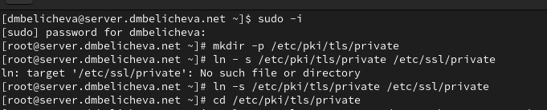{#fig:001 width=70%}

## Выполнение лабораторной работы

Сгенерируем ключ и сертификат:

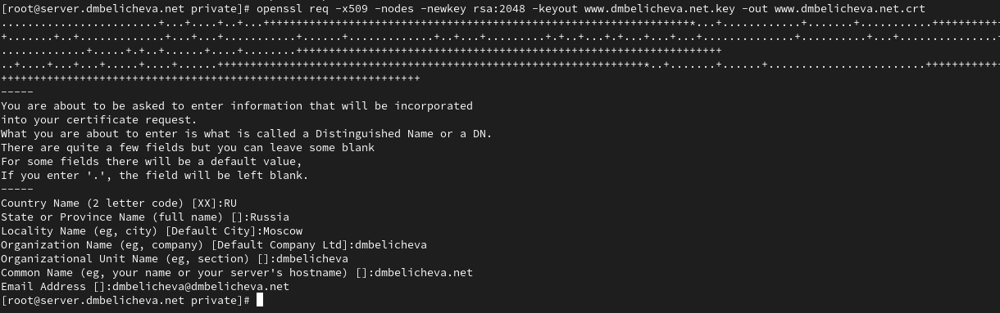{#fig:002 width=70%}

## Выполнение лабораторной работы

Сгенерированные ключ и сертификат появявились в соответствующем каталогах /etc/ssl/private и /etc/ssl/certs.

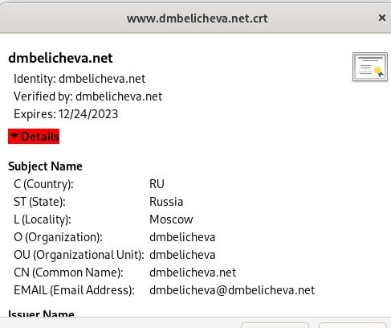{#fig:005 width=40%}

## Выполнение лабораторной работы

Для перехода веб-сервера www.dmbelicheva.net на функционирование через протокол HTTPS требуется изменить его конфигурационный файл. Перейдем в каталог с конфигурационными файлами: `cd /etc/httpd/conf.d`

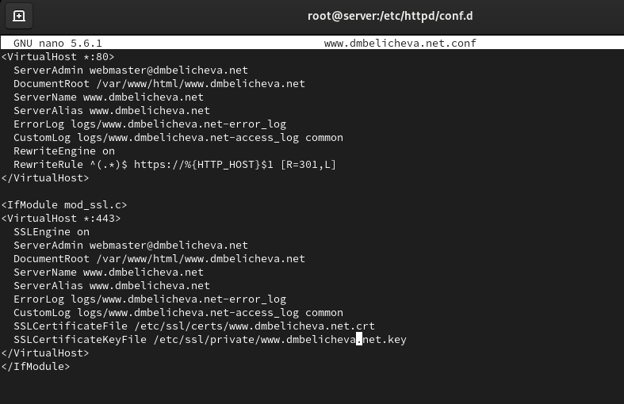{#fig:006 width=50%}

## Выполнение лабораторной работы

Внесем изменения в настройки межсетевого экрана на сервере, разрешив работу с https. Перезапустим веб-сервер.

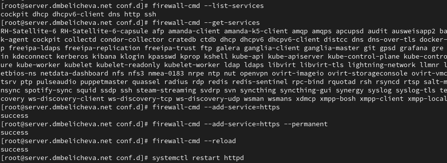{#fig:007 width=60%}

## Выполнение лабораторной работы

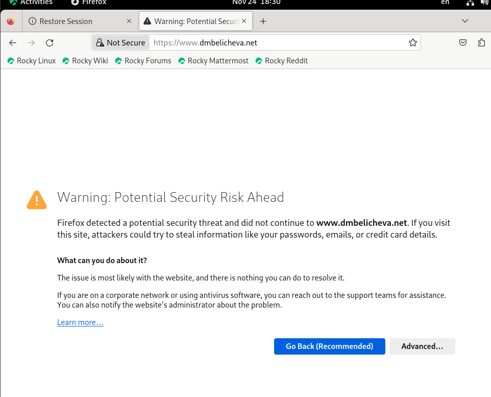{#fig:008 width=60%}

## Выполнение лабораторной работы

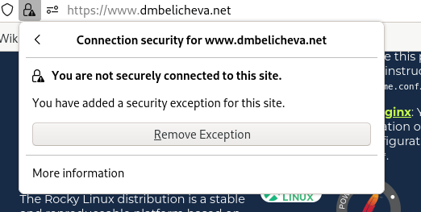{#fig:009 width=70%}

## Выполнение лабораторной работы

**Конфигурирование HTTP-сервера для работы с PHP**

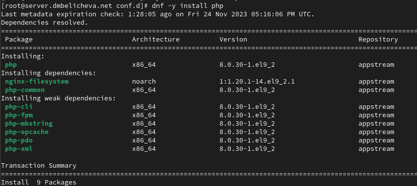{#fig:011 width=50%}

## Выполнение лабораторной работы

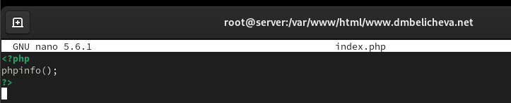{#fig:012 width=70%}

## Выполнение лабораторной работы

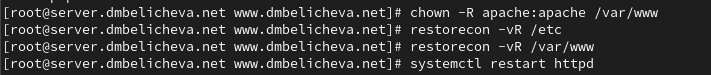{#fig:013 width=70%}

## Выполнение лабораторной работы

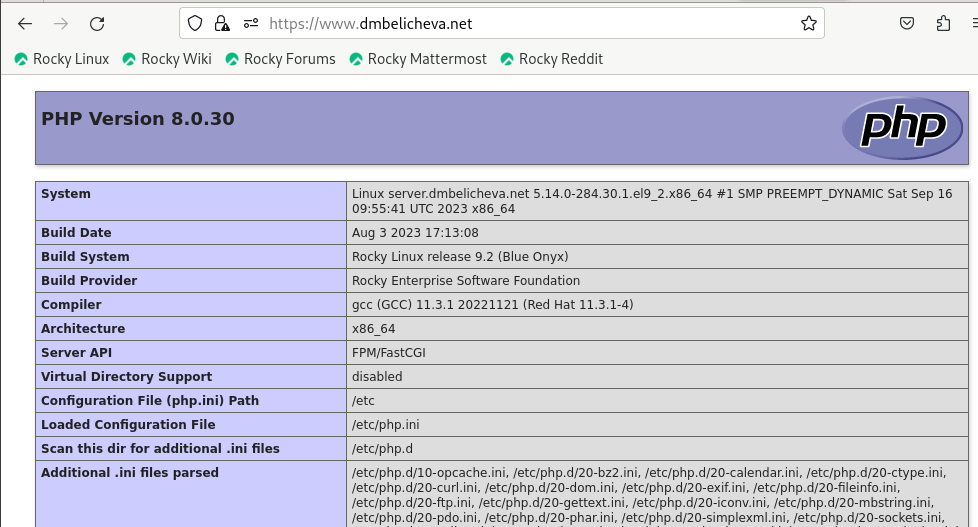{#fig:014 width=70%}

## Выполнение лабораторной работы

**Внесение изменений в настройки внутреннего окружения виртуальной машины**

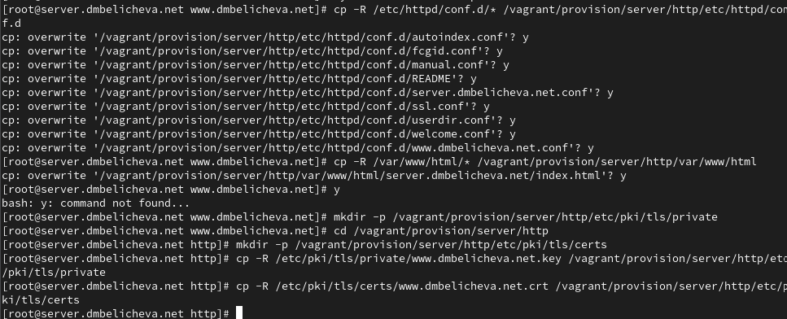{#fig:015 width=50%}

## Выполнение лабораторной работы

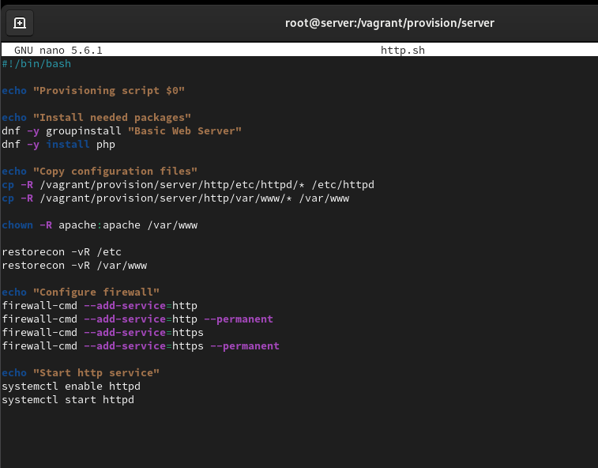{#fig:016 width=60%}

## Выводы

в процессе выполнения данной лабораторной работы я приобрела практические навыки по расширенному конфигурированию HTTP-сервера Apache в части безопасности и возможности использования PHP.
