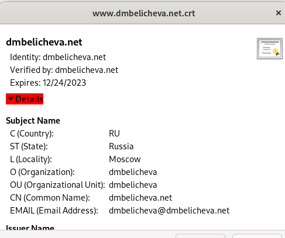
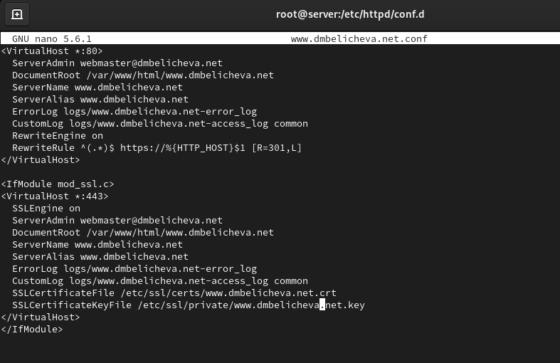
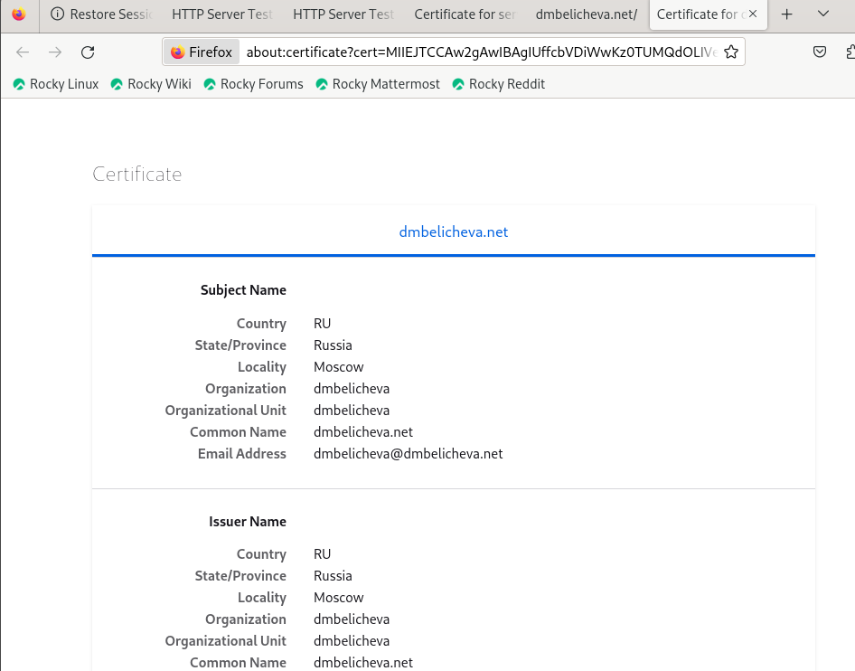

---
## Front matter
title: "Лабораторная работа №5"
subtitle: "Расширенная настройка HTTP-сервера Apache"
author: "Беличева Дарья Михайловна"

## Generic otions
lang: ru-RU
toc-title: "Содержание"

## Bibliography
bibliography: bib/cite.bib
csl: pandoc/csl/gost-r-7-0-5-2008-numeric.csl

## Pdf output format
toc: true # Table of contents
toc-depth: 2
lof: true # List of figures
lot: false # List of tables
fontsize: 12pt
linestretch: 1.5
papersize: a4
documentclass: scrreprt
## I18n polyglossia
polyglossia-lang:
  name: russian
  options:
	- spelling=modern
	- babelshorthands=true
polyglossia-otherlangs:
  name: english
## I18n babel
babel-lang: russian
babel-otherlangs: english
## Fonts
mainfont: PT Serif
romanfont: PT Serif
sansfont: PT Sans
monofont: PT Mono
mainfontoptions: Ligatures=TeX
romanfontoptions: Ligatures=TeX
sansfontoptions: Ligatures=TeX,Scale=MatchLowercase
monofontoptions: Scale=MatchLowercase,Scale=0.9
## Biblatex
biblatex: true
biblio-style: "gost-numeric"
biblatexoptions:
  - parentracker=true
  - backend=biber
  - hyperref=auto
  - language=auto
  - autolang=other*
  - citestyle=gost-numeric
## Pandoc-crossref LaTeX customization
figureTitle: "Рис."
tableTitle: "Таблица"
listingTitle: "Листинг"
lofTitle: "Список иллюстраций"
lotTitle: "Список таблиц"
lolTitle: "Листинги"
## Misc options
indent: true
header-includes:
  - \usepackage{indentfirst}
  - \usepackage{float} # keep figures where there are in the text
  - \floatplacement{figure}{H} # keep figures where there are in the text
---

# Цель работы

Приобрести практические навыки по расширенному конфигурированию HTTP-сервера Apache в части безопасности и возможности использования PHP.


# Задание

1. Сгенерировать криптографический ключ и самоподписанный сертификат безопасности для возможности перехода веб-сервера от работы через протокол HTTP к работе
через протокол HTTPS;

2. Настроить веб-сервер для работы с PHP;

3. Написать скрипт для Vagrant, фиксирующий действия по расширенной настройке HTTP-сервера во внутреннем окружении виртуальной машины server.

# Выполнение лабораторной работы

**Конфигурирование HTTP-сервера для работы через протокол HTTPS**

Загрузим вашу операционную систему и перейдем в рабочий каталог с проектом: `cd C:\Users\dasha\work\study\dmbelicheva\vagrant`

Запустим виртуальную машину server: `make server-up`

На виртуальной машине server войдем под своим пользователем и откроем терминал. Перейдем в режим суперпользователя: `sudo -i`

В каталоге /etc/ssl создадим каталог private.

{#fig:001 width=70%}

Сгенерируем ключ и сертификат:

{#fig:002 width=70%}

- req -x509 означает, что используется запрос подписи сертификата x509 (CSR);

- параметр -nodes указывает OpenSSL, что нужно пропустить шифрование сертификата SSL с использованием парольной фразы, т.е. позволить Apache читать файл без какого-либо вмешательства пользователя (без ввода пароля при попытке доступа
к странице, в частности);

- параметр -newkey rsa: 2048 указывает, что одновременно создаются новый
ключ и новый сертификат, причём используется 2048-битный ключ RSA;

- параметр -keyout указывает, где хранить сгенерированный файл закрытого ключа
при создании;

- параметр -out указывает, где разместить созданный сертификат SSL.
Далее требуется заполнить сертификат:

Сгенерированные ключ и сертификат появявились в соответствующем каталогах /etc/ssl/private и /etc/ssl/certs.

{#fig:003 width=70%}

{#fig:004 width=70%}

{#fig:005 width=70%}

Для перехода веб-сервера www.dmbelicheva.net на функционирование через протокол HTTPS требуется изменить его конфигурационный файл. Перейдем в каталог с конфигурационными файлами: `cd /etc/httpd/conf.d`

Откроем на редактирование файл /etc/httpd/conf.d/www.dmbelicheva.net.conf и заменим его содержимое на следующее:

```
<VirtualHost *:80>
  ServerAdmin webmaster@dmbelicheva.net
  DocumentRoot /var/www/html/www.dmbelicheva.net
  ServerName www.dmbelicheva.net
  ServerAlias www.dmbelicheva.net
  ErrorLog logs/www.dmbelicheva.net-error_log
  CustomLog logs/www.dmbelicheva.net-access_log common
  RewriteEngine on
  RewriteRule ^(.*)$ https://%{HTTP_HOST}$1 [R=301,L]
</VirtualHost>

<IfModule mod_ssl.c>
<VirtualHost *:443>
  SSLEngine on
  ServerAdmin webmaster@dmbelicheva.net
  DocumentRoot /var/www/html/www.dmbelicheva.net
  ServerName www.dmbelicheva.net
  ServerAlias www.dmbelicheva.net
  ErrorLog logs/www.dmbelicheva.net-error_log
  CustomLog logs/www.dmbelicheva.net-access_log common
  SSLCertificateFile /etc/ssl/certs/www.dmbelicheva.net.crt
  SSLCertificateKeyFile /etc/ssl/private/www.dmbelicheva.net.key
</VirtualHost>
</IfModule>
```

{#fig:006 width=70%}

Внесем изменения в настройки межсетевого экрана на сервере, разрешив работу с https.
Перезапустим веб-сервер: `systemctl restart httpd`.

{#fig:007 width=70%}

На виртуальной машине client в строке браузера введем название веб-сервера www.user.net и убедимся, что произойдёт автоматическое переключение на работу по протоколу HTTPS. На открывшейся странице с сообщением о незащищённости соединения нажмем кнопку «Дополнительно», затем добавим адрес сервера в постоянные исключения. Затем просмотрим содержание сертификата.

{#fig:008 width=70%}

{#fig:009 width=70%}

{#fig:010 width=70%}

**Конфигурирование HTTP-сервера для работы с PHP**

Установим пакеты для работы с PHP: `dnf -y install php`

{#fig:011 width=70%}

В каталоге /var/www/html/www.dmbelicheva.net заменим файл index.html на index.php следующего содержания:

```
<?php
phpinfo();
?>
```

{#fig:012 width=70%}

Скорректируем права доступа в каталог с веб-контентом: `chown -R apache:apache /var/www`

Восстановим контекст безопасности в SELinux:

```
restorecon -vR /etc
restorecon -vR /var/www
```

Перезапустим HTTP-сервер: `systemctl restart httpd`

{#fig:013 width=70%}

На виртуальной машине client в строке браузера введием название веб-сервера
www.dmbelicheva.net и убедимся, что будет выведена страница с информацией об используемой на веб-сервере версии PHP.

{#fig:014 width=70%}

**Внесение изменений в настройки внутреннего окружения виртуальной машины**

На виртуальной машине server перейдем в каталог для внесения изменений в настройки внутреннего окружения /vagrant/provision/server/http и в соответствующие каталоги скопируйте конфигурационные файлы:

{#fig:015 width=70%}

В имеющийся скрипт /vagrant/provision/server/http.sh внесем изменения, добавив установку PHP и настройку межсетевого экрана, разрешающую работать с https.

{#fig:016 width=70%}

# Выводы

в процессе выполнения данной лабораторной работы я приобрела практические навыки по расширенному конфигурированию HTTP-сервера Apache в части безопасности и возможности использования PHP.

# Контрольные вопросы

1. В чём отличие HTTP от HTTPS?

Отличие состоит в том, что HTTPS — расширение протокола HTTP для поддержки шифрования в целях повышения безопасности.

2. Каким образом обеспечивается безопасность контента веб-сервера при работе через HTTPS?

Улучшение безопасности при использовании HTTPS вместо HTTP достигается за счёт
использования криптографических протоколов при организации HTTP-соединения и передачи по нему данных. Для шифрования может применяться протокол SSL (Secure Sockets Layer) или протокол TLC (Transport Layer Security). Оба протокола используют асимметричное шифрование для аутентификации, симметричное шифрование для
конфиденциальности и коды аутентичности сообщений для сохранения целостности
сообщений.

3. Что такое сертификационный центр? Приведите пример.

Сертификационный центр (Certification authority, CA) представляет собой компонент глобальной службы каталогов, отвечающий за управление криптографическими ключами пользователей. 

Пример: IdenTrust, DigiCert.