---
## Front matter
lang: ru-RU
title: Лабораторная работа №6
subtitle: Установка и настройка системы управления базами данных MariaDB
author:
  - Беличева Дарья Михайловна
institute:
  - Российский университет дружбы народов, Москва, Россия

## i18n babel
babel-lang: russian
babel-otherlangs: english

## Formatting pdf
toc: false
toc-title: Содержание
slide_level: 2
aspectratio: 169
section-titles: true
theme: metropolis
header-includes:
 - \metroset{progressbar=frametitle,sectionpage=progressbar,numbering=fraction}
 - '\makeatletter'
 - '\beamer@ignorenonframefalse'
 - '\makeatother'
---


## Цель работы

Приобрести практические навыки по установке и конфигурированию системы управления базами данных на примере программного обеспечения MariaDB.

## Задание

1. Установить необходимые для работы MariaDB пакеты (см. раздел 6.4.1).

2. Настроить в качестве кодировки символов по умолчанию utf8 в базах данных.

3. В базе данных MariaDB создать тестовую базу addressbook, содержащую таблицу
city с полями name и city, т.е., например, для некоторого сотрудника указан город, в котором он работает.

4. Создать резервную копию базы данных addressbook и восстановите из неё данные.

5. Написать скрипт для Vagrant, фиксирующий действия по установке и настройке базы
данных MariaDB во внутреннем окружении виртуальной машины server. Соответствующим образом внести изменения в Vagrantfile.


## Выполнение лабораторной работы

**Установка MariaDB**

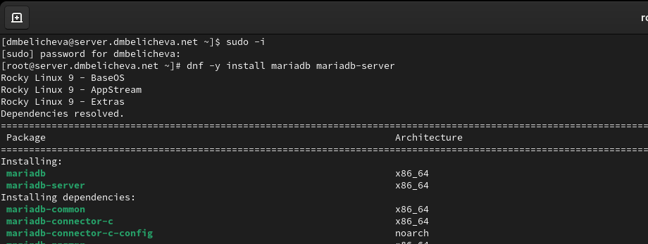{#fig:001 width=70%}

## Выполнение лабораторной работы

Просмотрим конфигурационные файлы mariadb в каталоге /etc/my.cnf.d и в файле /etc/my.cnf.

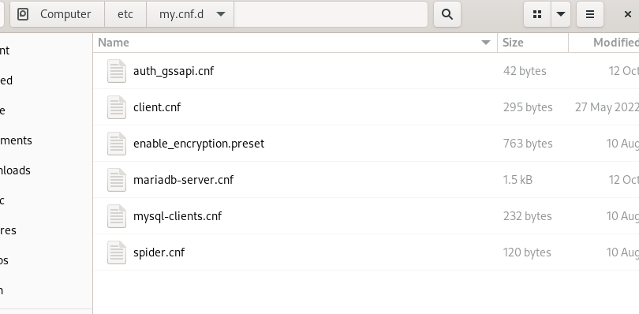{#fig:002 width=60%}

## Выполнение лабораторной работы

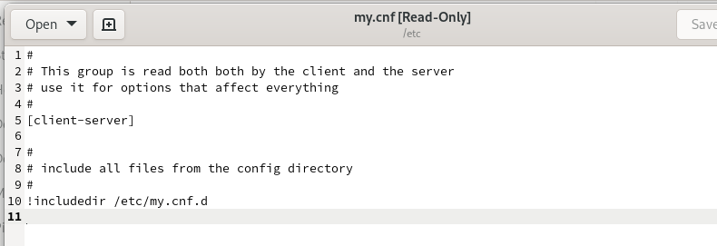{#fig:003 width=70%}

## Выполнение лабораторной работы

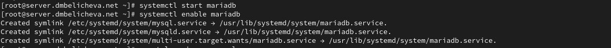{#fig:004 width=70%}

## Выполнение лабораторной работы

Убедимся, что mariadb прослушивает порт 3306:

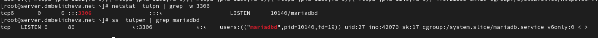{#fig:005 width=70%}

## Выполнение лабораторной работы

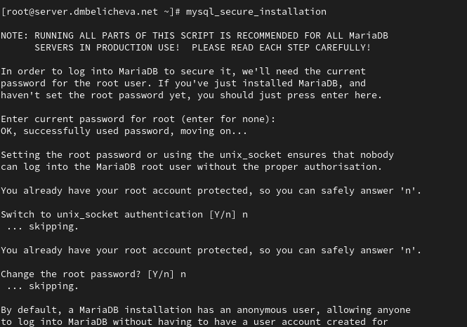{#fig:006 width=70%}


## Выполнение лабораторной работы

Для входа в базу данных с правами администратора базы данных введем: `mysql -u root -p`
Просмотрим список команд MySQL, введя `\h`.

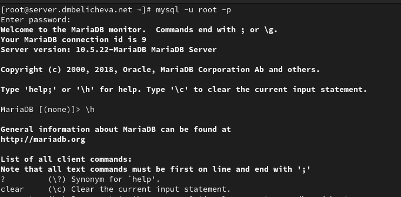{#fig:007 width=50%}

## Выполнение лабораторной работы

На данный момент есть три базы данных (mysql, information_schema, perfomance_schema).

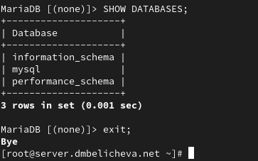{#fig:008 width=70%}

## Выполнение лабораторной работы

**Конфигурация кодировки символов**

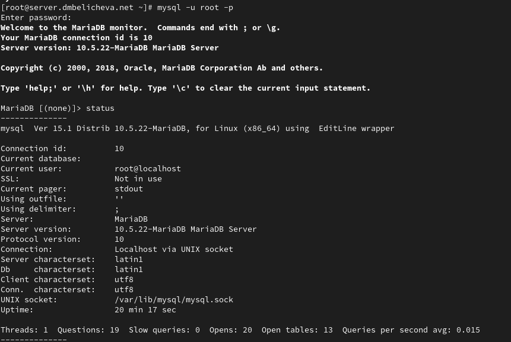{#fig:009 width=60%}

## Выполнение лабораторной работы

В каталоге /etc/my.cnf.d создадим файл utf8.cnf:

```bash
cd /etc/my.cnf.d
touch utf8.cnf
```

## Выполнение лабораторной работы

Откроем его на редактирование и укажем в нём следующую конфигурацию:

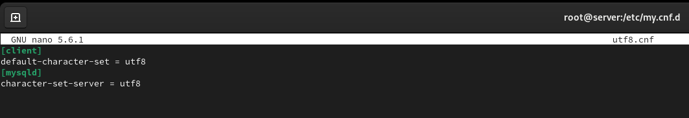{#fig:010 width=60%}

## Выполнение лабораторной работы

Перезапустим MariaDB: `systemctl restart mariadb`. Войдем в базу данных с правами администратора и посмотрим статус MariaDB. Увидим, что поменялся стандарт кодирования символов для сервера и базы данных на utf8.

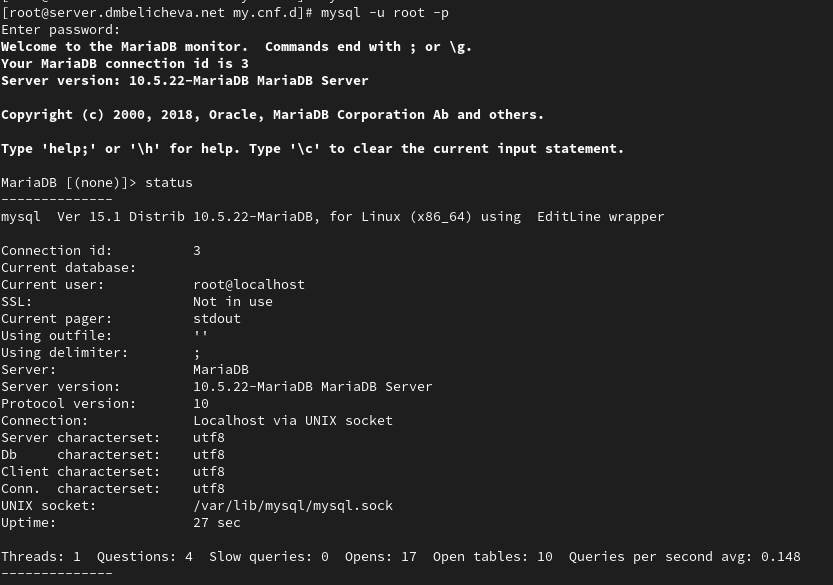{#fig:011 width=50%}

## Выполнение лабораторной работы

**Создание базы данных**

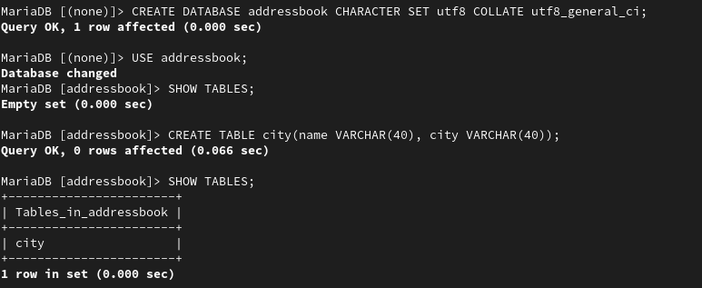{#fig:012 width=70%}

## Выполнение лабораторной работы

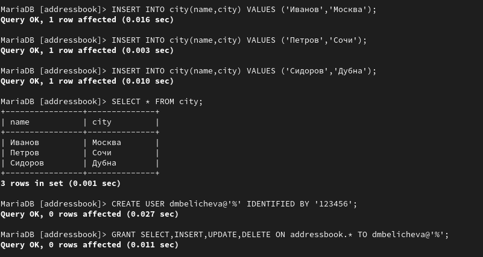{#fig:013 width=70%}

## Выполнение лабораторной работы

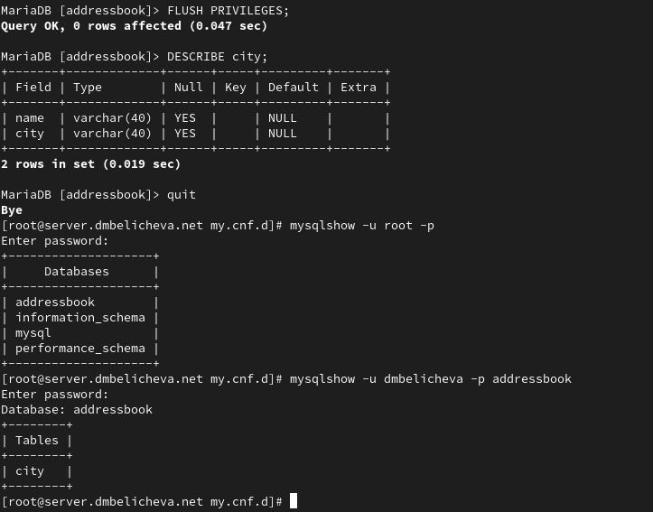{#fig:014 width=70%}

## Выполнение лабораторной работы

**Резервные копии**

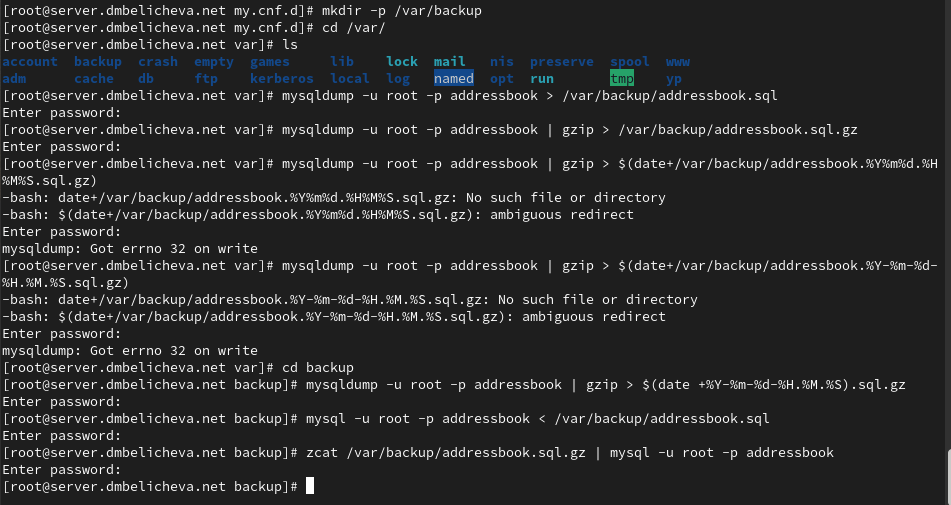{#fig:015 width=70%}

## Выполнение лабораторной работы

**Внесение изменений в настройки внутреннего окружения виртуальной машины**

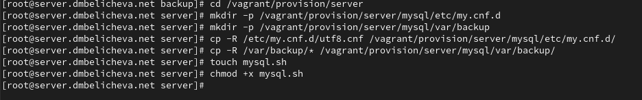{#fig:016 width=70%}

## Выполнение лабораторной работы

В каталоге /vagrant/provision/server создадим исполняемый файл mysql.sh:

```bash
cd /vagrant/provision/server
touch mysql.sh
chmod +x mysql.sh
```
## Выполнение лабораторной работы

Открыв его на редактирование, пропишем в нём следующий скрипт, повторяющий произведённые действия по установке и настройке сервера баз данных:

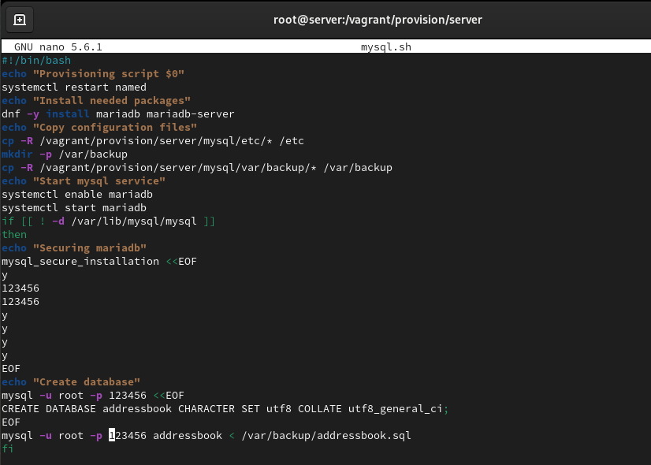{#fig:017 width=70%}

## Выполнение лабораторной работы

Для отработки созданного скрипта во время загрузки виртуальных машин в конфигурационном файле Vagrantfile необходимо добавить в конфигурации сервера следующую запись:

```bash
server.vm.provision "server mysql",
type: "shell",
preserve_order: true,
path: "provision/server/mysql.sh"
```

## Выводы

В процессе выполения данной лабораторной работы я приобрела практические навыки по установке и конфигурированию системы управления базами данных на примере программного обеспечения MariaDB.

