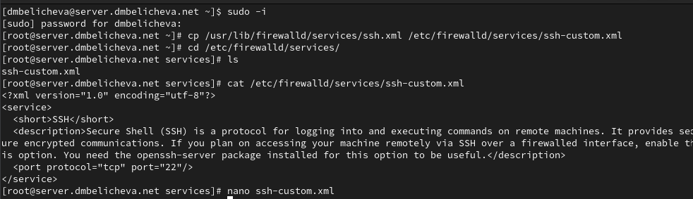
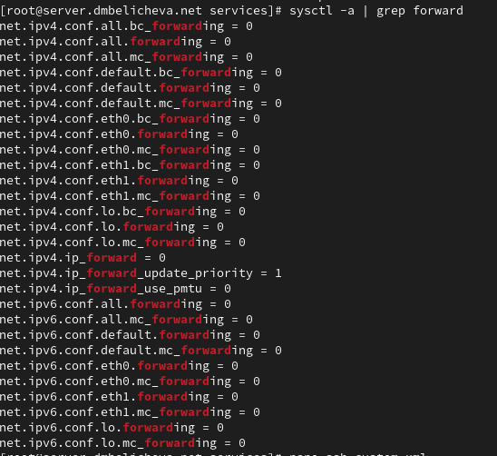

---
## Front matter
lang: ru-RU
title: Лабораторная работа №7
subtitle: Расширенные настройки межсетевого экрана
author:
  - Беличева Дарья Михайловна
institute:
  - Российский университет дружбы народов, Москва, Россия

## i18n babel
babel-lang: russian
babel-otherlangs: english

## Formatting pdf
toc: false
toc-title: Содержание
slide_level: 2
aspectratio: 169
section-titles: true
theme: metropolis
header-includes:
 - \metroset{progressbar=frametitle,sectionpage=progressbar,numbering=fraction}
 - '\makeatletter'
 - '\beamer@ignorenonframefalse'
 - '\makeatother'
---


## Цель работы

Получить навыки настройки межсетевого экрана в Linux в части переадресации портов и настройки Masquerading.

## Задание

1. Настроить межсетевой экран виртуальной машины server для доступа к серверу по протоколу SSH не через 22-й порт, а через порт 2022.
   
2. Настроить Port Forwarding на виртуальной машине server.

3. Настроить маскарадинг на виртуальной машине server для организации доступа клиента к сети Интернет.

4. Написать скрипт для Vagrant, фиксирующий действия по расширенной настройке межсетевого экрана. Соответствующим образом внести изменения в Vagrantfile.

# Выполнение лабораторной работы

## Создание пользовательской службы firewalld

На основе существующего файла описания службы ssh создадим файл с собственным описанием и посмотрим содержимое файла службы.

{#fig:001 width=60%}

## Создание пользовательской службы firewalld

{#fig:002 width=70%}

## Создание пользовательской службы firewalld

Просмотрим список доступных FirewallD служб. Новая служба ещё не отображается в списке.

{#fig:003 width=60%}

## Создание пользовательской службы firewalld

{#fig:004 width=70%}

## Создание пользовательской службы firewalld

Организуем на сервере переадресацию с порта 2022 на порт 22. На клиенте попробуем получить доступ по SSH к серверу через порт 2022:

{#fig:005 width=60%}

## Настройка Port Forwarding и Masquerading

{#fig:006 width=50%}

## Настройка Port Forwarding и Masquerading

{#fig:007 width=70%}

## Настройка Port Forwarding и Masquerading

На клиенте проверим доступность выхода в Интернет.

{#fig:008 width=70%}


## Внесение изменений в настройки внутреннего окружения виртуальной машины

{#fig:009 width=70%}

## Внесение изменений в настройки внутреннего окружения виртуальной машины

{#fig:010 width=70%}

## Внесение изменений в настройки внутреннего окружения виртуальной машины

Для отработки созданного скрипта во время загрузки виртуальной машины server
в конфигурационном файле Vagrantfile необходимо добавить в разделе конфигурации для сервера:

```
server.vm.provision "server firewall",
  type: "shell",
  preserve_order: true,
  path: "provision/server/firewall.sh"
```

## Выводы

В процессе выполнения данной лабораторной работы я получила навыки настройки межсетевого экрана в Linux в части переадресации портов и настройки Masquerading.
