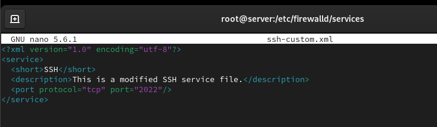
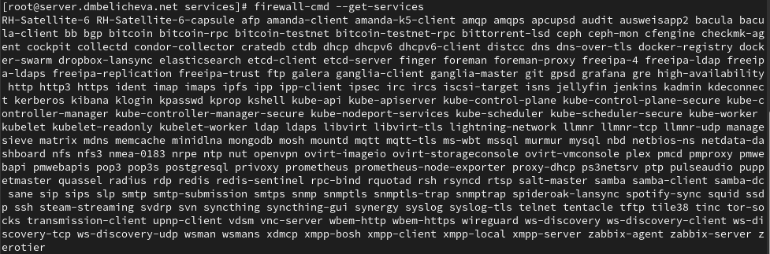
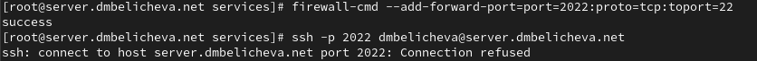
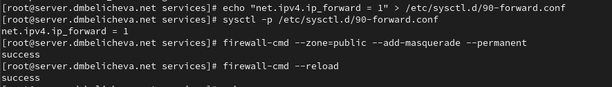
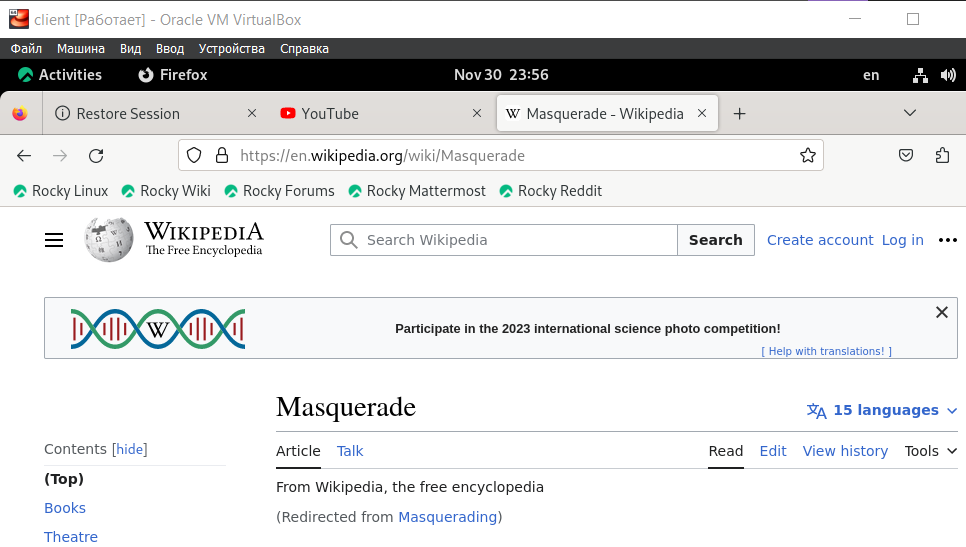
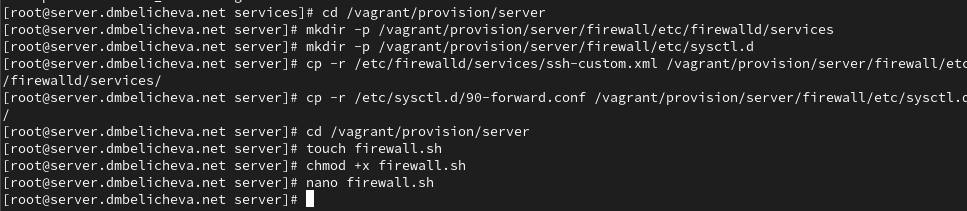

---
## Front matter
title: "Лабораторная работа №7"
subtitle: "Расширенные настройки межсетевого экрана"
author: "Беличева Дарья Михайловна"

## Generic otions
lang: ru-RU
toc-title: "Содержание"

## Bibliography
bibliography: bib/cite.bib
csl: pandoc/csl/gost-r-7-0-5-2008-numeric.csl

## Pdf output format
toc: true # Table of contents
toc-depth: 2
lof: true # List of figures
lot: false # List of tables
fontsize: 12pt
linestretch: 1.5
papersize: a4
documentclass: scrreprt
## I18n polyglossia
polyglossia-lang:
  name: russian
  options:
	- spelling=modern
	- babelshorthands=true
polyglossia-otherlangs:
  name: english
## I18n babel
babel-lang: russian
babel-otherlangs: english
## Fonts
mainfont: PT Serif
romanfont: PT Serif
sansfont: PT Sans
monofont: PT Mono
mainfontoptions: Ligatures=TeX
romanfontoptions: Ligatures=TeX
sansfontoptions: Ligatures=TeX,Scale=MatchLowercase
monofontoptions: Scale=MatchLowercase,Scale=0.9
## Biblatex
biblatex: true
biblio-style: "gost-numeric"
biblatexoptions:
  - parentracker=true
  - backend=biber
  - hyperref=auto
  - language=auto
  - autolang=other*
  - citestyle=gost-numeric
## Pandoc-crossref LaTeX customization
figureTitle: "Рис."
tableTitle: "Таблица"
listingTitle: "Листинг"
lofTitle: "Список иллюстраций"
lotTitle: "Список таблиц"
lolTitle: "Листинги"
## Misc options
indent: true
header-includes:
  - \usepackage{indentfirst}
  - \usepackage{float} # keep figures where there are in the text
  - \floatplacement{figure}{H} # keep figures where there are in the text
---

# Цель работы

Получить навыки настройки межсетевого экрана в Linux в части переадресации портов и настройки Masquerading.

# Задание

1. Настроить межсетевой экран виртуальной машины server для доступа к серверу по протоколу SSH не через 22-й порт, а через порт 2022.
   
2. Настроить Port Forwarding на виртуальной машине server.

3. Настроить маскарадинг на виртуальной машине server для организации доступа клиента к сети Интернет.

4. Написать скрипт для Vagrant, фиксирующий действия по расширенной настройке межсетевого экрана. Соответствующим образом внести изменения в Vagrantfile.

# Выполнение лабораторной работы

## Создание пользовательской службы firewalld

На основе существующего файла описания службы ssh создадим файл с собственным описанием и посмотрим содержимое файла службы.

{#fig:001 width=70%}

В первой строчке указана версия xml и используемая кодировка - utf8. На второй строчке указан тег service, далее его тег-потомок short, внутри которого указан SSH. Затем указан тег description, внутри которого прописано
описание протокола ssh, и указан протокол передачи порта tcp и номер порта.

Откроем файл описания службы на редактирование и заменим порт 22 на новый порт (2022):

`<port protocol="tcp" port="2022"/>`

В этом же файле скорректируем описание службы для демонстрации, что это модифицированный файл службы.

{#fig:002 width=70%}

Просмотрим список доступных FirewallD служб:

`firewall-cmd --get-services`

Новая служба ещё не отображается в списке.

{#fig:003 width=70%}

Перегрузим правила межсетевого экрана с сохранением информации о состоянии и вновь выведем на экран список служб, а также список активных служб.
Созданная служба отображается в списке доступных для FirewallD служб, но не активирована.
Добавим новую службу в FirewallD и выведем на экран список активных служб:

{#fig:004 width=70%}

Организуем на сервере переадресацию с порта 2022 на порт 22:

`firewall-cmd --add-forward-port=port=2022:proto=tcp:toport=22`

На клиенте попробуем получить доступ по SSH к серверу через порт 2022:

`ssh -p 2022 dmbelicheva@server.dmbelicheva.net`

{#fig:005 width=70%}

К сожалению, в доступе мне было отказано.

## Настройка Port Forwarding и Masquerading

На сервере посмотрим, активирована ли в ядре системы возможность перенаправления IPv4-пакетов пакетов:

`sysctl -a | grep forward`

{#fig:006 width=70%}

Включим перенаправление IPv4-пакетов на сервере. Включим маскарадинг на сервере и перезапустим систему:

{#fig:007 width=70%}

На клиенте проверим доступность выхода в Интернет.

{#fig:008 width=70%}

Выход в Интернет на клиенте доступен.

## Внесение изменений в настройки внутреннего окружения виртуальной машины

На виртуальной машине server перейдем в каталог для внесения изменений в настройки внутреннего окружения /vagrant/provision/server/, создадим в нём каталог firewall, в который поместим в соответствующие подкаталоги конфигурационные файлы FirewallD. В каталоге /vagrant/provision/server создадим файл firewall.sh.

{#fig:009 width=70%}

Открыв его на редактирование, пропишите в нём следующий скрипт:

{#fig:010 width=70%}

Для отработки созданного скрипта во время загрузки виртуальной машины server
в конфигурационном файле Vagrantfile необходимо добавить в разделе конфигурации для сервера:

```
server.vm.provision "server firewall",
  type: "shell",
  preserve_order: true,
  path: "provision/server/firewall.sh"
```

# Выводы

В процессе выполнения данной лабораторной работы я получила навыки настройки межсетевого экрана в Linux в части переадресации портов и настройки Masquerading.

# Контрольные вопросы

1. Где хранятся пользовательские файлы firewalld? 
  
`/usr/lib/firewalld/services`

2. Какую строку надо включить в пользовательский файл службы, чтобы указать порт TCP 2022?

`<port protocol="tcp" port="2022"/>`

3. Какая команда позволяет вам перечислить все службы, доступные в настоящее время на вашем сервере?

`firewall-cmd --get-services`

4. В чем разница между трансляцией сетевых адресов (NAT) и маскарадингом (masquerading)?

При маскарадинге вместо адреса отправителя(как делается это в NAT) динамически подставляется адрес назначенного интерфейса (сетевой адрес + порт).

5. Какая команда разрешает входящий трафик на порт 4404 и перенаправляет его в службу ssh по IP-адресу 10.0.0.10?

`sudo firewall-cmd --add-forward-port=port=4404:proto=tcp:toport=22:toaddr=10.0.0.10`

6. Какая команда используется для включения маcкарадинга IP-пакетов для всех пакетов,
выходящих в зону public?

`firewall-cmd --zone=public --add-masquerade --permanent`