---
## Front matter
lang: ru-RU
title: Лабораторная работа № 8
subtitle: Настройка SMTP-сервера
author:
  - Беличева Дарья Михайловна
institute:
  - Российский университет дружбы народов, Москва, Россия

## i18n babel
babel-lang: russian
babel-otherlangs: english

## Formatting pdf
toc: false
toc-title: Содержание
slide_level: 2
aspectratio: 169
section-titles: true
theme: metropolis
header-includes:
 - \metroset{progressbar=frametitle,sectionpage=progressbar,numbering=fraction}
 - '\makeatletter'
 - '\beamer@ignorenonframefalse'
 - '\makeatother'
---

## Цель работы

Приобретение практических навыков по установке и конфигурированию SMTP-сервера.

## Задание

1. Установить на виртуальной машине server SMTP-сервер postfix.

2. Сделать первоначальную настройку postfix при помощи утилиты postconf, задав
отправку писем не на локальный хост, а на сервер в домене.

3. Проверить отправку почты с сервера и клиента.

4. Сконфигурировать Postfix для работы в домене. Проверить отправку почты с сервера
и клиента.

5. Написать скрипт для Vagrant, фиксирующий действия по установке и настройке
Postfix во внутреннем окружении виртуальной машины server. Соответствующим
образом внесите изменения в Vagrantfile.

# Выполнение лабораторной работы

## Установка Postfix

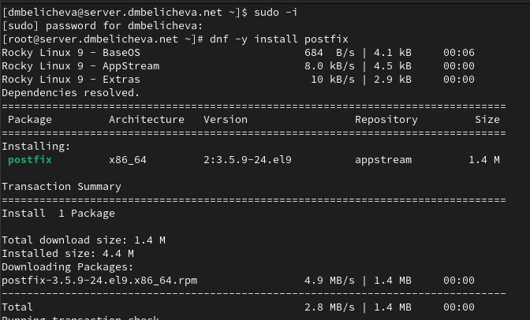{#fig:001 width=70%}


## Установка Postfix

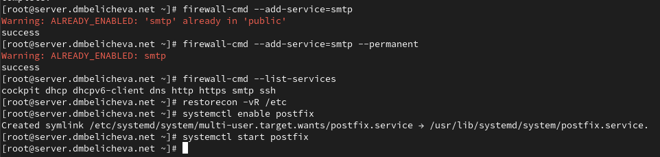{#fig:003 width=70%}

## Изменение параметров Postfix с помощью postconf 

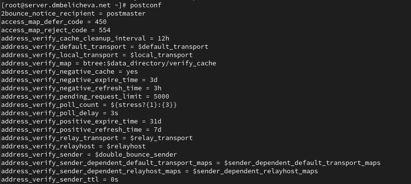{#fig:004 width=70%}

## Изменение параметров Postfix с помощью postconf 

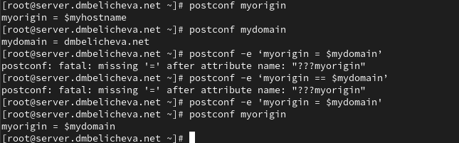{#fig:004 width=70%}

## Изменение параметров Postfix с помощью postconf 

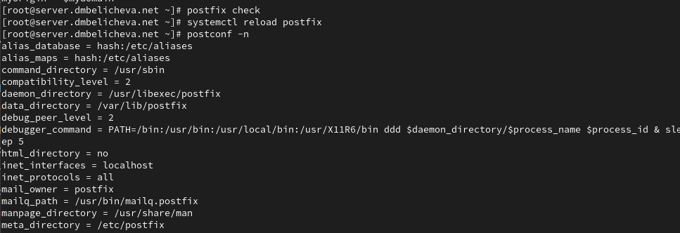{#fig:004 width=70%}

## Изменение параметров Postfix с помощью postconf 

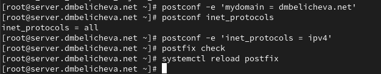{#fig:007 width=70%}


## Проверка работы Postfix


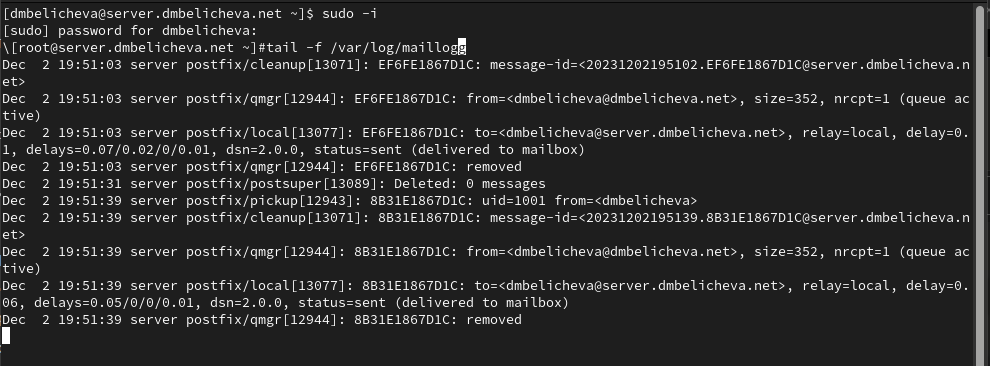{#fig:007 width=70%}

## Проверка работы Postfix

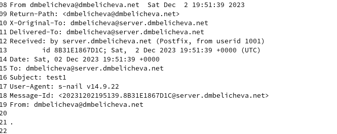{#fig:007 width=70%}

## Проверка работы Postfix

На виртуальной машине client войдем под вашим пользователем и откроем терминал. Перейдем в режим суперпользователя:
`sudo -i`

На клиенте установим необходимые для работы пакеты:
`dnf -y install postfix`

`dnf -y install s-nail`

## Проверка работы Postfix

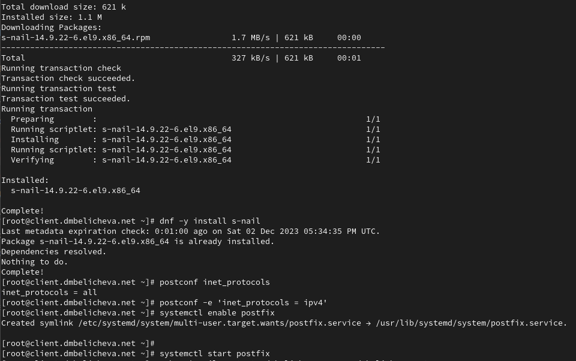{#fig:007 width=70%}

## Проверка работы Postfix

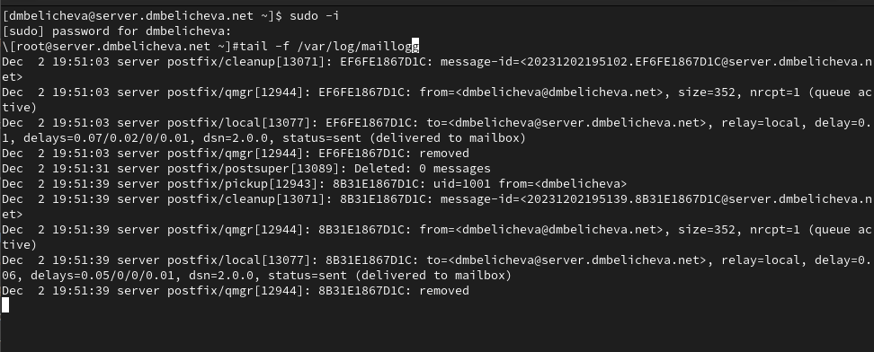{#fig:007 width=70%}

## Проверка работы Postfix

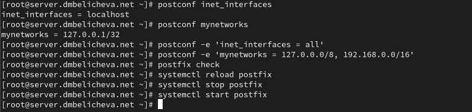{#fig:007 width=70%}

## Проверка работы Postfix

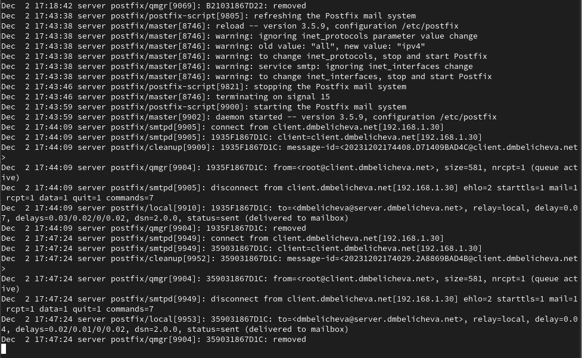{#fig:007 width=70%}

## Конфигурация Postfix для домена

С клиента отправим письмо на свой доменный адрес:

`echo .| mail -s test2 dmbelicheva@dmbelicheva.net`

## Конфигурация Postfix для домена

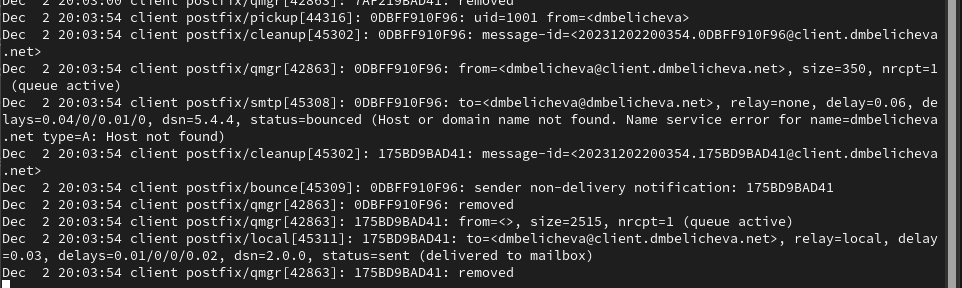{#fig:007 width=70%}

## Конфигурация Postfix для домена

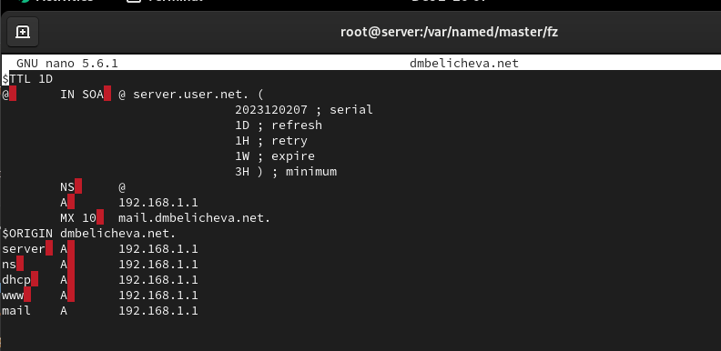{#fig:007 width=70%}

## Конфигурация Postfix для домена

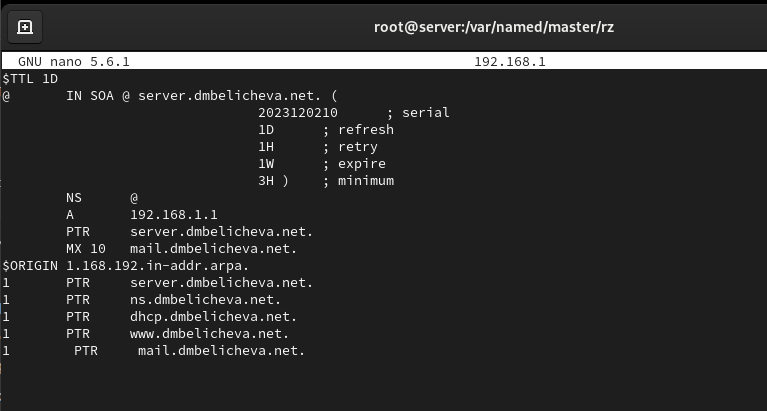{#fig:007 width=70%}


## Конфигурация Postfix для домена

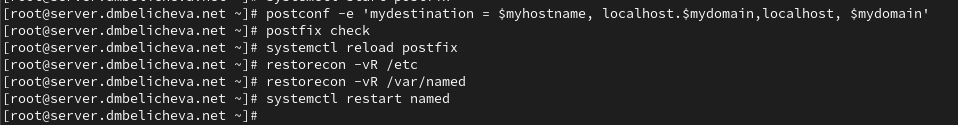{#fig:007 width=70%}

## Конфигурация Postfix для домена

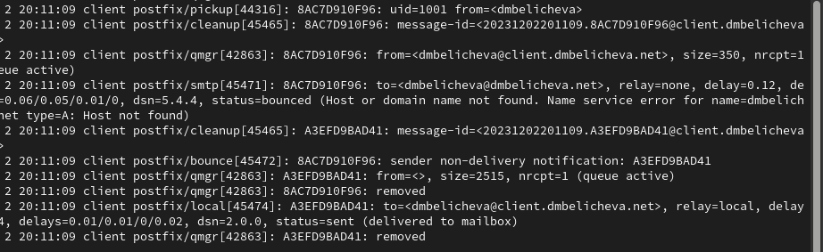{#fig:007 width=70%}

## Внесение изменений в настройки внутреннего окружения виртуальной машины

```
cd /vagrant/provision/server/dns/var/named
cp -R /var/named/* /vagrant/provision/server/dns/var/named
```

## Внесение изменений в настройки внутреннего окружения виртуальной машины

В каталоге /vagrant/provision/server создадим исполняемый файл mail.sh:

```
cd /vagrant/provision/server
touch mail.sh
chmod +x mail.sh
```

## Внесение изменений в настройки внутреннего окружения виртуальной машины

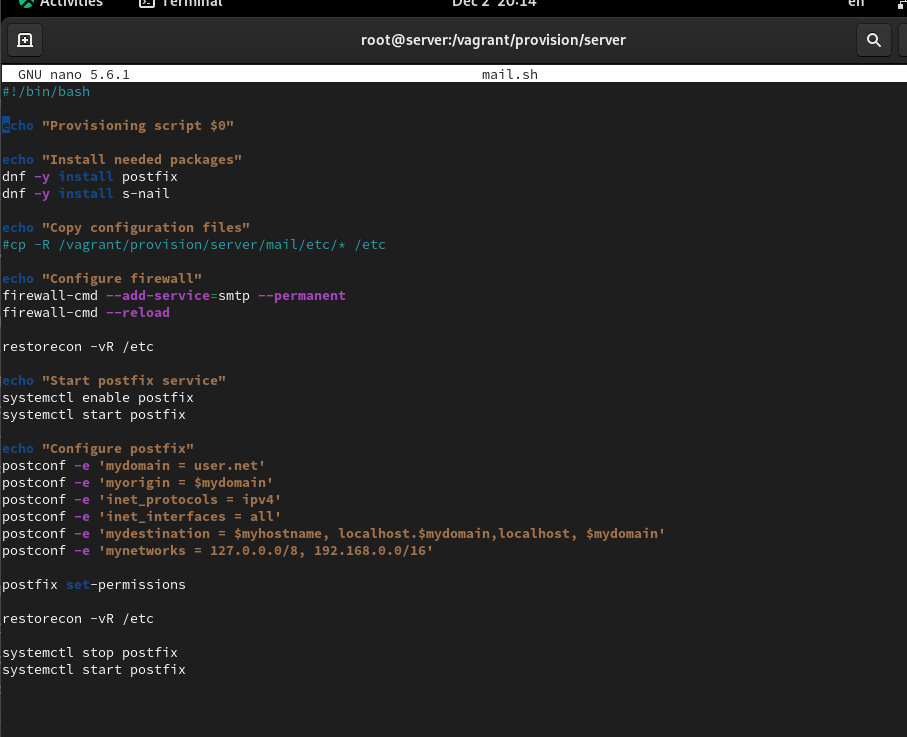{#fig:007 width=70%}

## Внесение изменений в настройки внутреннего окружения виртуальной машины

На виртуальной машине client перейдем в каталог для внесения изменений в настройки внутреннего окружения /vagrant/provision/client/:
`cd /vagrant/provision/client`

В каталоге /vagrant/provision/client создайте исполняемый файл mail.sh:

```
touch mail.sh
chmod +x mail.sh
```

## Внесение изменений в настройки внутреннего окружения виртуальной машины

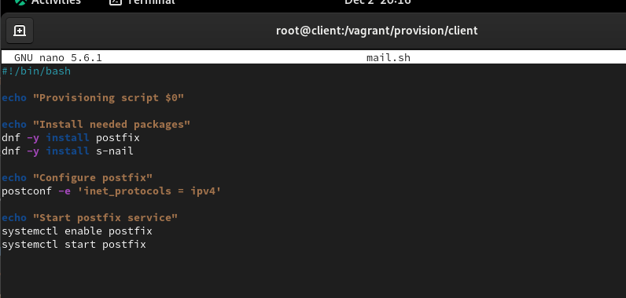{#fig:007 width=70%}

## Внесение изменений в настройки внутреннего окружения виртуальной машины

Для отработки созданного скрипта во время загрузки виртуальной машины server
в конфигурационном файле Vagrantfile необходимо добавить в разделе конфигурации для сервера:

```
server.vm.provision "server mail",
type: "shell",
preserve_order: true,
path: "provision/server/mail.sh"
```

## Внесение изменений в настройки внутреннего окружения виртуальной машины

Для отработки созданного скрипта во время загрузки виртуальной машины client
в конфигурационном файле Vagrantfile необходимо добавить в разделе конфигурации для клиента:

```
client.vm.provision "client mail",
type: "shell",
preserve_order: true,
path: "provision/client/mail.sh"
```

## Выводы

В процессе выполнения данной лабораторной работы я приобрела практические навыки по установке и конфигурированию SMTP-сервера.