---
## Front matter
title: "Лабораторная работа № 8"
subtitle: "Настройка SMTP-сервера"
author: "Беличева Дарья Михайловна"

## Generic otions
lang: ru-RU
toc-title: "Содержание"

## Bibliography
bibliography: bib/cite.bib
csl: pandoc/csl/gost-r-7-0-5-2008-numeric.csl

## Pdf output format
toc: true # Table of contents
toc-depth: 2
lof: true # List of figures
lot: true # List of tables
fontsize: 12pt
linestretch: 1.5
papersize: a4
documentclass: scrreprt
## I18n polyglossia
polyglossia-lang:
  name: russian
  options:
	- spelling=modern
	- babelshorthands=true
polyglossia-otherlangs:
  name: english
## I18n babel
babel-lang: russian
babel-otherlangs: english
## Fonts
mainfont: PT Serif
romanfont: PT Serif
sansfont: PT Sans
monofont: PT Mono
mainfontoptions: Ligatures=TeX
romanfontoptions: Ligatures=TeX
sansfontoptions: Ligatures=TeX,Scale=MatchLowercase
monofontoptions: Scale=MatchLowercase,Scale=0.9
## Biblatex
biblatex: true
biblio-style: "gost-numeric"
biblatexoptions:
  - parentracker=true
  - backend=biber
  - hyperref=auto
  - language=auto
  - autolang=other*
  - citestyle=gost-numeric
## Pandoc-crossref LaTeX customization
figureTitle: "Рис."
tableTitle: "Таблица"
listingTitle: "Листинг"
lofTitle: "Список иллюстраций"
lotTitle: "Список таблиц"
lolTitle: "Листинги"
## Misc options
indent: true
header-includes:
  - \usepackage{indentfirst}
  - \usepackage{float} # keep figures where there are in the text
  - \floatplacement{figure}{H} # keep figures where there are in the text
---

# Цель работы

Приобретение практических навыков по установке и конфигурированию SMTP-сервера.

# Задание

1. Установить на виртуальной машине server SMTP-сервер postfix.

2. Сделать первоначальную настройку postfix при помощи утилиты postconf, задав
отправку писем не на локальный хост, а на сервер в домене.

3. Проверить отправку почты с сервера и клиента.

4. Сконфигурировать Postfix для работы в домене. Проверить отправку почты с сервера
и клиента.

5. Написать скрипт для Vagrant, фиксирующий действия по установке и настройке
Postfix во внутреннем окружении виртуальной машины server. Соответствующим
образом внесите изменения в Vagrantfile.

# Выполнение лабораторной работы

## Установка Postfix

На виртуальной машине server войдем под своим пользователем и откроем терминал. Перейдем в режим суперпользователя:
`sudo -i`

Установим необходимые для работы пакеты.

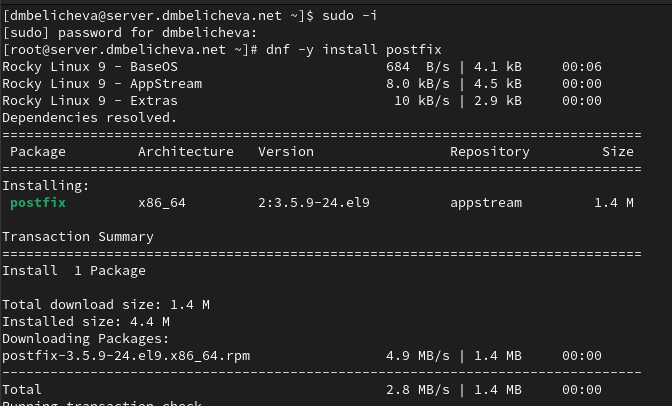{#fig:001 width=70%}

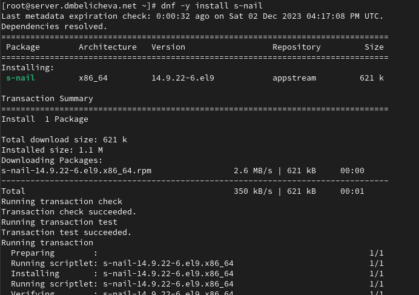{#fig:002 width=70%}

Сконфигурируем межсетевой экран, разрешив работать службе протокола SMTP. Восстановим контекст безопасности в SELinux.
Запустим Postfix.

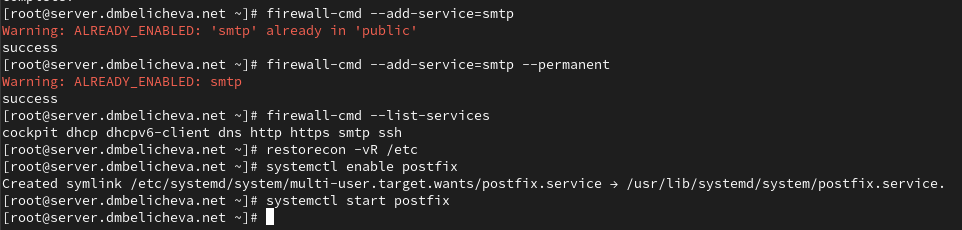{#fig:003 width=70%}

## Изменение параметров Postfix с помощью postconf 

Первоначальную настройку Postfix осуществим, используя postconf.

Для просмотра списка текущих настроек Postfix введите:
postconf

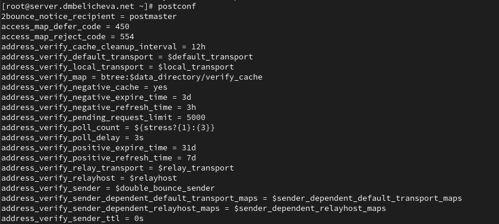{#fig:004 width=70%}

Посмотрим текущее значение параметра myorigin: postconf myorigin

Посмотрим текущее значение параметра mydomain: postconf mydomain

Должно быть указано mydomain = dmbelicheva.net
Заменим значение параметра myorigin на значение параметра mydomain:
postconf -e ‘myorigin = $mydomain’

Повторим команду: postconf myorigin

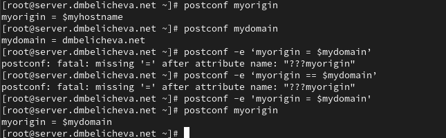{#fig:004 width=70%}

Замена параметра была произведена.

Проверим корректность содержания конфигурационного файла main.cf: postfix check

Перезагрузим конфигурационные файлы Postfix: systemctl reload postfix

Просмотрим все параметры с значением, отличным от значения по умолчанию: postconf -n

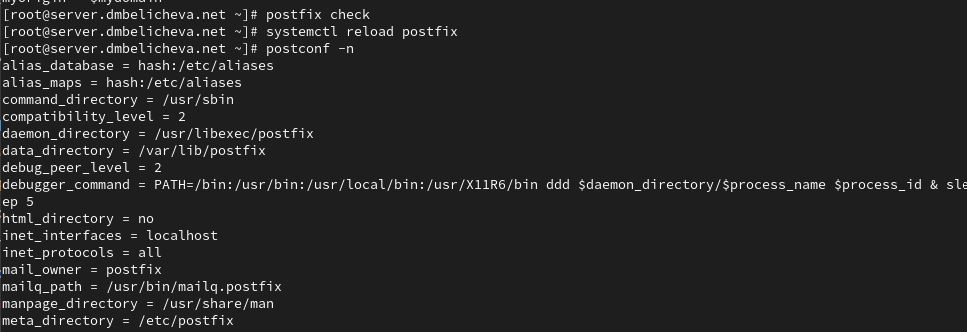{#fig:004 width=70%}

Зададим жёстко значение домена:
postconf -e 'mydomain = dmbelicheva.net'

Отключим IPv6 в списке разрешённых в работе Postfix протоколов и оставьте только
IPv4. Перезагрузим конфигурацию Postfix.

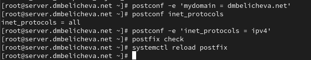{#fig:007 width=70%}


## Проверка работы Postfix

На сервере под учётной записью пользователя отправим себе письмо, используя
утилиту mail:

`echo .| mail -s test1 dmbelicheva@server.dmbelicheva.net`

На втором терминале запустим мониторинг работы почтовой службы и посмотрите,
что произошло с вашим сообщением:

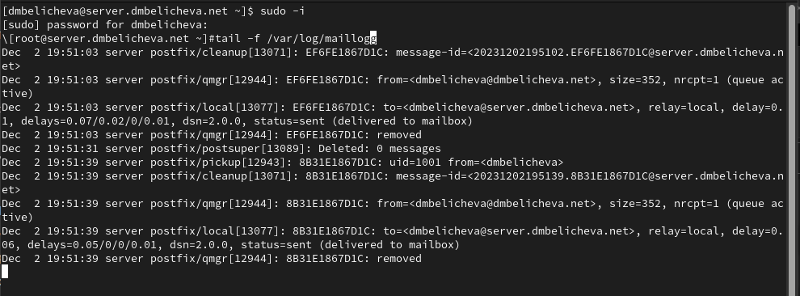{#fig:007 width=70%}

Из предпоследней строчки видно, что письмо отправлено.

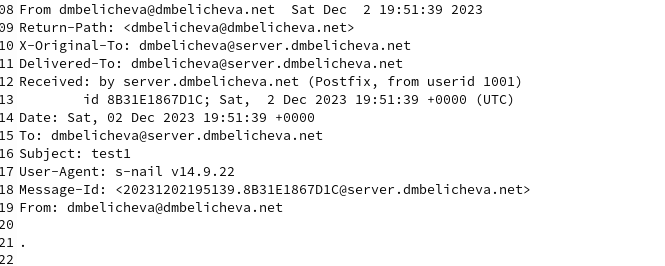{#fig:007 width=70%}

На виртуальной машине client войдем под вашим пользователем и откроем терминал. Перейдем в режим суперпользователя:
`sudo -i`

На клиенте установим необходимые для работы пакеты:
`dnf -y install postfix`

`dnf -y install s-nail`

Отключиv IPv6 в списке разрешённых в работе Postfix протоколов и оставьте только IPv4
На клиенте запустиv Postfix.

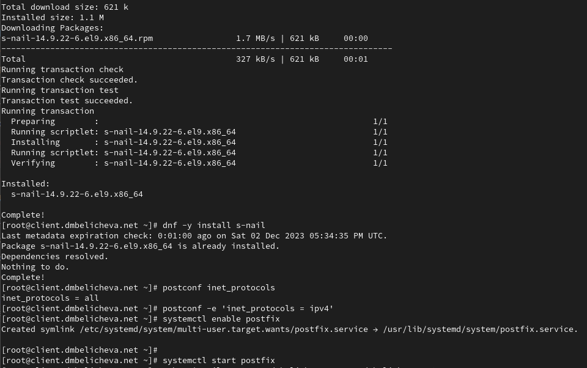{#fig:007 width=70%}

На клиенте под учётной записью пользователя аналогичным образом отправим себе второе письмо, используя утилиту mail. Сравним результат мониторинга почтовой службы на сервере при отправке сообщения с сервера и с клиента.

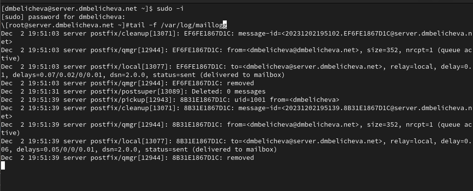{#fig:007 width=70%}

Новых писем не обнаружено.

На сервере в конфигурации Postfix посмотрим значения параметров сетевых
интерфейсов inet_interfaces и сетевых адресов mynetworks. Затем разрешим
Postfix прослушивать соединения не только с локального узла, но и с других
интерфейсов сети и добавим адрес внутренней сети, разрешив таким образом
пересылку сообщений между узлами сети. Теперь перезагрузим конфигурацию
Postfix и перезапустим Postfix.

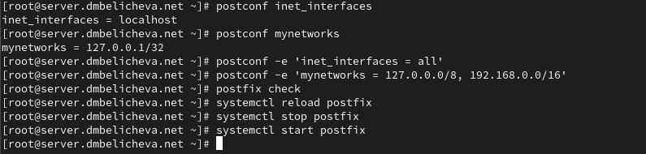{#fig:007 width=70%}

Повторим отправку сообщения с клиента. 

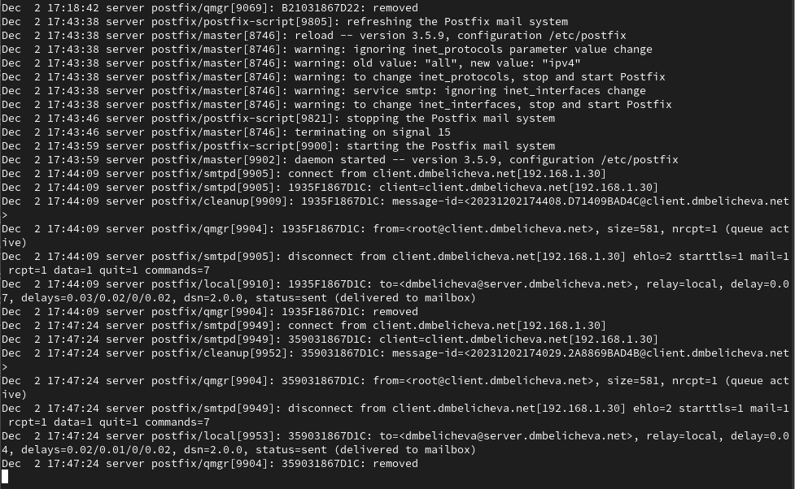{#fig:007 width=70%}

Теперь сначала произошло соединение с клиентом, было получено от него сообщение и затем соединение было разорвано.

## Конфигурация Postfix для домена

С клиента отправим письмо на свой доменный адрес:

`echo .| mail -s test2 dmbelicheva@dmbelicheva.net`

запустим мониторинг почтовой службы и посмотрим, что случилось с сообщением

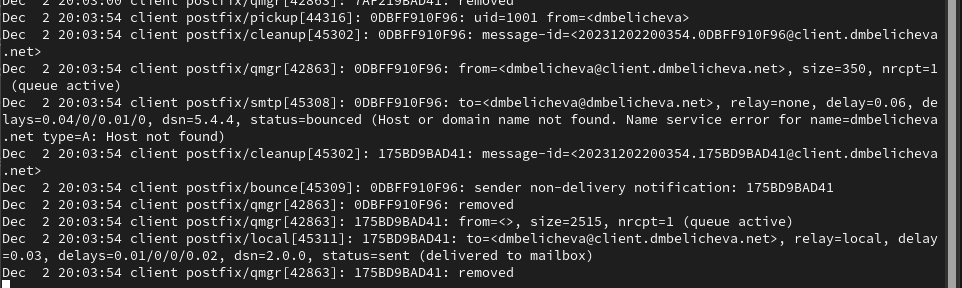{#fig:007 width=70%}

Можно увидеть, что выдалась ошибка имени сервиса, что хост или домэйн не найдены.

Для настройки возможности отправки сообщений не на конкретный узел сети,
а на доменный адрес пропишем MX-запись с указанием имени почтового сервера
mail.dmbelicheva.net в файле прямой и обратной DNS-зона на доменный адрес пропишите MX-запись с указанием имени почтового сервера mail.dmbelicheva.net в файле прямой DNS-зоны:

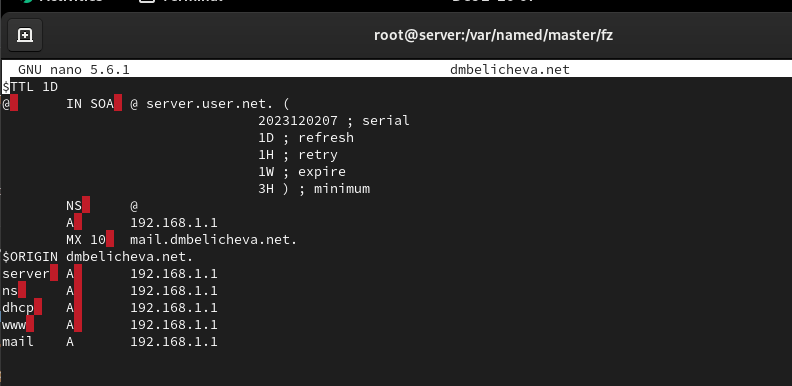{#fig:007 width=70%}

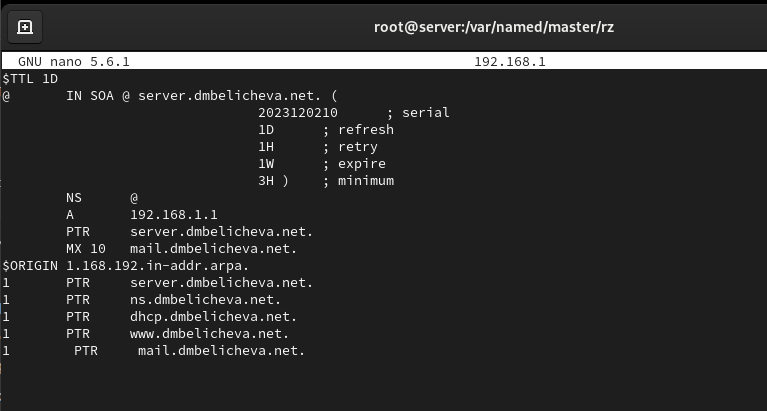{#fig:007 width=70%}


В конфигурации Postfix добавим домен в список элементов сети, для которых
данный сервер является конечной точкой доставки почты с помощью команды:
А затем перезагрузим конфигурацию Postfix, восстановим контекст безопасно-
сти в SELinux и перезапустим DNS:

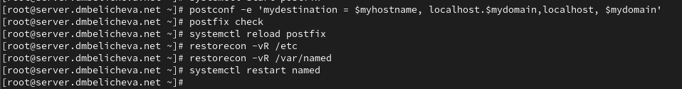{#fig:007 width=70%}

Попробуем отправить сообщения, находящиеся в очереди на отправление:
`postqueue -f`

Проверим отправку почты с клиента на доменный адрес.

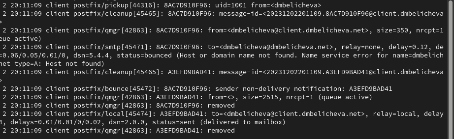{#fig:007 width=70%}

## Внесение изменений в настройки внутреннего окружения виртуальной машины

На виртуальной машине server перейдем в каталог для внесения изменений в настройки внутреннего окружения /vagrant/provision/server/.
Заменим конфигурационные файлы DNS-сервера:

```
cd /vagrant/provision/server/dns/var/named
cp -R /var/named/* /vagrant/provision/server/dns/var/named
```

В каталоге /vagrant/provision/server создадим исполняемый файл mail.sh:

```
cd /vagrant/provision/server
touch mail.sh
chmod +x mail.sh
```

Открыв его на редактирование, пропишите в нём следующий скрипт:

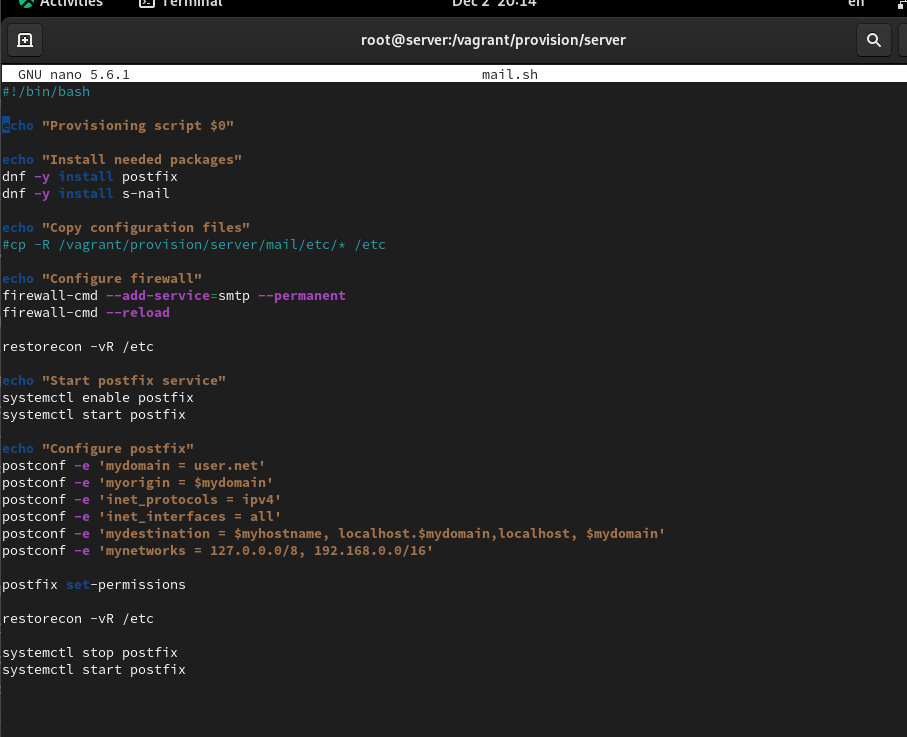{#fig:007 width=70%}

На виртуальной машине client перейдем в каталог для внесения изменений в настройки внутреннего окружения /vagrant/provision/client/:
`cd /vagrant/provision/client`

В каталоге /vagrant/provision/client создайте исполняемый файл mail.sh:

```
touch mail.sh
chmod +x mail.sh
```

Открыв его на редактирование, пропишите в нём следующий скрипт:

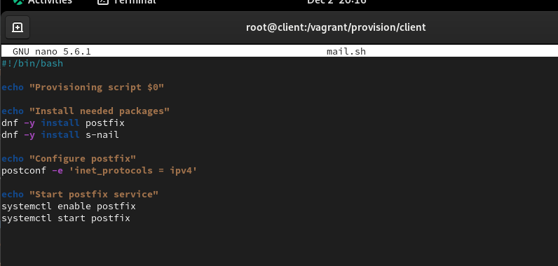{#fig:007 width=70%}

Для отработки созданного скрипта во время загрузки виртуальной машины server
в конфигурационном файле Vagrantfile необходимо добавить в разделе конфигурации для сервера:

```
server.vm.provision "server mail",
type: "shell",
preserve_order: true,
path: "provision/server/mail.sh"
```

Для отработки созданного скрипта во время загрузки виртуальной машины client
в конфигурационном файле Vagrantfile необходимо добавить в разделе конфигурации для клиента:

```
client.vm.provision "client mail",
type: "shell",
preserve_order: true,
path: "provision/client/mail.sh"
```

# Выводы

В процессе выполнения данной лабораторной работы я приобрела практические навыки по установке и конфигурированию SMTP-сервера.

