---
## Front matter
lang: ru-RU
title: Лабораторная работа №9
subtitle: Настройка POP3/IMAP сервера
author:
  - Беличева Д.М.
institute:
  - Российский университет дружбы народов, Москва, Россия

## i18n babel
babel-lang: russian
babel-otherlangs: english

## Formatting pdf
toc: false
toc-title: Содержание
slide_level: 2
aspectratio: 169
section-titles: true
theme: metropolis
header-includes:
 - \metroset{progressbar=frametitle,sectionpage=progressbar,numbering=fraction}
 - '\makeatletter'
 - '\beamer@ignorenonframefalse'
 - '\makeatother'
---

## Цель работы

Приобрести практические навыки по установке и простейшему конфигурированию POP3/IMAP-сервера.

## Задание

1. Установить на виртуальной машине server Dovecot и Telnet для дальнейшей проверки
корректности работы почтового сервера.

2. Настроить Dovecot.

3. Установить на виртуальной машине client программу для чтения почты Evolution
и настройте её для манипуляций с почтой вашего пользователя. Проверить корректность работы почтового сервера как с виртуальной машины server, так и с виртуальной машины client.

4. Изменить скрипт для Vagrant, фиксирующий действия по установке и настройке Postfix
и Dovecote во внутреннем окружении виртуальной машины server, создать скрипт
для Vagrant, фиксирующий действия по установке Evolution во внутреннем окружении виртуальной машины client. Соответствующим образом внести изменения в Vagrantfile.

# Выполнение лабораторной работы

## Установка Dovecot

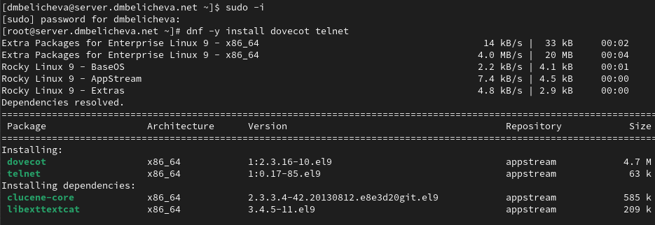{#fig:001 width=70%}

## Настройка dovecot

В конфигурационном файле /etc/dovecot/dovecot.conf пропишем список почтовых протоколов, по которым разрешено работать Dovecot: `protocols = imap pop3`

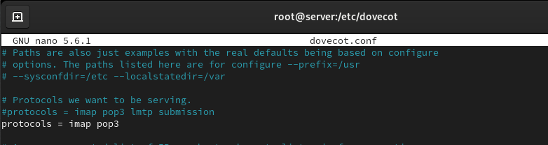{#fig:001 width=50%}

## Настройка dovecot

В конфигурационном файле /etc/dovecot/conf.d/10-auth.conf укажем метод аутентификации plain: `auth_mechanisms = plain`

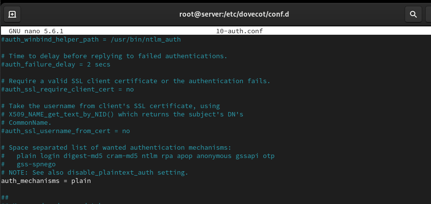{#fig:001 width=50%}

## Настройка dovecot

В конфигурационном файле /etc/dovecot/conf.d/auth-system.conf.ext проверим, что для поиска пользователей и их паролей используется pam и файл passwd:

```
passdb {
driver = pam
}
userdb {
driver = passwd
}
```

## Настройка dovecot

В конфигурационном файле /etc/dovecot/conf.d/10-mail.conf настроим месторасположение почтовых ящиков пользователей: `mail_location = maildir:~/Maildir`

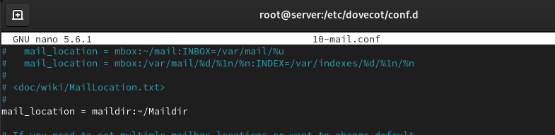{#fig:001 width=50%}

## Настройка dovecot

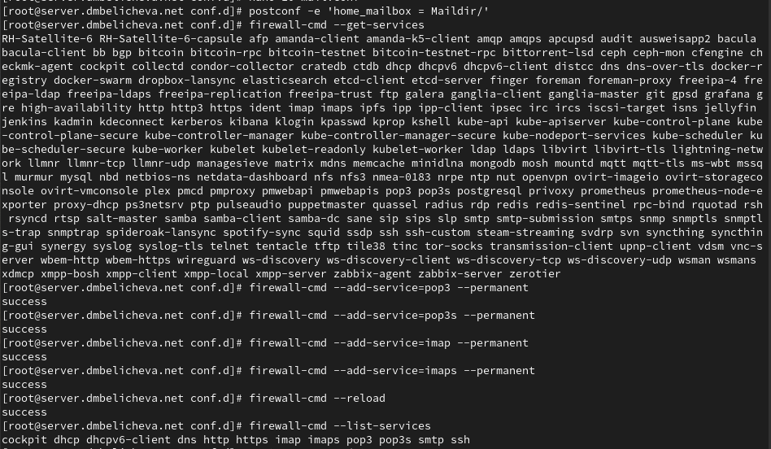{#fig:001 width=70%}

## Настройка dovecot

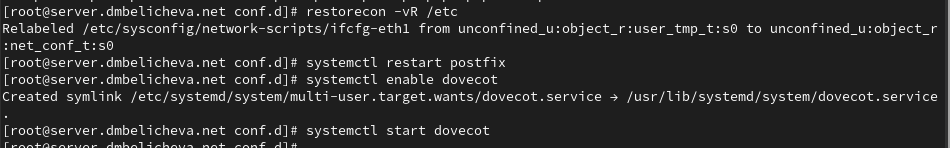{#fig:001 width=70%}

## Проверка работы Dovecot

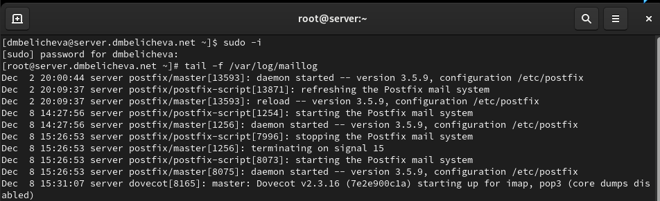{#fig:001 width=70%}

## Проверка работы Dovecot

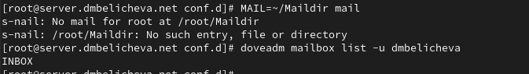{#fig:001 width=70%}

## Проверка работы Dovecot

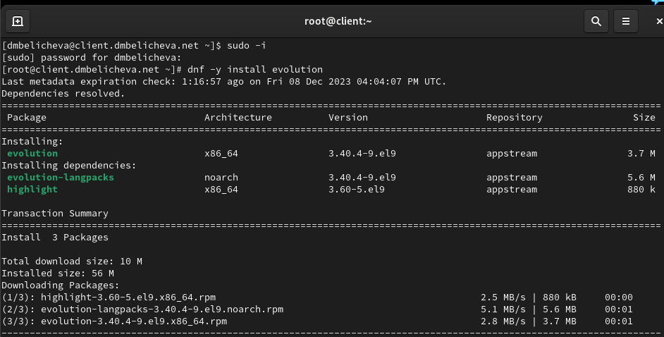{#fig:001 width=70%}

## Проверка работы Dovecot

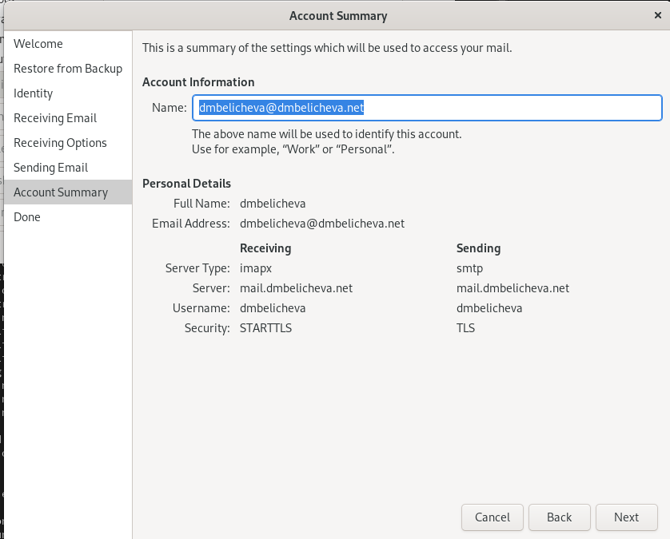{#fig:001 width=50%}

## Проверка работы Dovecot

Из почтового клиента отправим себе несколько тестовых писем.

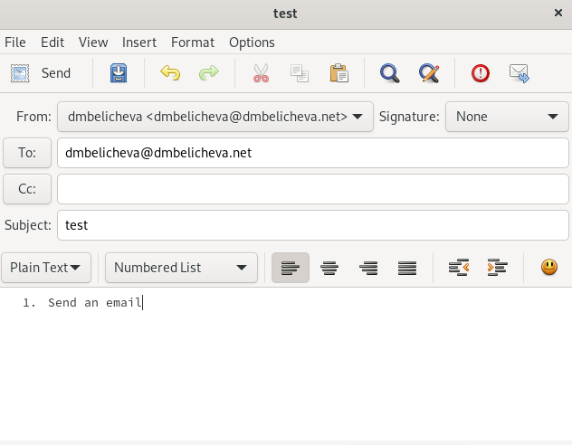{#fig:001 width=50%}

## Проверка работы Dovecot

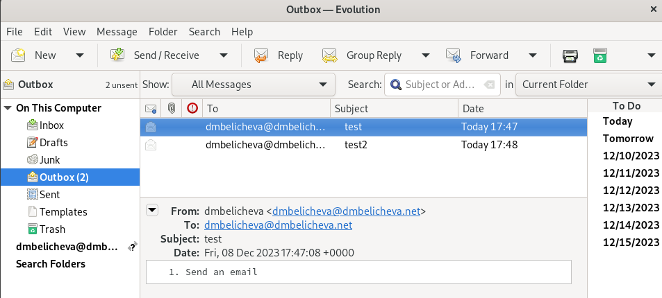{#fig:001 width=70%}

## Проверка работы Dovecot

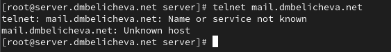{#fig:001 width=70%}

## Внесение изменений в настройки внутреннего окружения виртуальной машины

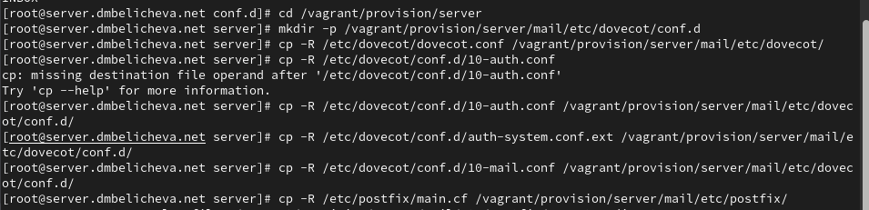{#fig:001 width=70%}

## Внесение изменений в настройки внутреннего окружения виртуальной машины

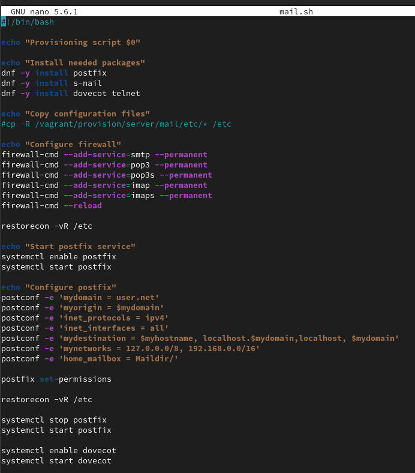{#fig:001 width=50%}

## Внесение изменений в настройки внутреннего окружения виртуальной машины

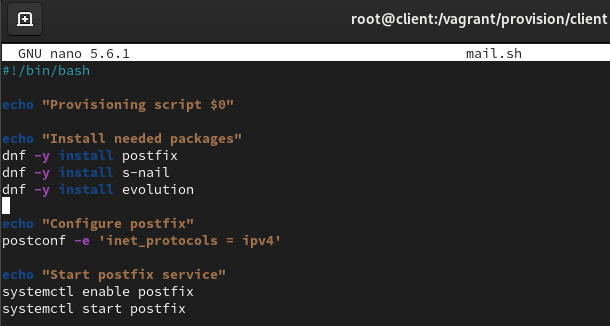{#fig:001 width=70%}

## Выводы

В процессе выполнения данной лабораторной работы я приобрела практические навыки по установке и простейшему конфигурированию POP3/IMAP-сервера.
