---
## Front matter
title: "Лабораторная работа №9"
subtitle: "Настройка POP3/IMAP сервера"
author: "Беличева Дарья Михайловна"

## Generic otions
lang: ru-RU
toc-title: "Содержание"

## Bibliography
bibliography: bib/cite.bib
csl: pandoc/csl/gost-r-7-0-5-2008-numeric.csl

## Pdf output format
toc: true # Table of contents
toc-depth: 2
lof: true # List of figures
lot: false # List of tables
fontsize: 12pt
linestretch: 1.5
papersize: a4
documentclass: scrreprt
## I18n polyglossia
polyglossia-lang:
  name: russian
  options:
	- spelling=modern
	- babelshorthands=true
polyglossia-otherlangs:
  name: english
## I18n babel
babel-lang: russian
babel-otherlangs: english
## Fonts
mainfont: PT Serif
romanfont: PT Serif
sansfont: PT Sans
monofont: PT Mono
mainfontoptions: Ligatures=TeX
romanfontoptions: Ligatures=TeX
sansfontoptions: Ligatures=TeX,Scale=MatchLowercase
monofontoptions: Scale=MatchLowercase,Scale=0.9
## Biblatex
biblatex: true
biblio-style: "gost-numeric"
biblatexoptions:
  - parentracker=true
  - backend=biber
  - hyperref=auto
  - language=auto
  - autolang=other*
  - citestyle=gost-numeric
## Pandoc-crossref LaTeX customization
figureTitle: "Рис."
tableTitle: "Таблица"
listingTitle: "Листинг"
lofTitle: "Список иллюстраций"
lotTitle: "Список таблиц"
lolTitle: "Листинги"
## Misc options
indent: true
header-includes:
  - \usepackage{indentfirst}
  - \usepackage{float} # keep figures where there are in the text
  - \floatplacement{figure}{H} # keep figures where there are in the text
---

# Цель работы

Приобрести практические навыки по установке и простейшему конфигурированию POP3/IMAP-сервера.

# Задание

1. Установить на виртуальной машине server Dovecot и Telnet для дальнейшей проверки
корректности работы почтового сервера.

2. Настроить Dovecot.

3. Установить на виртуальной машине client программу для чтения почты Evolution
и настройте её для манипуляций с почтой вашего пользователя. Проверить корректность работы почтового сервера как с виртуальной машины server, так и с виртуальной машины client.

4. Изменить скрипт для Vagrant, фиксирующий действия по установке и настройке Postfix
и Dovecote во внутреннем окружении виртуальной машины server, создать скрипт
для Vagrant, фиксирующий действия по установке Evolution во внутреннем окружении виртуальной машины client. Соответствующим образом внести изменения в Vagrantfile.

# Выполнение лабораторной работы

## Установка Dovecot

На виртуальной машине server войдем под своим пользователем и откроем терминал. Перейдем в режим суперпользователя: `sudo -i`

Установим необходимые для работы пакеты:

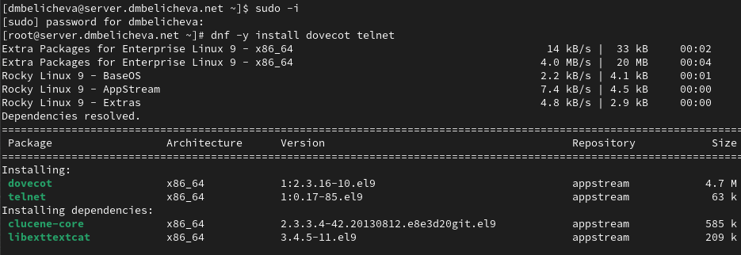{#fig:001 width=70%}

## Настройка dovecot

В конфигурационном файле /etc/dovecot/dovecot.conf пропишем список почтовых протоколов, по которым разрешено работать Dovecot: `protocols = imap pop3`

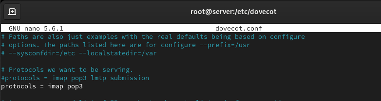{#fig:001 width=70%}

В конфигурационном файле /etc/dovecot/conf.d/10-auth.conf укажем метод аутентификации plain: `auth_mechanisms = plain`

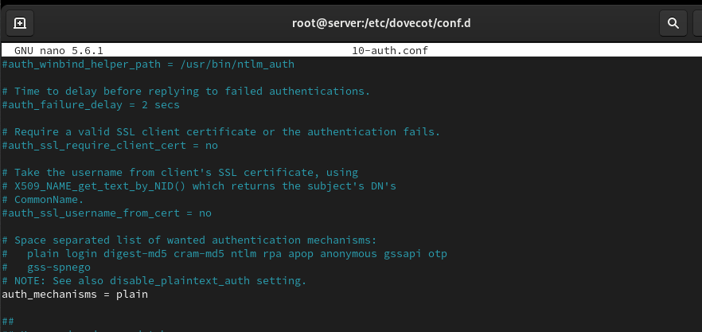{#fig:001 width=70%}

В конфигурационном файле /etc/dovecot/conf.d/auth-system.conf.ext проверим, что для поиска пользователей и их паролей используется pam и файл passwd:

```
passdb {
driver = pam
}
userdb {
driver = passwd
}
```

В конфигурационном файле /etc/dovecot/conf.d/10-mail.conf настроим месторасположение почтовых ящиков пользователей: `mail_location = maildir:~/Maildir`

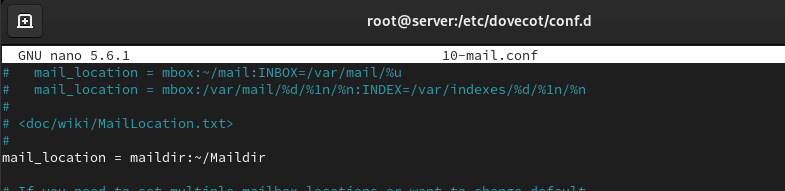{#fig:001 width=70%}

В Postfix зададим каталог для доставки почты: `postconf -e 'home_mailbox = Maildir/'`

Сконфигурируtv межсетевой экран, разрешив работать службам протоколов POP3
и IMAP:

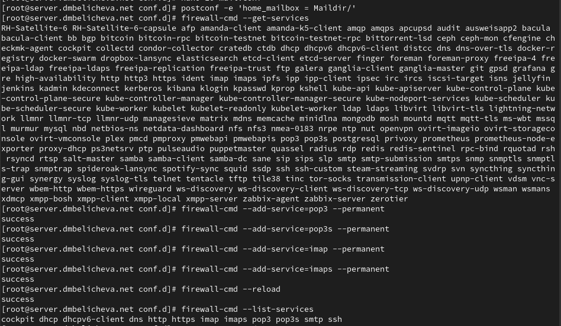{#fig:001 width=70%}

Восстановим контекст безопасности в SELinux: `restorecon -vR /etc`

Перезапустим Postfix и запустим Dovecot:

```
systemctl restart postfix
systemctl enable dovecot
systemctl start dovecot
```

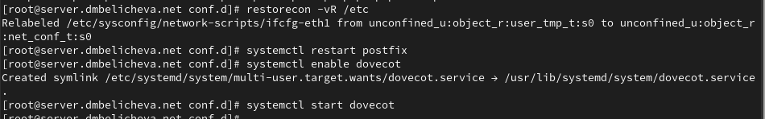{#fig:001 width=70%}

## Проверка работы Dovecot

На дополнительном терминале виртуальной машины server запустим мониторинг
работы почтовой службы: `tail -f /var/log/maillog`

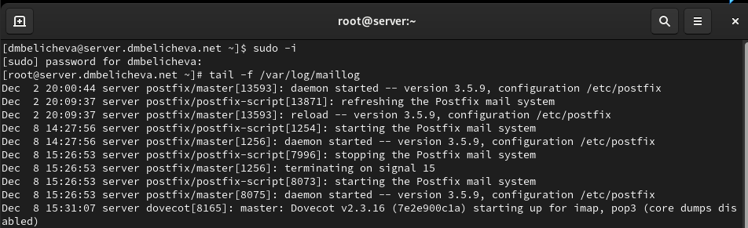{#fig:001 width=70%}

На терминале сервера для просмотра имеющейся почты используем: `MAIL=~/Maildir mail`

Для просмотра mailbox пользователя на сервере используем:
`doveadm mailbox list -u dmbelicheva`

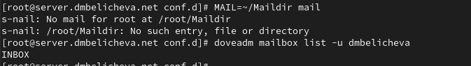{#fig:001 width=70%}

На виртуальной машине client войдем под своим пользователем и откроем терминал. Перейдем в режим суперпользователя: `sudo -i`

Установим почтовый клиент: `dnf -y install evolution`

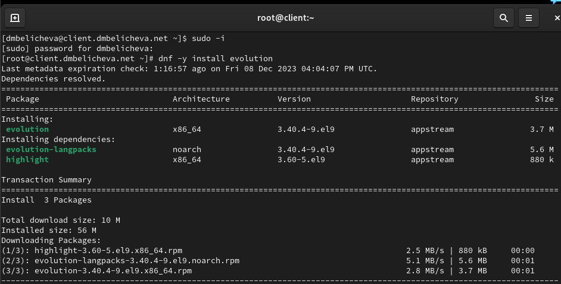{#fig:001 width=70%}

Запустим и настроим почтовый клиент Evolution:

- в окне настройки учётной записи почты укажем имя, адрес почты в виде
dmbelicheva@dmbelicheva.net;

- в качестве IMAP-сервера для входящих сообщений и SMTP-сервера для исходящих
сообщений пропишим mail.dmbelicheva.net, в качестве пользователя для входящих
и исходящих сообщений укажите dmbelicheva;

- проверим номера портов: для IMAP — порт 143, для SMTP — порт 25;

- проверим настройки SSL и метода аутентификации: для IMAP— STARTTLS, аутентификация по обычному паролю, для SMTP — без аутентификации, аутентификация
— «Без аутентификации»;

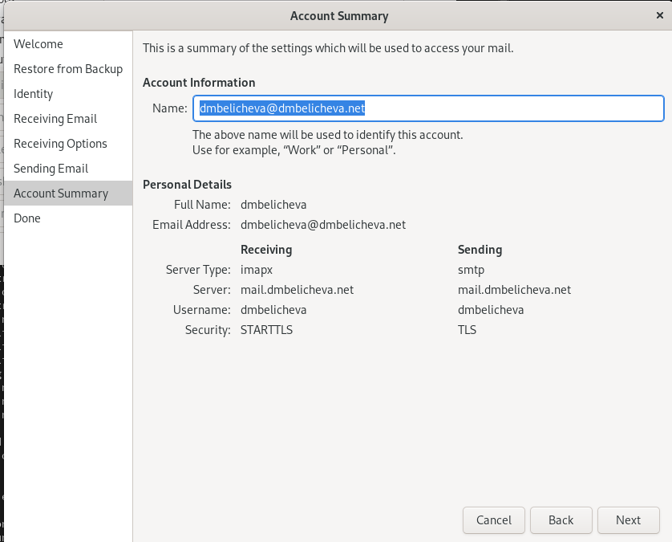{#fig:001 width=70%}

Из почтового клиента отправим себе несколько тестовых писем.

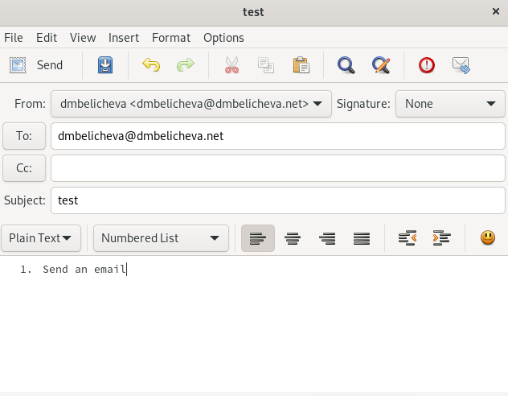{#fig:001 width=70%}

К сожалению, при отправке писем у меня возникла ошибка "error resolving mail.dmbelicheva.net name or service not known", поэтому письма уходят в outbox и все. В конфигурационных файлах вроде все в порядке, в файлаз dns-зон вроде тоже все нормально.

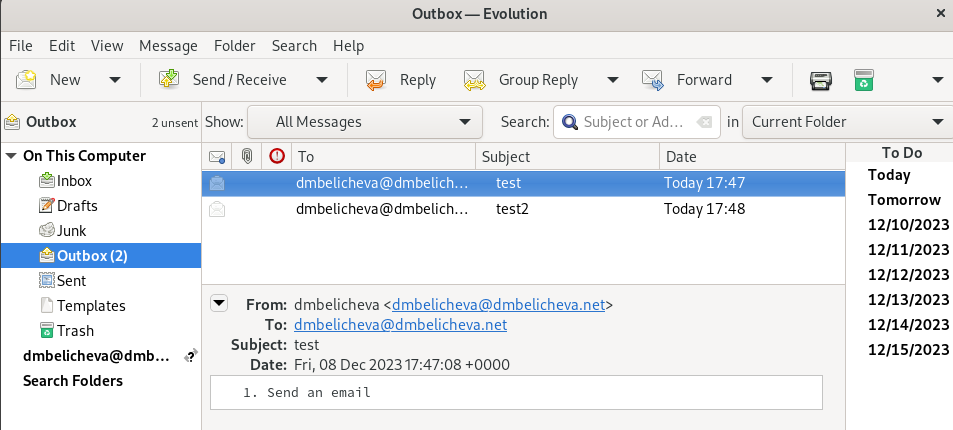{#fig:001 width=70%}

В мониторинге соответсвенно тоже ничего не появилось.

Проверим работу почтовой службы, используя на сервере протокол Telnet:

подключимся с помощью протокола Telnet к почтовому серверу по протоколу POP3
(через порт 110) `telnet mail.dmbelicheva.net 110`

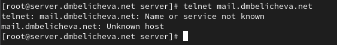{#fig:001 width=70%}

## Внесение изменений в настройки внутреннего окружения виртуальной машины

На виртуальной машине server перейдем в каталог для внесения изменений в настройки внутреннего окружения /vagrant/provision/server/. В соответствующие
подкаталоги поместим конфигурационные файлы Dovecot. Заменим конфигурационный файл Postfix:

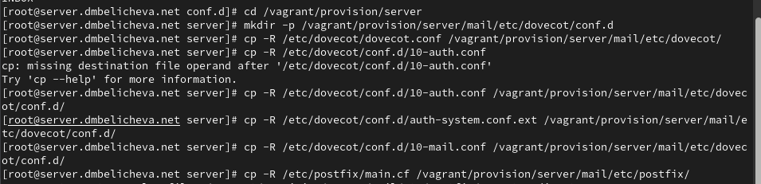{#fig:001 width=70%}

Внесем изменения в файл /vagrant/provision/server/mail.sh, добавив в него
строки:

- по установке Dovecot и Telnet;

- по настройке межсетевого экрана;

- по настройке Postfix в части задания месторасположения почтового ящика;

- по перезапуску Postfix и запуску Dovecot.

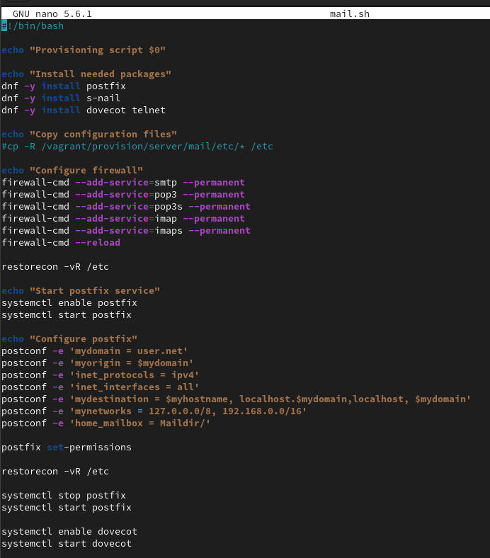{#fig:001 width=70%}

На виртуальной машине client в каталоге /vagrant/provision/client скорректируем файл mail.sh, прописав в нём: `dnf -y install evolution`

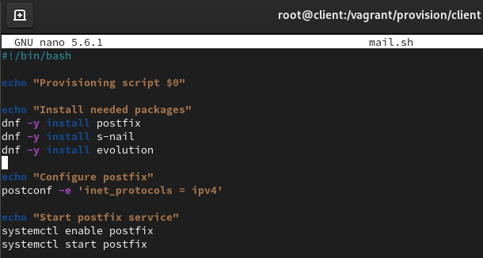{#fig:001 width=70%}

# Выводы

В процессе выполнения данной лабораторной работы я приобрела практические навыки по установке и простейшему конфигурированию POP3/IMAP-сервера.

# Контрольные вопросы

1. За что отвечает протокол SMTP?

Это сетевой протокол, который отвечает за отправление писем

2. За что отвечает протокол IMAP?

Он дает возможность почтовому клиенту получить доступ к сообщениям, хранящимся на почтовом сервере. 

3. За что отвечает протокол POP3?

Стандартный интернет-протокол прикладного уровня, используемый клиентами электронной почты для получения почты с удалённого сервера по TCP-соединению.

4. В чём назначение Dovecot?

Основная задача Dovecot – функционировать в качестве сервера для хранения электронной почты. Электронные письма доставляются на сервер с помощью агента доставки почты (MDA) и сохраняются для дальнейшего использования на сервере с помощью почтового клиента.

5. В каких файлах обычно находятся настройки работы Dovecot? За что отвечает каждый
из файлов?

Конфигурация Dovecot располагается в файле /etc/dovecot/dovecot.conf и в
файлах каталога /etc/dovecot/conf.d. Файл сертификатов безопасности Dovecot
располагается в каталоге /etc/pki/dovecot.

6. В чём назначение Postfix?

Postfix - это почтовый агент (MTA), используемый для маршрутизации и доставки электронной почты.

7. Какие методы аутентификации пользователей можно использовать в Dovecot и в чём
их отличие?

В Dovecot можно использовать методы аутентификации, такие как Plain, CRAMMD5, Digest-MD5, NTLM и другие.