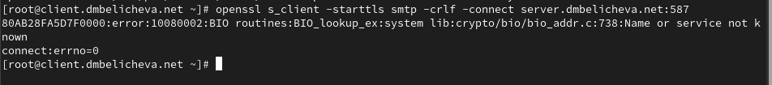

---
## Front matter
lang: ru-RU
title: Лабораторная работа №10
subtitle: Расширенные настройки SMTP-сервера
author:
  - Беличева Д.М.
institute:
  - Российский университет дружбы народов, Москва, Россия


## i18n babel
babel-lang: russian
babel-otherlangs: english

## Formatting pdf
toc: false
toc-title: Содержание
slide_level: 2
aspectratio: 169
section-titles: true
theme: metropolis
header-includes:
 - \metroset{progressbar=frametitle,sectionpage=progressbar,numbering=fraction}
 - '\makeatletter'
 - '\beamer@ignorenonframefalse'
 - '\makeatother'
---


## Цель работы

Приобрести практические навыки по конфигурированию SMTP-сервера в части настройки аутентификации.

## Задание

1. Настроить Dovecot для работы с LMTP.

2. Настроить аутентификацию посредством SASL на SMTP-сервере.

3. Настроить работу SMTP-сервера поверх TLS.

4. Скорректировать скрипт для Vagrant, фиксирующий действия расширенной настройки
SMTP-сервера во внутреннем окружении виртуальной машины server.


# Выполнение лабораторной работы

## Настройка LMTP в Dovecote

{#fig:001 width=70%}

## Настройка LMTP в Dovecote

{#fig:001 width=70%}

## Настройка LMTP в Dovecote

{#fig:001 width=70%}

## Настройка LMTP в Dovecote

Переопределим в Postfix с помощью postconf передачу сообщений не на прямую,
а через заданный unix-сокет:
`postconf -e 'mailbox_transport = lmtp:unix:private/dovecot-lmtp'`

## Настройка LMTP в Dovecote

В файле /etc/dovecot/conf.d/10-auth.conf зададим формат имени пользователя для аутентификации в форме логина пользователя без указания домена:
`auth_username_format = %Ln`

{#fig:001 width=60%}

## Настройка LMTP в Dovecote

Перезапустим Postfix и Dovecot.

Из-под учётной записи своего пользователя отправим письмо с клиента:
`echo .| mail -s "LMTP test" dmbelicheva@dmbelicheva.net`

На сервере просмотрим почтовый ящик пользователя:
`MAIL=~/Maildir/ mail`

Там оказалось пусто, потому что письмо не было доставлено в связи с какими-то проблемами. 

## Настройка SMTP-аутентификации

В файле /etc/dovecot/conf.d/10-master.conf определим службу аутентификации пользователей:

{#fig:001 width=70%}

## Настройка SMTP-аутентификации

{#fig:001 width=70%}

## Настройка SMTP-аутентификации

{#fig:001 width=70%}

## Настройка SMTP-аутентификации

Перезапустим Postfix и Dovecot:

```
systemctl restart postfix
systemctl restart dovecot
```

## Настройка SMTP-аутентификации

На клиенте установим telnet: `dnf -y install telnet`

На клиенте получим строку для аутентификации, вместо username указав логин
вашего пользователя, а вместо password указав пароль этого пользователя:
`printf 'username\x00username\x00password' | base64`

Подключимся на клиенте к SMTP-серверу посредством telnet:
`telnet server.dmbelicheva.net 25`

## Настройка SMTP-аутентификации

{#fig:001 width=70%}


## Настройка SMTP over TLS

{#fig:001 width=70%}

## Настройка SMTP over TLS

{#fig:001 width=70%}

## Настройка SMTP over TLS

Настроим межсетевой экран, разрешив работать службе smtp-submission:

{#fig:001 width=60%}

## Настройка SMTP over TLS

{#fig:001 width=70%}

## Внесение изменений в настройки внутреннего окружения виртуальной машины

{#fig:001 width=70%}

## Внесение изменений в настройки внутреннего окружения виртуальной машины

{#fig:001 width=50%}

## Внесение изменений в настройки внутреннего окружения виртуальной машины

{#fig:001 width=60%}

## Выводы

В процессе выполнения данной лабораторной работы я приобрела практические навыки по конфигурированию SMTP-сервера в части настройки аутентификации.
