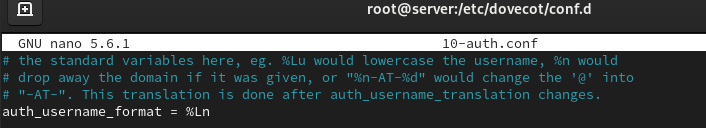

---
## Front matter
title: "Лабораторная работа № 10"
subtitle: "Расширенные настройки SMTP-сервера"
author: "Беличева Дарья Михайловна"

## Generic otions
lang: ru-RU
toc-title: "Содержание"

## Bibliography
bibliography: bib/cite.bib
csl: pandoc/csl/gost-r-7-0-5-2008-numeric.csl

## Pdf output format
toc: true # Table of contents
toc-depth: 2
lof: true # List of figures
lot: false # List of tables
fontsize: 12pt
linestretch: 1.5
papersize: a4
documentclass: scrreprt
## I18n polyglossia
polyglossia-lang:
  name: russian
  options:
	- spelling=modern
	- babelshorthands=true
polyglossia-otherlangs:
  name: english
## I18n babel
babel-lang: russian
babel-otherlangs: english
## Fonts
mainfont: PT Serif
romanfont: PT Serif
sansfont: PT Sans
monofont: PT Mono
mainfontoptions: Ligatures=TeX
romanfontoptions: Ligatures=TeX
sansfontoptions: Ligatures=TeX,Scale=MatchLowercase
monofontoptions: Scale=MatchLowercase,Scale=0.9
## Biblatex
biblatex: true
biblio-style: "gost-numeric"
biblatexoptions:
  - parentracker=true
  - backend=biber
  - hyperref=auto
  - language=auto
  - autolang=other*
  - citestyle=gost-numeric
## Pandoc-crossref LaTeX customization
figureTitle: "Рис."
tableTitle: "Таблица"
listingTitle: "Листинг"
lofTitle: "Список иллюстраций"
lotTitle: "Список таблиц"
lolTitle: "Листинги"
## Misc options
indent: true
header-includes:
  - \usepackage{indentfirst}
  - \usepackage{float} # keep figures where there are in the text
  - \floatplacement{figure}{H} # keep figures where there are in the text
---

# Цель работы

Приобрести практические навыки по конфигурированию SMTP-сервера в части настройки аутентификации.

# Задание

1. Настроить Dovecot для работы с LMTP.

2. Настроить аутентификацию посредством SASL на SMTP-сервере.

3. Настроить работу SMTP-сервера поверх TLS.

4. Скорректировать скрипт для Vagrant, фиксирующий действия расширенной настройки
SMTP-сервера во внутреннем окружении виртуальной машины server.


# Выполнение лабораторной работы

## Настройка LMTP в Dovecote

На виртуальной машине server войдем под своим пользователем и откроем терминал. Перейдем в режим суперпользователя: `sudo -i`
  
В дополнительном терминале запустим мониторинг работы почтовой службы: `tail -f /var/log/maillog`

{#fig:001 width=70%}

Добавим в список протоколов, с которыми может работать Dovecot, протокол LMTP.
Для этого в файле /etc/dovecot/dovecot.conf укажем `protocols = imap pop3 lmtp`

{#fig:001 width=70%}

Настроим в Dovecot сервис lmtp для связи с Postfix. Для этого в файле
/etc/dovecot/conf.d/10-master.conf заменим определение сервиса lmtp на
следующую запись:

```
service lmtp {
unix_listener /var/spool/postfix/private/dovecot-lmtp {
group = postfix
user = postfix
mode = 0600
}
}
```

{#fig:001 width=70%}

Переопределим в Postfix с помощью postconf передачу сообщений не на прямую,
а через заданный unix-сокет:
`postconf -e 'mailbox_transport = lmtp:unix:private/dovecot-lmtp'`

В файле /etc/dovecot/conf.d/10-auth.conf зададим формат имени пользователя для аутентификации в форме логина пользователя без указания домена:
`auth_username_format = %Ln`

{#fig:001 width=70%}

Перезапустим Postfix и Dovecot.

Из-под учётной записи своего пользователя отправим письмо с клиента:
`echo .| mail -s "LMTP test" dmbelicheva@dmbelicheva.net`

На сервере просмотрим почтовый ящик пользователя:
`MAIL=~/Maildir/ mail`

Там оказалось пусто, потому что письмо не было доставлено в связи с какими-то проблемами. 

## Настройка SMTP-аутентификации

В файле /etc/dovecot/conf.d/10-master.conf определим службу аутентификации пользователей:

{#fig:001 width=70%}

Для Postfix зададим тип аутентификации SASL для smtpd и путь к соответствующему unix-сокету:

```
postconf -e 'smtpd_sasl_type = dovecot'
postconf -e 'smtpd_sasl_path = private/auth'
```

Настроим Postfix для приёма почты из Интернета только для обслуживаемых нашим
сервером пользователей или для произвольных пользователей локальной машины
(имеется в виду локальных пользователей сервера), обеспечивая тем самым запрет на
использование почтового сервера в качестве SMTP relay для спам-рассылок (порядок
указания опций имеет значение):

```
postconf -e 'smtpd_recipient_restrictions =
reject_unknown_recipient_domain,
permit_mynetworks, reject_non_fqdn_recipient, 
reject_unauth_destination,reject_unverified_recipient, permit'
```

В настройках Postfix ограничем приём почты только локальным адресом SMTP-сервера сети:
`postconf -e 'mynetworks = 127.0.0.0/8'`

{#fig:001 width=70%}

Для проверки работы аутентификации временно запустим SMTP-сервер
(порт 25) с возможностью аутентификации. Для этого необходимо в файле
/etc/postfix/master.cf изменим строки

{#fig:001 width=70%}

Перезапустим Postfix и Dovecot:

```
systemctl restart postfix
systemctl restart dovecot
```

На клиенте установим telnet: `dnf -y install telnet`

На клиенте получим строку для аутентификации, вместо username указав логин
вашего пользователя, а вместо password указав пароль этого пользователя:
`printf 'username\x00username\x00password' | base64`

Подключимся на клиенте к SMTP-серверу посредством telnet:
`telnet server.dmbelicheva.net 25`

{#fig:001 width=70%}

Подключение не удалось.

## Настройка SMTP over TLS

Настроим на сервере TLS, воспользовавшись временным сертификатом Dovecot.
Предварительно скопируем необходимые файлы сертификата и ключа из каталога /etc/pki/dovecot в каталог /etc/pki/tls/ в соответствующие подкаталоги
(чтобы не было проблем с SELinux):

```
cp /etc/pki/dovecot/certs/dovecot.pem /etc/pki/tls/certs
cp /etc/pki/dovecot/private/dovecot.pem /etc/pki/tls/private
```

Сконфигурируем Postfix, указав пути к сертификату и ключу, а также к каталогу для
хранения TLS-сессий и уровень безопасности:

```
postconf -e 'smtpd_tls_cert_file=/etc/pki/tls/certs/dovecot.pem'
postconf -e 'smtpd_tls_key_file=/etc/pki/tls/private/dovecot.pem'
postconf -e 'smtpd_tls_session_cache_database = btree:/var/lib/postfix/smtpd_scache'
postconf -e 'smtpd_tls_security_level = may'
postconf -e 'smtp_tls_security_level = may'
```

{#fig:001 width=70%}

Для того чтобы запустить SMTP-сервер на 587-м порту, в файле
/etc/postfix/master.cf изменим строки

{#fig:001 width=70%}

Настроим межсетевой экран, разрешив работать службе smtp-submission:

{#fig:001 width=70%}

Перезапустим Postfix: `systemctl restart postfix`

На клиенте подключимся к SMTP-серверу через 587-й порт посредством openssl:
`openssl s_client -starttls smtp -crlf -connect server.dmbelicheva.net:587`

{#fig:001 width=70%}

Подключение не удалось.

## Внесение изменений в настройки внутреннего окружения виртуальной машины

На виртуальной машине server перейдем в каталог для внесения изменений
в настройки внутреннего окружения /vagrant/provision/server/. В соответствующие подкаталоги поместим конфигурационные файлы Dovecot и Postfix:

{#fig:001 width=70%}

Внесем соответствующие изменения по расширенной конфигурации SMTP-сервера в файл /vagrant/provision/server/mail.sh:

{#fig:001 width=70%}

Внесем изменения в файл /vagrant/provision/client/mail.sh, добавив установку telnet.

{#fig:001 width=70%}

# Выводы

В процессе выполнения данной лабораторной работы я приобрела практические навыки по конфигурированию SMTP-сервера в части настройки аутентификации.

# Контрольные вопросы

1. Приведите пример задания формата аутентификации пользователя в Dovecot в форме
логина с указанием домена.

`auth_username_format = %Lu%d`

2. Какие функции выполняет почтовый Relay-сервер?

обеспечивает приём сообщения, временное хранение (часто не больше нескольких минут в случае мгновенных сообщений, до недели в случае электронной почты), пересылку сообщения узлу-получателю (или следующему релею)

3. Какие угрозы безопасности могут возникнуть в случае настройки почтового сервера
как Relay-сервера?

спам, перехват и изменение электронных сообщений.