---
## Front matter
lang: ru-RU
title: Лабораторная работа №11
subtitle: Настройка безопасного удалённого доступа по протоколу SSH
author:
  - Беличева Дарья Михайловна
institute:
  - Российский университет дружбы народов, Москва, Россия

## i18n babel
babel-lang: russian
babel-otherlangs: english

## Formatting pdf
toc: false
toc-title: Содержание
slide_level: 2
aspectratio: 169
section-titles: true
theme: metropolis
header-includes:
 - \metroset{progressbar=frametitle,sectionpage=progressbar,numbering=fraction}
 - '\makeatletter'
 - '\beamer@ignorenonframefalse'
 - '\makeatother'
---

## Цель работы

Приобрести практические навыки по настройке удалённого доступа к серверу с помощью SSH.

## Задание

1. Настроить запрет удалённого доступа на сервер по SSH для пользователя root.

2. Настроить разрешение удалённого доступа к серверу по SSH только для пользователей
группы vagrant и вашего пользователя.

3. Настроить удалённый доступ к серверу по SSH через порт 2022.

4. Настроить удалённый доступ к серверу по SSH по ключу.

## Задание

5. Организовать SSH-туннель с клиента на сервер, перенаправив локальное соединение с TCP-порта 80 на порт 8080.

6. Используя удалённое SSH-соединение, выполнить с клиента несколько команд на сервере.

7. Используя удалённое SSH-соединение, запустить с клиента графическое приложение на сервере.

8. Написать скрипт для Vagrant, фиксирующий действия по настройке SSH-сервера во
внутреннем окружении виртуальной машины server. Соответствующим образом
внести изменения в Vagrantfile.

# Выполнение лабораторной работы

## Запрет удалённого доступа по SSH для пользователя root

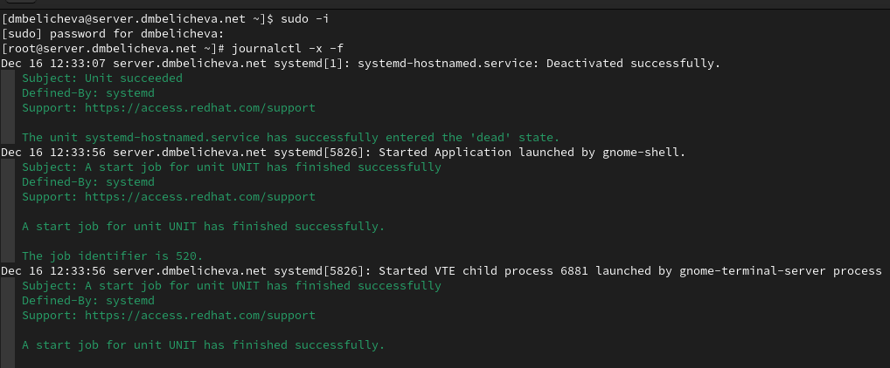{#fig:001 width=70%}

## Запрет удалённого доступа по SSH для пользователя root

С клиента попытаемся получить доступ к серверу посредством SSH-соединения через
пользователя root: `ssh root@server.dmbelicheva.net`

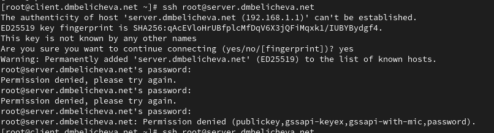{#fig:001 width=50%}

## Запрет удалённого доступа по SSH для пользователя root

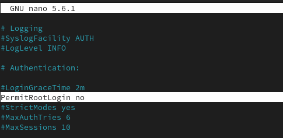{#fig:001 width=70%}

## Запрет удалённого доступа по SSH для пользователя root

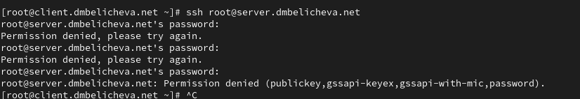{#fig:001 width=70%}

## Ограничение списка пользователей для удалённого доступа по SSH

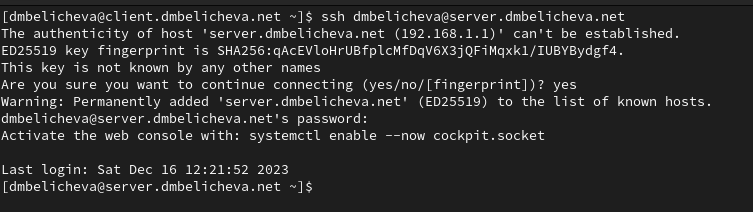{#fig:001 width=70%}

## Ограничение списка пользователей для удалённого доступа по SSH

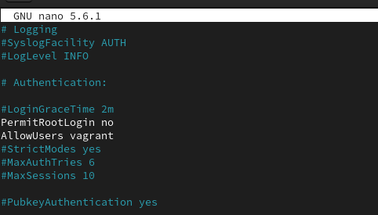{#fig:001 width=70%}

## Ограничение списка пользователей для удалённого доступа по SSH

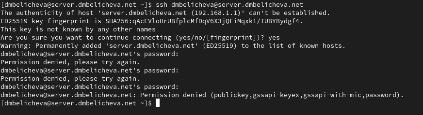{#fig:001 width=70%}

## Ограничение списка пользователей для удалённого доступа по SSH

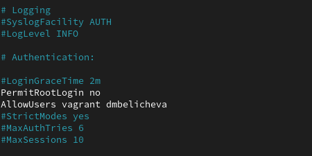{#fig:001 width=70%}

## Ограничение списка пользователей для удалённого доступа по SSH

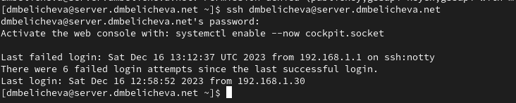{#fig:001 width=70%}


## Настройка дополнительных портов для удалённого доступа по SSH

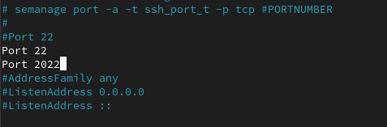{#fig:001 width=70%}

## Настройка дополнительных портов для удалённого доступа по SSH

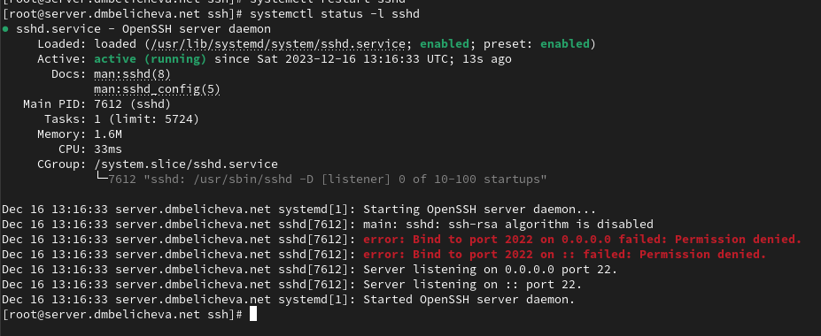{#fig:001 width=70%}

## Настройка дополнительных портов для удалённого доступа по SSH

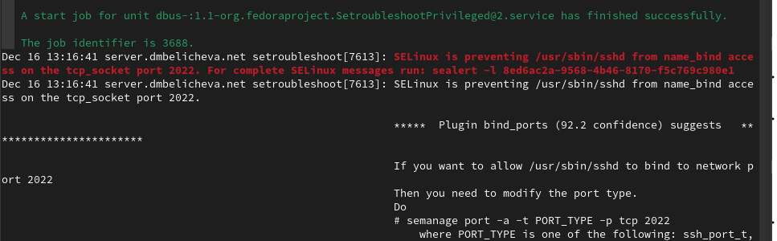{#fig:001 width=70%}

## Настройка дополнительных портов для удалённого доступа по SSH

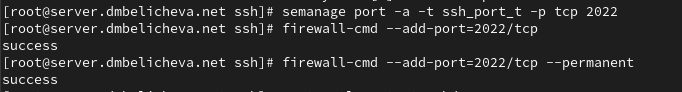{#fig:001 width=70%}

## Настройка дополнительных портов для удалённого доступа по SSH

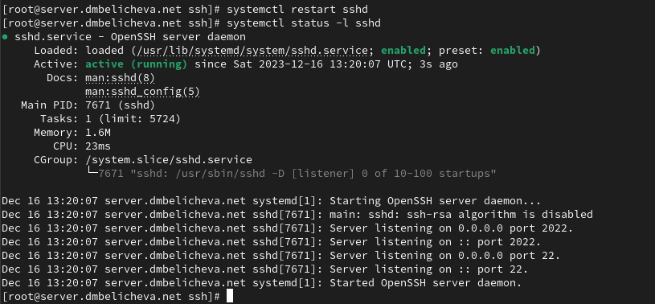{#fig:001 width=70%}

## Настройка дополнительных портов для удалённого доступа по SSH

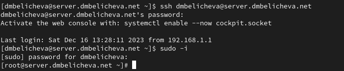{#fig:001 width=70%}

## Настройка дополнительных портов для удалённого доступа по SSH

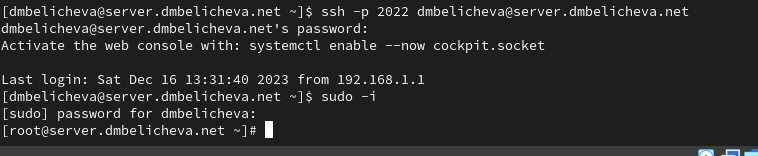{#fig:001 width=70%}

## Настройка удалённого доступа по SSH по ключу

В этом упражнении создадим пару из открытого и закрытого ключей для входа на
сервер.

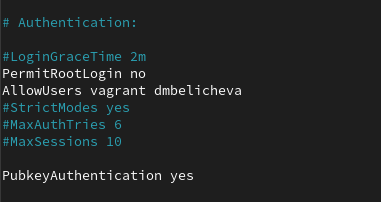{#fig:001 width=60%}

## Настройка удалённого доступа по SSH по ключу

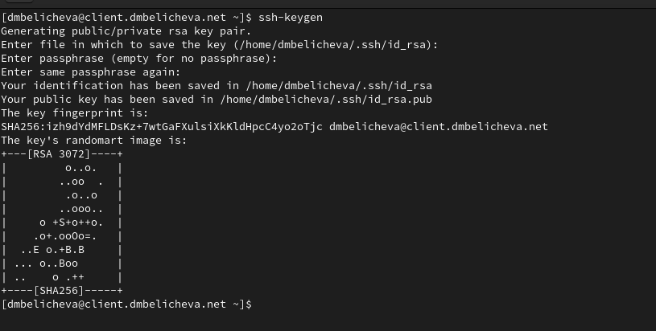{#fig:001 width=70%}

## Настройка удалённого доступа по SSH по ключу

{#fig:001 width=70%}

## Организация туннелей SSH, перенаправление TCP-портов

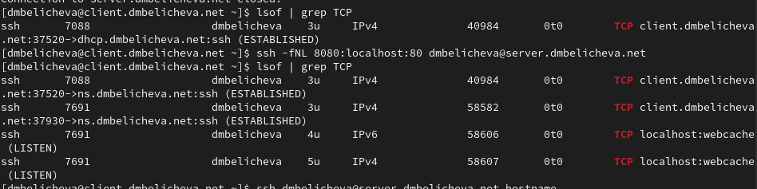{#fig:001 width=70%}

На клиенте запустим браузер и в адресной строке введем localhost:8080. Убедимся, что отобразится страница с приветствием «Welcome to the server.dmbelicheva.net server».

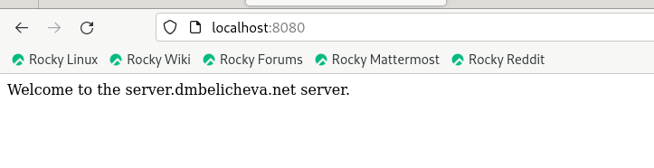{#fig:001 width=70%}

## Запуск консольных приложений через SSH

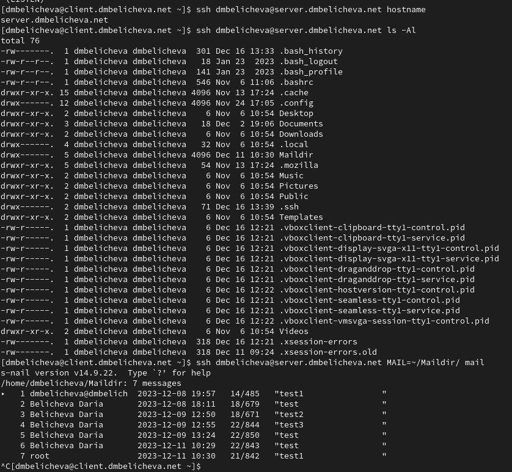{#fig:001 width=70%}

## Запуск графических приложений через SSH (X11Forwarding)

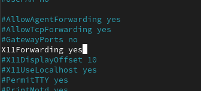{#fig:001 width=70%}

## Запуск графических приложений через SSH (X11Forwarding)

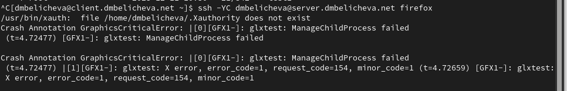{#fig:001 width=70%}

## Запуск графических приложений через SSH (X11Forwarding)

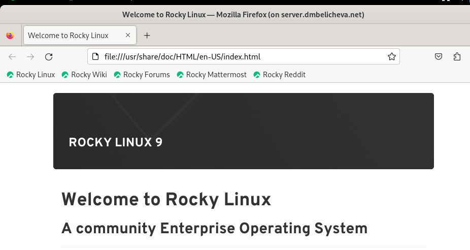{#fig:001 width=70%}

## Внесение изменений в настройки внутреннего окружения виртуальной машины

```
cd /vagrant/provision/server
mkdir -p /vagrant/provision/server/ssh/etc/ssh
cp -R /etc/ssh/sshd_config /vagrant/provision/server/ssh/etc/ssh/
```

## Внесение изменений в настройки внутреннего окружения виртуальной машины

```
cd /vagrant/provision/server
touch ssh.sh
chmod +x ssh.sh
```

## Внесение изменений в настройки внутреннего окружения виртуальной машины

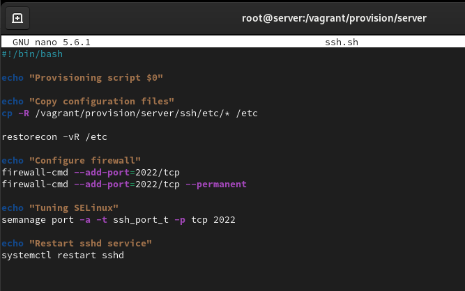{#fig:001 width=70%}

## Внесение изменений в настройки внутреннего окружения виртуальной машины

```
server.vm.provision "server ssh",
  type: "shell",
  preserve_order: true,
  path: "provision/server/ssh.sh"
```

## Выводы

В процессе выполнения данной лабораторной работы я приобрела практические навыки по настройке удалённого доступа к серверу с помощью SSH.
