---
## Front matter
title: "Лабораторная работа №11"
subtitle: "Настройка безопасного удалённого доступа по протоколу SSH"
author: "Беличева Дарья Михайловна"

## Generic otions
lang: ru-RU
toc-title: "Содержание"

## Bibliography
bibliography: bib/cite.bib
csl: pandoc/csl/gost-r-7-0-5-2008-numeric.csl

## Pdf output format
toc: true # Table of contents
toc-depth: 2
lof: true # List of figures
lot: false # List of tables
fontsize: 12pt
linestretch: 1.5
papersize: a4
documentclass: scrreprt
## I18n polyglossia
polyglossia-lang:
  name: russian
  options:
	- spelling=modern
	- babelshorthands=true
polyglossia-otherlangs:
  name: english
## I18n babel
babel-lang: russian
babel-otherlangs: english
## Fonts
mainfont: PT Serif
romanfont: PT Serif
sansfont: PT Sans
monofont: PT Mono
mainfontoptions: Ligatures=TeX
romanfontoptions: Ligatures=TeX
sansfontoptions: Ligatures=TeX,Scale=MatchLowercase
monofontoptions: Scale=MatchLowercase,Scale=0.9
## Biblatex
biblatex: true
biblio-style: "gost-numeric"
biblatexoptions:
  - parentracker=true
  - backend=biber
  - hyperref=auto
  - language=auto
  - autolang=other*
  - citestyle=gost-numeric
## Pandoc-crossref LaTeX customization
figureTitle: "Рис."
tableTitle: "Таблица"
listingTitle: "Листинг"
lofTitle: "Список иллюстраций"
lotTitle: "Список таблиц"
lolTitle: "Листинги"
## Misc options
indent: true
header-includes:
  - \usepackage{indentfirst}
  - \usepackage{float} # keep figures where there are in the text
  - \floatplacement{figure}{H} # keep figures where there are in the text
---

# Цель работы

Приобрести практические навыки по настройке удалённого доступа к серверу с помощью SSH.

# Задание

1. Настроить запрет удалённого доступа на сервер по SSH для пользователя root.

2. Настроить разрешение удалённого доступа к серверу по SSH только для пользователей
группы vagrant и вашего пользователя.

3. Настроить удалённый доступ к серверу по SSH через порт 2022.

4. Настроить удалённый доступ к серверу по SSH по ключу.

5. Организовать SSH-туннель с клиента на сервер, перенаправив локальное соединение с TCP-порта 80 на порт 8080.

6. Используя удалённое SSH-соединение, выполнить с клиента несколько команд на сервере.

7. Используя удалённое SSH-соединение, запустить с клиента графическое приложение на сервере.

8. Написать скрипт для Vagrant, фиксирующий действия по настройке SSH-сервера во
внутреннем окружении виртуальной машины server. Соответствующим образом
внести изменения в Vagrantfile.

# Выполнение лабораторной работы

## Запрет удалённого доступа по SSH для пользователя root

На сервере зададим пароль для пользователя root, если этого не было сделано ранее:

```
sudo -i
passwd root
```

На сервере в дополнительном терминале запустим мониторинг системных событий:

```
sudo -i
journalctl -x -f
```

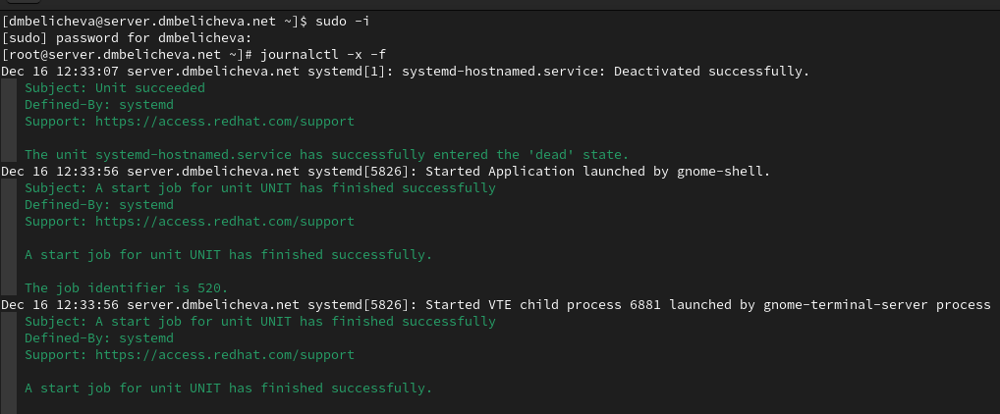{#fig:001 width=70%}

С клиента попытаемся получить доступ к серверу посредством SSH-соединения через
пользователя root: `ssh root@server.dmbelicheva.net`

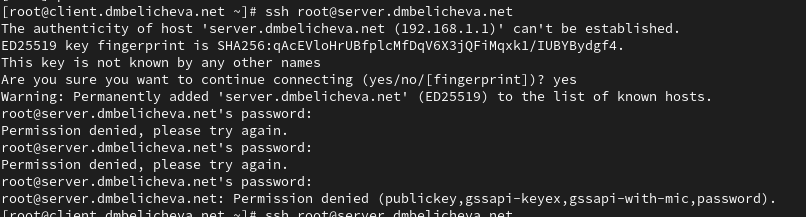{#fig:001 width=70%}

В доступе отказано.

На сервере откроем файл /etc/ssh/sshd_config конфигурации sshd для редактирования и запретим вход на сервер пользователю root, установив: `PermitRootLogin no`

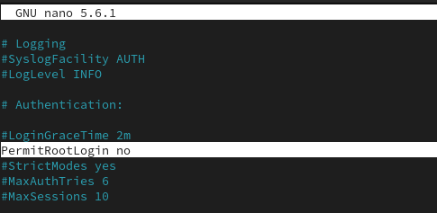{#fig:001 width=70%}

После сохранения изменений в файле конфигурации перезапустим sshd: `systemctl restart sshd`

Повторим попытку получения доступа с клиента к серверу посредством SSH-соединения через пользователя root: `ssh root@server.dmbelicheva.net`

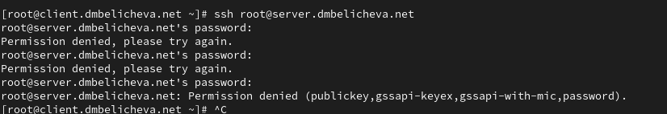{#fig:001 width=70%}

В доступе с клиента к серверу посредством SSH соединения через пользователя root отказано. Так и должно быть, ведь мызапретили вход на сервер пользователю root.

## Ограничение списка пользователей для удалённого доступа по SSH

С клиента попытаемся получить доступ к серверу посредством SSH-соединения через
пользователя dmbelicheva: `ssh dmbelicheva@server.dmbelicheva.net`

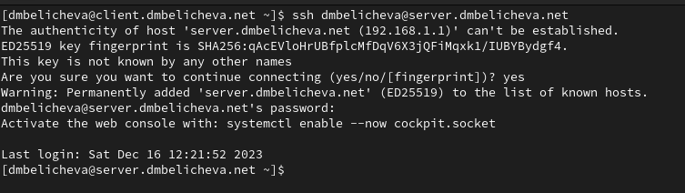{#fig:001 width=70%}

Соединение через пользователя dmbelicheva произошло успешно.

На сервере откроем файл /etc/ssh/sshd_config конфигурации sshd на редактирование и добавим строку `AllowUsers vagrant`

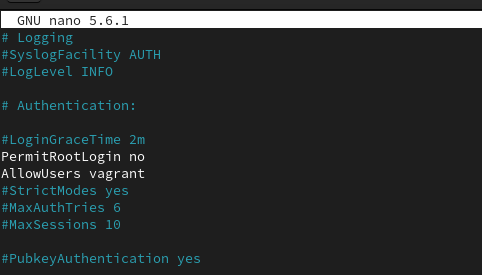{#fig:001 width=70%}

После сохранения изменений в файле конфигурации перезапустим sshd: `systemctl restart sshd`

Повторим попытку получения доступа с клиента к серверу посредством SSH-соединения через пользователя dmbelicheva: `ssh dmbelicheva@server.dmbelicheva.net`

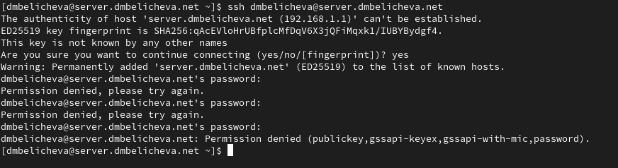{#fig:001 width=70%}

В доступе отказано.

В файле /etc/ssh/sshd_config конфигурации sshd внесем следующее изменение:
`AllowUsers vagrant dmbelicheva`

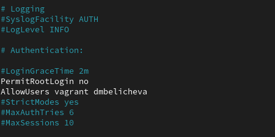{#fig:001 width=70%}

После сохранения изменений в файле конфигурации перезапустим sshd и вновь
попытаемся получить доступ с клиента к серверу посредством SSH-соединения через
пользователя user.

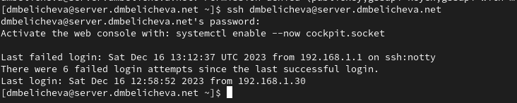{#fig:001 width=70%}

Теперь доступ успешно получен, поскольку мы разрешили пользователю dmbelicheva доступ к серверу посредством ssh.

## Настройка дополнительных портов для удалённого доступа по SSH

На сервере в файле конфигурации sshd /etc/ssh/sshd_config найдем строку Port
и ниже этой строки добавим:

```
Port 22
Port 2022
```

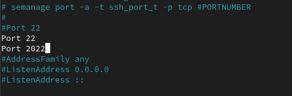{#fig:001 width=70%}

Эта запись сообщает процессу sshd о необходимости организации соединения через
два разных порта, что даёт гарантию возможности открыть сеансы SSH, даже если
была сделана ошибка в конфигурации.

После сохранения изменений в файле конфигурации перезапустим sshd:
`systemctl restart sshd`

Посмотрим расширенный статус работы sshd:
`systemctl status -l sshd`

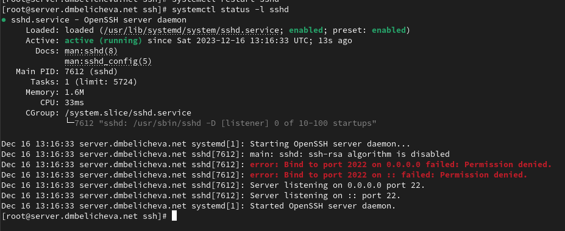{#fig:001 width=70%}

Система должна сообщить вам об отказе в работе sshd через порт 2022.Дополнительно
посмотрим сообщения в терминале с мониторингом системных событий.

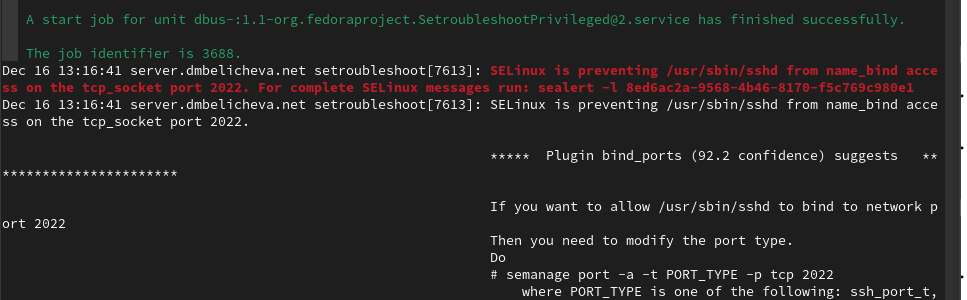{#fig:001 width=70%}

Видно, что отказ происходит из-за запрета SELinux на работу с этим портом.

Исправим на сервере метки SELinux к порту 2022:
`semanage port -a -t ssh_port_t -p tcp 2022`

В настройках межсетевого экрана откроем порт 2022 протокола TCP:

```
firewall-cmd --add-port=2022/tcp
firewall-cmd --add-port=2022/tcp --permanent
```

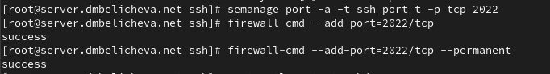{#fig:001 width=70%}

Вновь перезапустим sshd и посмотрим расширенный статус его работы. Статус
должен показать, что процесс sshd теперь прослушивает два порта.

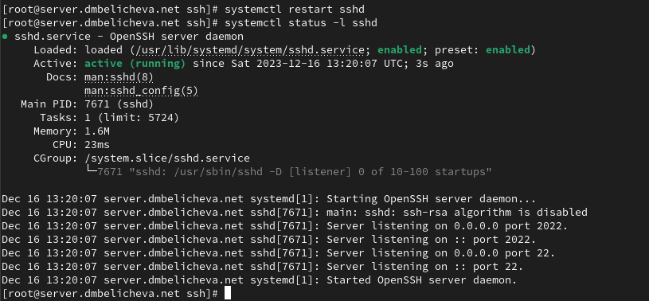{#fig:001 width=70%}

С клиента попытаемся получить доступ к серверу посредством SSH-соединения через
пользователя dmbelicheva: `ssh dmbelicheva@server.dmbelicheva.net`

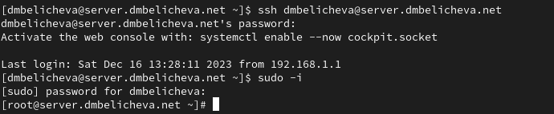{#fig:001 width=70%}

После открытия оболочки пользователя введем `sudo -i` для получения доступа
root.

Повторим попытку получения доступа с клиента к серверу посредством
SSH-соединения через пользователя user, указав порт 2022:
`ssh dmbelicheva@server.dmbelicheva.net`

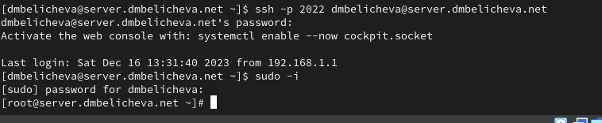{#fig:001 width=70%}

После открытия оболочки пользователя введем `sudo -i` для получения доступа
root.

## Настройка удалённого доступа по SSH по ключу

В этом упражнении создадим пару из открытого и закрытого ключей для входа на
сервер.

На сервере в конфигурационном файле /etc/ssh/sshd_config зададим параметр,
разрешающий аутентификацию по ключу:
`PubkeyAuthentication yes`

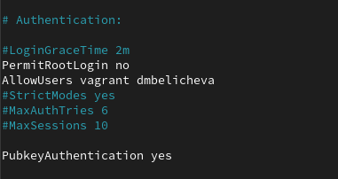{#fig:001 width=70%}

После сохранения изменений в файле конфигурации перезапустим sshd.

На клиенте сформируем SSH-ключ, введя в терминале под пользователем dmbelicheva:
`ssh-keygen`

Когда спросят, хотим ли мы использовать кодовую фразу, нажмем Enter, чтобы использовать установку без пароля. При запросе имени файла, в котором будет храниться
закрытый ключ, примем предлагаемое по умолчанию имя файла (~/.ssh/id_rsa).
Когда попросят ввести кодовую фразу, нажмем Enter дважды.

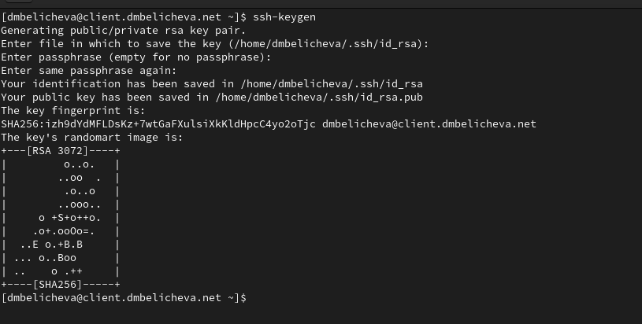{#fig:001 width=70%}

Закрытый ключ теперь будет записан в файл ~/.ssh/id_rsa, а открытый ключ записывается в файл ~/.ssh/id_rsa.pub.

Скопируем открытый ключ на сервер, введя на клиенте: `ssh-copy-id dmbelicheva@server.dmbelicheva.net`

При запросе введем пароль пользователя на удалённом сервере.

Попробуем получить доступ с клиента к серверу посредством SSH-соединения: `ssh dmbelicheva@server.dmbelicheva.net`

{#fig:001 width=70%}

Теперь пройдем аутентификацию без ввода пароля для учётной записи удалённого пользователя.

## Организация туннелей SSH, перенаправление TCP-портов

На клиенте посмотрим, запущены ли какие-то службы с протоколом TCP:
`lsof | grep TCP`

Перенаправим порт 80 на server.dmbelicheva.net на порт 8080 на локальной машине:
`ssh -fNL 8080:localhost:80 dmbelicheva@server.dmbelicheva.net`

Вновь на клиенте посмотрим, запущены ли какие-то службы с протоколом TCP:
`lsof | grep TCP`

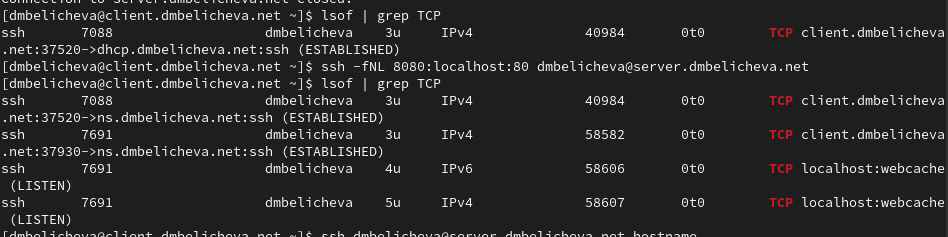{#fig:001 width=70%}

На клиенте запустим браузер и в адресной строке введем localhost:8080. Убедимся, что отобразится страница с приветствием «Welcome to the server.dmbelicheva.net server».

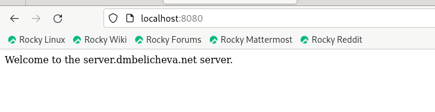{#fig:001 width=70%}

## Запуск консольных приложений через SSH

На клиенте откройте терминал под пользователем dmbelicheva.
Посмотрите с клиента имя узла сервера:
`ssh dmbelicheva@server.dmbelicheva.net hostname`

Посмотрите с клиента список файлов на сервере:
`ssh dmbelicheva@server.dmbelicheva.net ls -Al`

Посмотрите с клиента почту на сервере:
`ssh dmbelicheva@server.dmbelicheva.net MAIL=~/Maildir/ mail`

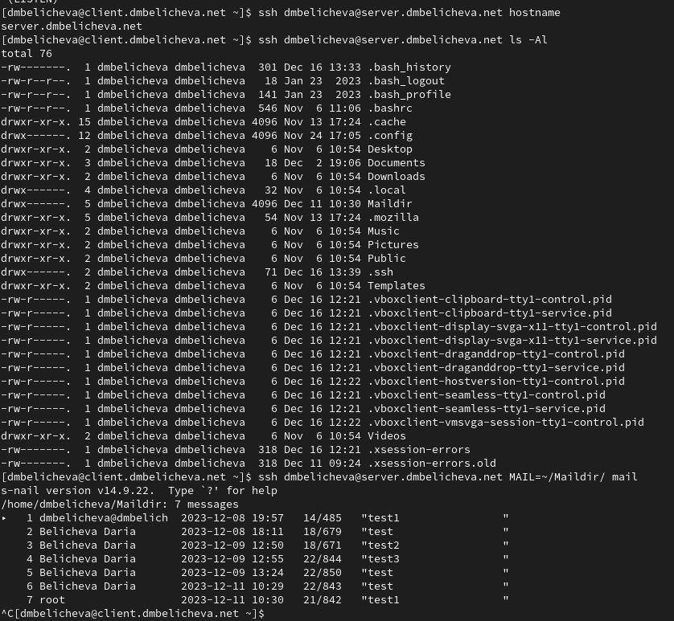{#fig:001 width=70%}

## Запуск графических приложений через SSH (X11Forwarding)

На сервере в конфигурационном файле /etc/ssh/sshd_config разрешим отображать на локальном клиентском компьютере графические интерфейсы X11:
`X11Forwarding yes`

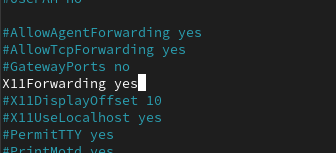{#fig:001 width=70%}

После сохранения изменения в конфигурационном файле перезапустим sshd.
Попробуем с клиента удалённо подключиться к серверу и запустить графическое
приложение, например firefox:
`ssh -YC user@server.dmbelicheva.net firefox`

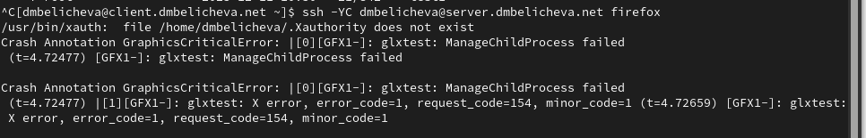{#fig:001 width=70%}

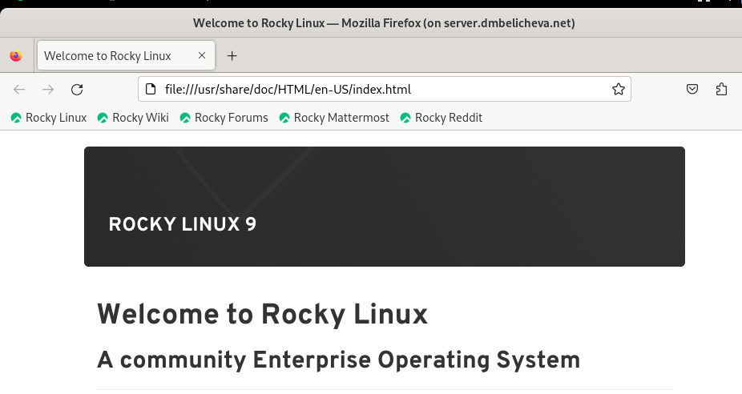{#fig:001 width=70%}

## Внесение изменений в настройки внутреннего окружения виртуальной машины

На виртуальной машине server перейдем в каталог для внесения изменений в настройки внутреннего окружения /vagrant/provision/server/, создадим в нём
каталог ssh, в который поместим в соответствующие подкаталоги конфигурационный файл sshd_config:

```
cd /vagrant/provision/server
mkdir -p /vagrant/provision/server/ssh/etc/ssh
cp -R /etc/ssh/sshd_config /vagrant/provision/server/ssh/etc/ssh/
```

В каталоге /vagrant/provision/server создадим исполняемый файл ssh.sh:

```
cd /vagrant/provision/server
touch ssh.sh
chmod +x ssh.sh
```

Открыв его на редактирование, пропишем в нём следующий скрипт:

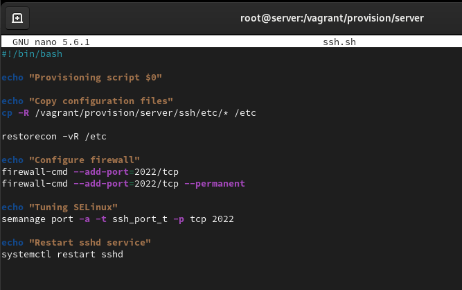{#fig:001 width=70%}

Для отработки созданного скрипта во время загрузки виртуальной машины server
в конфигурационном файле Vagrantfile необходимо добавить в разделе конфигурации для сервера:

```
server.vm.provision "server ssh",
  type: "shell",
  preserve_order: true,
  path: "provision/server/ssh.sh"
```

# Выводы

В процессе выполнения данной лабораторной работы я приобрела практические навыки по настройке удалённого доступа к серверу с помощью SSH.
