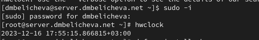
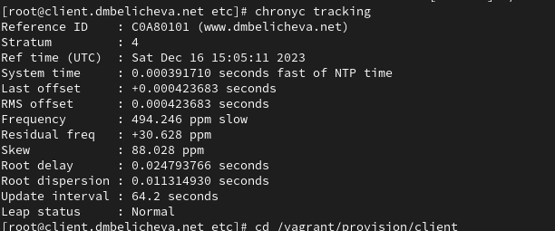

---
## Front matter
lang: ru-RU
title: Лабораторная работа №12
subtitle: Синхронизация времени
author:
  - Беличева Дарья Михайловна
institute:
  - Российский университет дружбы народов, Москва, Россия

## i18n babel
babel-lang: russian
babel-otherlangs: english

## Formatting pdf
toc: false
toc-title: Содержание
slide_level: 2
aspectratio: 169
section-titles: true
theme: metropolis
header-includes:
 - \metroset{progressbar=frametitle,sectionpage=progressbar,numbering=fraction}
 - '\makeatletter'
 - '\beamer@ignorenonframefalse'
 - '\makeatother'
---


## Цель работы

Получить навыки по управлению системным временем и настройке синхронизации времени.

## Задание

1. Изучить команды по настройке параметров времени.

2. Настроить сервер в качестве сервера синхронизации времени для локальной сети.

3. Написать скрипты для Vagrant, фиксирующие действия по установке и настройке
NTP-сервера и клиента.

# Выполнение лабораторной работы

## Настройка параметров времени

На сервере и клиенте посмотрим параметры настройки даты и времени:
`timedatectl`

{#fig:001 width=70%}

## Настройка параметров времени

{#fig:001 width=70%}

## Настройка параметров времени

{#fig:001 width=70%}

## Настройка параметров времени

На сервере и клиенте посмотрим текущее системное время:
`date`

{#fig:001 width=70%}

## Настройка параметров времени

{#fig:001 width=70%}

## Настройка параметров времени

На сервере и клиенте посмотрим аппаратное время:
`hwclock`

{#fig:001 width=70%}

## Настройка параметров времени

{#fig:001 width=70%}

## Управление синхронизацией времени

{#fig:001 width=70%}

## Управление синхронизацией времени

На сервере откроем на редактирование файл /etc/chrony.conf и добавьте строку:
`allow 192.168.0.0/16`

{#fig:001 width=70%}

## Управление синхронизацией времени

{#fig:001 width=70%}

## Управление синхронизацией времени

На клиенте откроем файл /etc/chrony.conf и добавим строку: `server server.dmbelicheva.net iburst`

{#fig:001 width=60%}

## Управление синхронизацией времени

{#fig:001 width=70%}

## Управление синхронизацией времени

{#fig:001 width=70%}

## Управление синхронизацией времени

{#fig:001 width=70%}

## Внесение изменений в настройки внутреннего окружения виртуальных машин

```
cd /vagrant/provision/server
mkdir -p /vagrant/provision/server/ntp/etc
cp -R /etc/chrony.conf /vagrant/provision/server/ntp/etc/
```

## Внесение изменений в настройки внутреннего окружения виртуальных машин

В каталоге /vagrant/provision/server создадим исполняемый файл ntp.sh:

```
touch ntp.sh
chmod +x ntp.sh
```

## Внесение изменений в настройки внутреннего окружения виртуальных машин

{#fig:001 width=70%}

## Внесение изменений в настройки внутреннего окружения виртуальных машин

```
cd /vagrant/provision/client
mkdir -p /vagrant/provision/client/ntp/etc
cp -R /etc/chrony.conf /vagrant/provision/client/ntp/etc/
```

## Внесение изменений в настройки внутреннего окружения виртуальных машин

В каталоге /vagrant/provision/client создайте исполняемый файл ntp.sh:
cd /vagrant/provision/client

```
touch ntp.sh
chmod +x ntp.sh
```

## Внесение изменений в настройки внутреннего окружения виртуальных машин

{#fig:001 width=70%}

## Внесение изменений в настройки внутреннего окружения виртуальных машин

```
server.vm.provision "server ntp",
type: "shell",
preserve_order: true,
path: "provision/server/ntp.sh"
```

## Внесение изменений в настройки внутреннего окружения виртуальных машин

```
client.vm.provision "client ntp",
type: "shell",
preserve_order: true,
path: "provision/client/ntp.sh"
```


## Выводы

В процессе выполнения данной лабораторной работы я получила навыки по управлению системным временем и настройке синхронизации времени.