---
## Front matter
title: "Лабораторная работа №12"
subtitle: "Синхронизация времени"
author: "Беличева Дарья Михайловна"

## Generic otions
lang: ru-RU
toc-title: "Содержание"

## Bibliography
bibliography: bib/cite.bib
csl: pandoc/csl/gost-r-7-0-5-2008-numeric.csl

## Pdf output format
toc: true # Table of contents
toc-depth: 2
lof: true # List of figures
lot: false # List of tables
fontsize: 12pt
linestretch: 1.5
papersize: a4
documentclass: scrreprt
## I18n polyglossia
polyglossia-lang:
  name: russian
  options:
	- spelling=modern
	- babelshorthands=true
polyglossia-otherlangs:
  name: english
## I18n babel
babel-lang: russian
babel-otherlangs: english
## Fonts
mainfont: PT Serif
romanfont: PT Serif
sansfont: PT Sans
monofont: PT Mono
mainfontoptions: Ligatures=TeX
romanfontoptions: Ligatures=TeX
sansfontoptions: Ligatures=TeX,Scale=MatchLowercase
monofontoptions: Scale=MatchLowercase,Scale=0.9
## Biblatex
biblatex: true
biblio-style: "gost-numeric"
biblatexoptions:
  - parentracker=true
  - backend=biber
  - hyperref=auto
  - language=auto
  - autolang=other*
  - citestyle=gost-numeric
## Pandoc-crossref LaTeX customization
figureTitle: "Рис."
tableTitle: "Таблица"
listingTitle: "Листинг"
lofTitle: "Список иллюстраций"
lotTitle: "Список таблиц"
lolTitle: "Листинги"
## Misc options
indent: true
header-includes:
  - \usepackage{indentfirst}
  - \usepackage{float} # keep figures where there are in the text
  - \floatplacement{figure}{H} # keep figures where there are in the text
---

# Цель работы

Получить навыки по управлению системным временем и настройке синхронизации времени.

# Задание

1. Изучить команды по настройке параметров времени.

2. Настроить сервер в качестве сервера синхронизации времени для локальной сети.

3. Написать скрипты для Vagrant, фиксирующие действия по установке и настройке
NTP-сервера и клиента.

# Выполнение лабораторной работы

## Настройка параметров времени

На сервере и клиенте посмотрим параметры настройки даты и времени:
`timedatectl`

{#fig:001 width=70%}

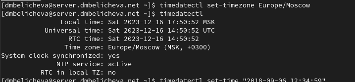{#fig:001 width=70%}

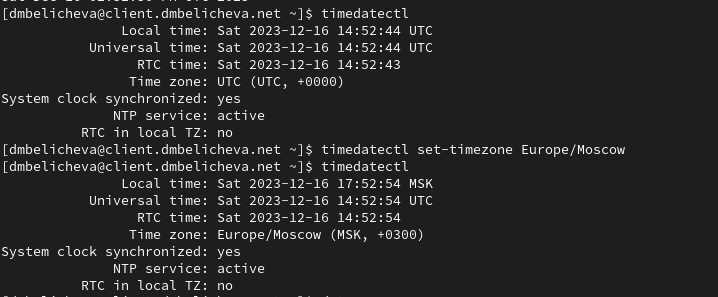{#fig:001 width=70%}

На сервере и клиенте посмотрим текущее системное время:
`date`

{#fig:001 width=70%}

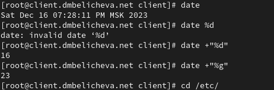{#fig:001 width=70%}

На сервере и клиенте посмотрим аппаратное время:
`hwclock`

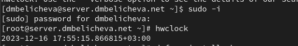{#fig:001 width=70%}

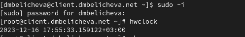{#fig:001 width=70%}

## Управление синхронизацией времени

При необходимости установим на сервере необходимое программное обеспечение:
`dnf -y install chrony`

Проверим источники времени на клиенте и на сервере:
`chronyc sources`

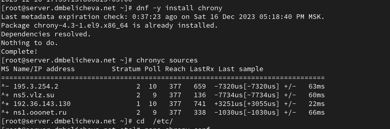{#fig:001 width=70%}

На сервере откроем на редактирование файл /etc/chrony.conf и добавьте строку:
`allow 192.168.0.0/16`

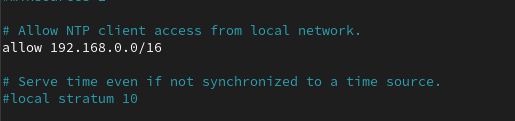{#fig:001 width=70%}

На сервере перезапустим службу chronyd:
`systemctl restart chronyd`

Настроем межсетевой экран на сервере:

```
firewall-cmd --add-service=ntp --permanent
firewall-cmd --reload
```

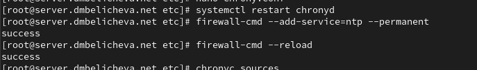{#fig:001 width=70%}

На клиенте откроем файл /etc/chrony.conf и добавим строку: `server server.dmbelicheva.net iburst`

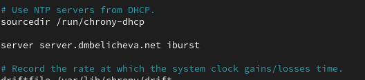{#fig:001 width=70%}

Удалим все остальные строки с директивой server.

На клиенте перезапустим службу chronyd:
`systemctl restart chronyd`

Проверим источники времени на клиенте и на сервере:
`chronyc sources`

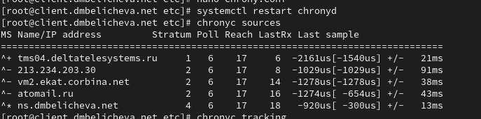{#fig:001 width=70%}

Появился источник синхронизации сервер.

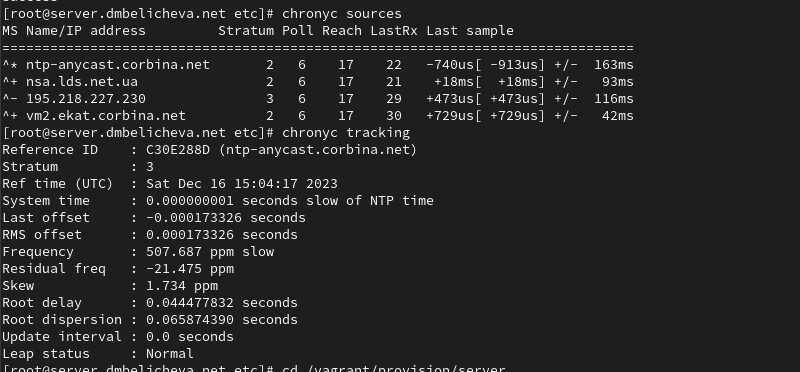{#fig:001 width=70%}

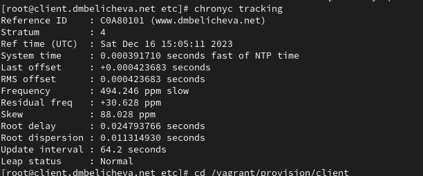{#fig:001 width=70%}

Клиент имеет уровень синхронизации - 4, так как синхронизирутеся с сервером, имеющим уровень 3. Также выводится информация о реальном времени, системном времени, частоте обновления, задержке.

## Внесение изменений в настройки внутреннего окружения виртуальных машин

На виртуальной машине server перейдем в каталог для внесения изменений в настройки внутреннего окружения /vagrant/provision/server/, создадим в нём
каталог ntp, в который поместим в соответствующие подкаталоги конфигурационные файлы:

```
cd /vagrant/provision/server
mkdir -p /vagrant/provision/server/ntp/etc
cp -R /etc/chrony.conf /vagrant/provision/server/ntp/etc/
```

В каталоге /vagrant/provision/server создадим исполняемый файл ntp.sh:

```
touch ntp.sh
chmod +x ntp.sh
```

Открыв его на редактирование, пропишем в нём следующий скрипт:

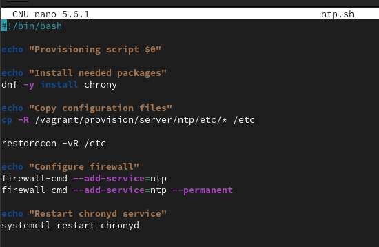{#fig:001 width=70%}

На виртуальной машине client перейдем в каталог для внесения изменений в настройки внутреннего окружения /vagrant/provision/client/, создадим в нём
каталог ntp, в который поместим в соответствующие подкаталоги конфигурационные файлы:

```
cd /vagrant/provision/client
mkdir -p /vagrant/provision/client/ntp/etc
cp -R /etc/chrony.conf /vagrant/provision/client/ntp/etc/
```

В каталоге /vagrant/provision/client создайте исполняемый файл ntp.sh:
cd /vagrant/provision/client

```
touch ntp.sh
chmod +x ntp.sh
```

Открыв его на редактирование, пропишем в нём следующий скрипт:

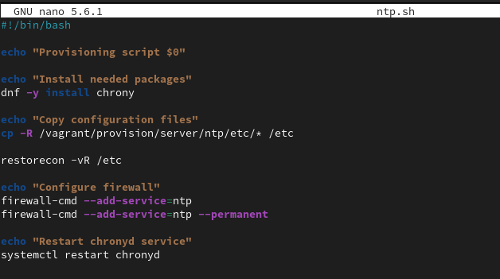{#fig:001 width=70%}

Для отработки созданных скриптов во время загрузки виртуальных машин server
и client в конфигурационном файле Vagrantfile необходимо добавить в соответствующих разделах конфигураций для сервера и клиента:

```
server.vm.provision "server ntp",
type: "shell",
preserve_order: true,
path: "provision/server/ntp.sh"
```

```
client.vm.provision "client ntp",
type: "shell",
preserve_order: true,
path: "provision/client/ntp.sh"
```


# Выводы

В процессе выполнения данной лабораторной работы я получила навыки по управлению системным временем и настройке синхронизации времени.