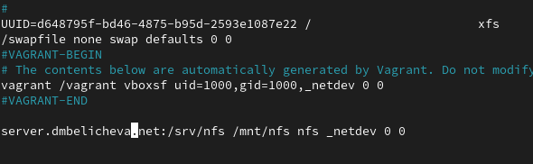
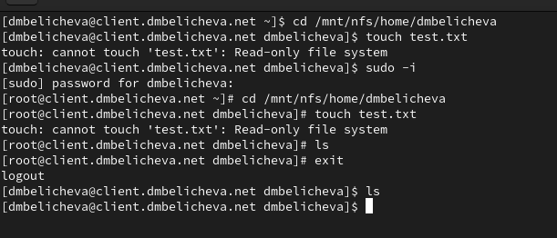

---
## Front matter
lang: ru-RU
title: Лабораторная работа №13
subtitle: Настройка NFS
author:
  - Беличева Дарья Михайловна
institute:
  - Российский университет дружбы народов, Москва, Россия

## i18n babel
babel-lang: russian
babel-otherlangs: english

## Formatting pdf
toc: false
toc-title: Содержание
slide_level: 2
aspectratio: 169
section-titles: true
theme: metropolis
header-includes:
 - \metroset{progressbar=frametitle,sectionpage=progressbar,numbering=fraction}
 - '\makeatletter'
 - '\beamer@ignorenonframefalse'
 - '\makeatother'
---


## Цель работы

Приобрести навыки настройки сервера NFS для удалённого доступа к ресурсам.

## Задание

1. Установить и настроить сервер NFSv4.

2. Подмонтировать удалённый ресурс на клиенте.

3. Подключить каталог с контентом веб-сервера к дереву NFS.

4. Подключить каталог для удалённой работы вашего пользователя к дереву NFS.

5. Написать скрипты для Vagrant, фиксирующие действия по установке и настройке
сервера NFSv4 во внутреннем окружении виртуальных машин server и client. Соответствующим образом внести изменения в Vagrantfile.

# Выполнение лабораторной работы

## Настройка сервера NFSv4

{#fig:001 width=70%}

## Настройка сервера NFSv4

На сервере создадим каталог, который предполагается сделать доступным всем пользователям сети (корень дерева NFS):
`mkdir -p /srv/nfs`

## Настройка сервера NFSv4

{#fig:001 width=70%}

## Настройка сервера NFSv4

{#fig:001 width=70%}

## Настройка сервера NFSv4

{#fig:001 width=70%}

## Настройка сервера NFSv4

{#fig:001 width=70%}

## Настройка сервера NFSv4

Попробуем на сервере остановить сервис межсетевого экрана:
`systemctl stop firewalld.service`

Затем на клиенте вновь попробуем подключиться к удалённо смонтированному
ресурсу:
`showmount -e server.dmbelicheva.net`

## Настройка сервера NFSv4

{#fig:001 width=70%}

## Настройка сервера NFSv4

На сервере запустим сервис межсетевого экрана
`systemctl start firewalld`

## Настройка сервера NFSv4

На сервере посмотрим, какие службы задействованы при удалённом монтировании:

{#fig:001 width=70%}

## Настройка сервера NFSv4

{#fig:001 width=70%}

## Настройка сервера NFSv4

{#fig:001 width=70%}

## Настройка сервера NFSv4

{#fig:001 width=70%}

## Монтирование NFS на клиенте

{#fig:001 width=70%}

## Монтирование NFS на клиенте

{#fig:001 width=70%}

## Монтирование NFS на клиенте

{#fig:001 width=70%}

## Монтирование NFS на клиенте

Перезапустим клиент и убедимся, что удалённый ресурс подключается автоматически.

{#fig:001 width=70%}

## Подключение каталогов к дереву NFS

На сервере создадим общий каталог, в который затем будет подмонтирован каталог
с контентом веб-сервера:
`mkdir -p /srv/nfs/www`

Подмонтируем каталог web-сервера:
`mount -o bind /var/www/ /srv/nfs/www/`

## Подключение каталогов к дереву NFS

На сервере проверим, что отображается в каталоге /srv/nfs.

{#fig:001 width=70%}

## Подключение каталогов к дереву NFS

На клиенте посмотрим, что отображается в каталоге /mnt/nfs.

{#fig:001 width=70%}

## Подключение каталогов к дереву NFS

{#fig:001 width=70%}

## Подключение каталогов к дереву NFS

Экспортируем все каталоги, упомянутые в файле /etc/exports:
`exportfs -r`
Проверим на клиенте каталог /mnt/nfs.

{#fig:001 width=60%}

## Подключение каталогов к дереву NFS

{#fig:001 width=70%}

## Подключение каталогов к дереву NFS

Повторно экспортируем каталоги, указанные в файле /etc/exports:
`exportfs -r`

На клиенте проверим каталог /mnt/nfs.

{#fig:001 width=60%}


## Подключение каталогов для работы пользователей

```
mkdir -p -m 700 ~/common
cd ~/common
touch dmbelicheva@server.txt
```

## Подключение каталогов для работы пользователей

{#fig:001 width=70%}

## Подключение каталогов для работы пользователей

{#fig:001 width=70%}

## Подключение каталогов для работы пользователей

Внесем изменения в файл /etc/fstab (вместо user укажите свой логин):
`/home/user/common /srv/nfs/home/user none bind 0 0`

Повторно экспортируем каталоги:
`exportfs -r`

## Подключение каталогов для работы пользователей

На клиенте проверим каталог /mnt/nfs.

{#fig:001 width=70%}

## Подключение каталогов для работы пользователей

{#fig:001 width=70%}


## Внесение изменений в настройки внутреннего окружения виртуальных машин

```
cd /vagrant/provision/server
mkdir -p /vagrant/provision/server/nfs/etc
cp -R /etc/exports /vagrant/provision/server/nfs/etc/
```

## Внесение изменений в настройки внутреннего окружения виртуальных машин

В каталоге /vagrant/provision/server создадим исполняемый файл nfs.sh:

```
cd /vagrant/provision/server
touch nfs.sh
chmod +x nfs.sh
```

## Внесение изменений в настройки внутреннего окружения виртуальных машин

{#fig:001 width=70%}

## Внесение изменений в настройки внутреннего окружения виртуальных машин

В каталоге /vagrant/provision/client создадим исполняемый файл nfs.sh:

```
cd /vagrant/provision/client
touch nfs.sh
chmod +x nfs.sh
```

## Внесение изменений в настройки внутреннего окружения виртуальных машин

{#fig:001 width=70%}

## Внесение изменений в настройки внутреннего окружения виртуальных машин

```
server.vm.provision "server nfs",
  type: "shell",
  preserve_order: true,
  path: "provision/server/nfs.sh"
```

```
client.vm.provision "client nfs",
  type: "shell",
  preserve_order: true,
  path: "provision/client/nfs.sh"
```

## Выводы

В процессе выполнения данной лабораторной работы я приобрела навыки настройки сервера NFS для удалённого доступа к ресурсам.