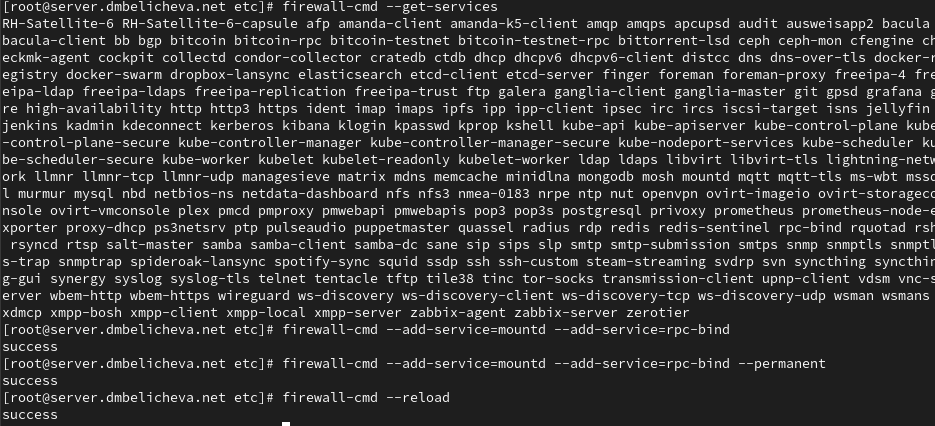
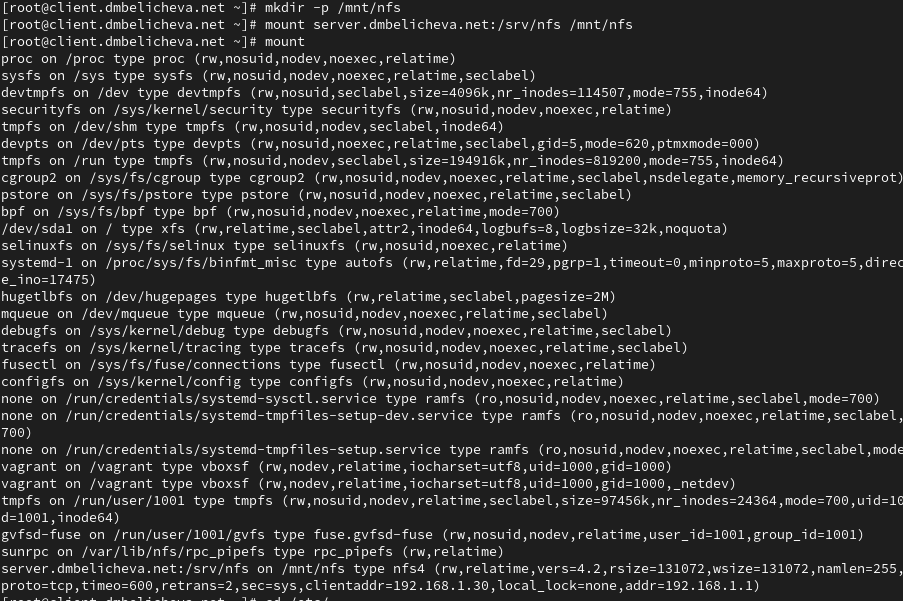
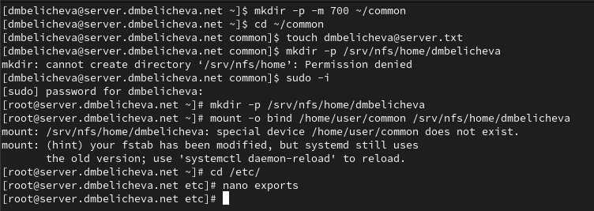
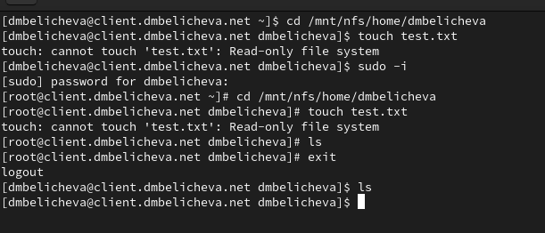
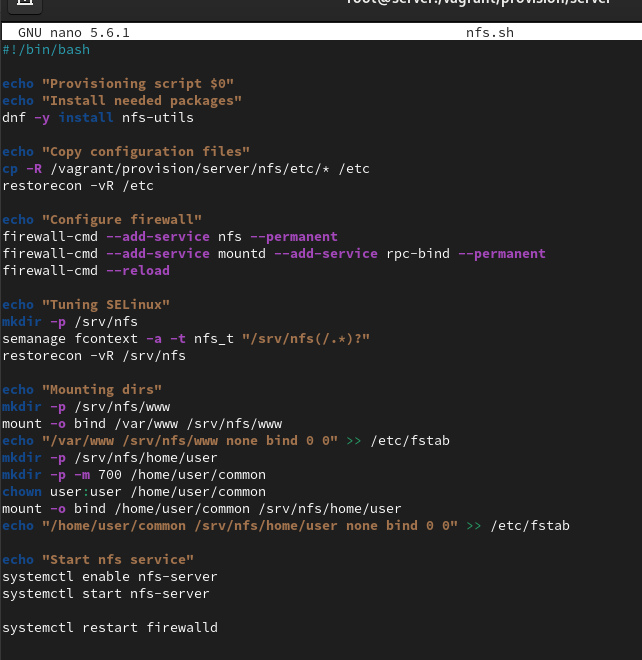
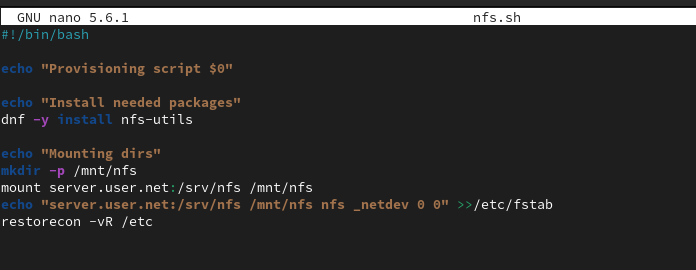

---
## Front matter
title: "Лабораторная работа №13"
subtitle: "Настройка NFS"
author: "Беличева Дарья Михайловна"

## Generic otions
lang: ru-RU
toc-title: "Содержание"

## Bibliography
bibliography: bib/cite.bib
csl: pandoc/csl/gost-r-7-0-5-2008-numeric.csl

## Pdf output format
toc: true # Table of contents
toc-depth: 2
lof: true # List of figures
lot: false # List of tables
fontsize: 12pt
linestretch: 1.5
papersize: a4
documentclass: scrreprt
## I18n polyglossia
polyglossia-lang:
  name: russian
  options:
	- spelling=modern
	- babelshorthands=true
polyglossia-otherlangs:
  name: english
## I18n babel
babel-lang: russian
babel-otherlangs: english
## Fonts
mainfont: PT Serif
romanfont: PT Serif
sansfont: PT Sans
monofont: PT Mono
mainfontoptions: Ligatures=TeX
romanfontoptions: Ligatures=TeX
sansfontoptions: Ligatures=TeX,Scale=MatchLowercase
monofontoptions: Scale=MatchLowercase,Scale=0.9
## Biblatex
biblatex: true
biblio-style: "gost-numeric"
biblatexoptions:
  - parentracker=true
  - backend=biber
  - hyperref=auto
  - language=auto
  - autolang=other*
  - citestyle=gost-numeric
## Pandoc-crossref LaTeX customization
figureTitle: "Рис."
tableTitle: "Таблица"
listingTitle: "Листинг"
lofTitle: "Список иллюстраций"
lotTitle: "Список таблиц"
lolTitle: "Листинги"
## Misc options
indent: true
header-includes:
  - \usepackage{indentfirst}
  - \usepackage{float} # keep figures where there are in the text
  - \floatplacement{figure}{H} # keep figures where there are in the text
---

# Цель работы

Приобрести навыки настройки сервера NFS для удалённого доступа к ресурсам.

# Задание

1. Установить и настроить сервер NFSv4.

2. Подмонтировать удалённый ресурс на клиенте.

3. Подключить каталог с контентом веб-сервера к дереву NFS.

4. Подключить каталог для удалённой работы вашего пользователя к дереву NFS.

5. Написать скрипты для Vagrant, фиксирующие действия по установке и настройке
сервера NFSv4 во внутреннем окружении виртуальных машин server и client. Соответствующим образом внести изменения в Vagrantfile.

# Выполнение лабораторной работы

## Настройка сервера NFSv4

На сервере установим необходимое программное обеспечение:
`dnf -y install nfs-utils`

{#fig:001 width=70%}

На сервере создадим каталог, который предполагается сделать доступным всем пользователям сети (корень дерева NFS):
`mkdir -p /srv/nfs`

В файле /etc/exports пропишем подключаемый через NFS общий каталог с доступом только на чтение:
`/srv/nfs *(ro)`

{#fig:001 width=70%}

Для общего каталога зададим контекст безопасности NFS:
`semanage fcontext -a -t nfs_t "/srv/nfs(/.*)?"`

Применим изменённую настройку SELinux к файловой системе:
`restorecon -vR /srv/nfs`

Запустим сервер NFS:

```
systemctl start nfs-server.service
systemctl enable nfs-server.service
```

Настроим межсетевой экран для работы сервера NFS:

```
firewall-cmd --add-service=nfs
firewall-cmd --add-service=nfs --permanent
firewall-cmd --reload
```

{#fig:001 width=70%}

На клиенте установим необходимое для работы NFS программное обеспечение:
`dnf -y install nfs-utils`

{#fig:001 width=70%}

На клиенте попробуем посмотреть имеющиеся подмонтированные удалённые ресурсы (вместо user укажите свой логин):

`showmount -e server.dmbelicheva.net`

{#fig:001 width=70%}

Попробуем на сервере остановить сервис межсетевого экрана:
`systemctl stop firewalld.service`

Затем на клиенте вновь попробуем подключиться к удалённо смонтированному
ресурсу:
`showmount -e server.dmbelicheva.net`

{#fig:001 width=70%}

На сервере запустим сервис межсетевого экрана
`systemctl start firewalld`

На сервере посмотрим, какие службы задействованы при удалённом монтировании:

```
lsof | grep TCP
lsof | grep UDP
```

{#fig:001 width=70%}

{#fig:001 width=70%}

Добавим службы rpc-bind и mountd в настройки межсетевого экрана на сервере:

```
firewall-cmd --get-services
firewall-cmd --add-service=mountd --add-service=rpc-bind
firewall-cmd --add-service=mountd --add-service=rpc-bind --permanent
firewall-cmd --reload
```

{#fig:001 width=70%}

На клиенте проверим подключение удалённого ресурса:
`showmount -e server.dmbelicheva.net`

{#fig:001 width=70%}

## Монтирование NFS на клиенте

На клиенте создадим каталог, в который будет монтироваться удалённый ресурс, и подмонтируем дерево NFS:

```
mkdir -p /mnt/nfs
mount server.dmbelicheva.net:/srv/nfs /mnt/nfs
```

Проверим, что общий ресурс NFS подключён правильно:
`mount`

{#fig:001 width=70%}

На клиенте в конце файла /etc/fstab добавим следующую запись:
`server.dmbelicheva.net:/srv/nfs /mnt/nfs nfs _netdev 0 0`

{#fig:001 width=70%}

На клиенте проверим наличие автоматического монтирования удалённых ресурсов
при запуске операционной системы:
`systemctl status remote-fs.target`

{#fig:001 width=70%}

Перезапустим клиент и убедимся, что удалённый ресурс подключается автоматически.

{#fig:001 width=70%}

## Подключение каталогов к дереву NFS

На сервере создадим общий каталог, в который затем будет подмонтирован каталог
с контентом веб-сервера:
`mkdir -p /srv/nfs/www`

Подмонтируем каталог web-сервера:
`mount -o bind /var/www/ /srv/nfs/www/`

На сервере проверим, что отображается в каталоге /srv/nfs.

{#fig:001 width=70%}

На клиенте посмотрим, что отображается в каталоге /mnt/nfs.

{#fig:001 width=70%}

На сервере в файле /etc/exports добавим экспорт каталога веб-сервера с удалённого
ресурса:
`/srv/nfs/www 192.168.0.0/16(rw)`

{#fig:001 width=70%}

Экспортируем все каталоги, упомянутые в файле /etc/exports:
`exportfs -r`

Проверим на клиенте каталог /mnt/nfs.

{#fig:001 width=70%}

На сервере в конце файла /etc/fstab добавим следующую запись:
`/var/www /srv/nfs/www none bind 0 0`

{#fig:001 width=70%}

Повторно экспортируем каталоги, указанные в файле /etc/exports:
`exportfs -r`

На клиенте проверим каталог /mnt/nfs.

{#fig:001 width=70%}


## Подключение каталогов для работы пользователей

На сервере под пользователем dmbelicheva в его домашнем каталоге создадим каталог
common с полными правами доступа только для этого пользователя, а в нём файл
dmbelicheva@server.txt:

```
mkdir -p -m 700 ~/common
cd ~/common
touch dmbelicheva@server.txt
```

На сервере создадим общий каталог для работы пользователя dmbelicheva по сети:
`mkdir -p /srv/nfs/home/user`

Подмонтируем каталог common пользователя dmbelicheva в NFS:
`mount -o bind /home/user/common /srv/nfs/home/user`

{#fig:001 width=70%}

Подключим каталог пользователя в файле /etc/exports, прописав в нём (вместо
user укажите свой логин):
`/srv/nfs/home/user 192.168.0.0/16(rw)`

{#fig:001 width=70%}

Внесем изменения в файл /etc/fstab (вместо user укажите свой логин):
`/home/user/common /srv/nfs/home/user none bind 0 0`

Повторно экспортируем каталоги:
`exportfs -r`

На клиенте проверим каталог /mnt/nfs.

{#fig:001 width=70%}


На клиенте под пользователем user перейдем в каталог /mnt/nfs/home/user
и попробуем создать в нём файл user@client.txt и внести в него какие-либо изменения:

```
cd /mnt/nfs/home/user
touch user@client.txt
```

{#fig:001 width=70%}

Безуспешно.

Попробуем это проделать под пользователем root.

Безуспешно.

На сервере посмотрим, появились ли изменения в каталоге пользователя /home/user/common.

Не появились, все тщетно.

## Внесение изменений в настройки внутреннего окружения виртуальных машин

На виртуальной машине server перейдем в каталог для внесения изменений в настройки внутреннего окружения /vagrant/provision/server/, создадим в нём
каталог nfs, в который поместим в соответствующие подкаталоги конфигурационные файлы:

```
cd /vagrant/provision/server
mkdir -p /vagrant/provision/server/nfs/etc
cp -R /etc/exports /vagrant/provision/server/nfs/etc/
```

В каталоге /vagrant/provision/server создадим исполняемый файл nfs.sh:

```
cd /vagrant/provision/server
touch nfs.sh
chmod +x nfs.sh
```

Открыв его на редактирование, пропишем в нём следующий скрипт:

{#fig:001 width=70%}

На виртуальной машине client перейдем в каталог для внесения изменений в настройки внутреннего окружения /vagrant/provision/client/:
`cd /vagrant/provision/client`

В каталоге /vagrant/provision/client создадим исполняемый файл nfs.sh:

```
cd /vagrant/provision/client
touch nfs.sh
chmod +x nfs.sh
```

Открыв его на редактирование, пропишем в нём следующий скрипт:

{#fig:001 width=70%}

Для отработки созданных скриптов во время загрузки виртуальных машин server
и client в конфигурационном файле Vagrantfile необходимо добавить в соответствующих разделах конфигураций для сервера и клиента:

```
server.vm.provision "server nfs",
  type: "shell",
  preserve_order: true,
  path: "provision/server/nfs.sh"
```

```
client.vm.provision "client nfs",
  type: "shell",
  preserve_order: true,
  path: "provision/client/nfs.sh"
```

# Выводы

В процессе выполнения данной лабораторной работы я приобрела навыки настройки сервера NFS для удалённого доступа к ресурсам.