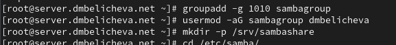

---
## Front matter
lang: ru-RU
title: Лабораторная работа №14
subtitle: Настройка файловых служб Samba
author:
  - Беличева Дарья Михайловна
institute:
  - Российский университет дружбы народов, Москва, Россия

## i18n babel
babel-lang: russian
babel-otherlangs: english

## Formatting pdf
toc: false
toc-title: Содержание
slide_level: 2
aspectratio: 169
section-titles: true
theme: metropolis
header-includes:
 - \metroset{progressbar=frametitle,sectionpage=progressbar,numbering=fraction}
 - '\makeatletter'
 - '\beamer@ignorenonframefalse'
 - '\makeatother'
---


## Цель работы

Приобрести навыки настройки доступа групп пользователей к общим ресурсам по протоколу SMB.

## Задание

1. Установите и настройте сервер Samba.

2. Настройте на клиенте доступ к разделяемым ресурсам.

3. Напишите скрипты для Vagrant, фиксирующие действия по установке и настройке сервера Samba для доступа к разделяемым ресурсам во внутреннем окружении виртуальных машин server и client. Соответствующим образом необходимо внести изменения в Vagrantfile.

# Выполнение лабораторной работы

## Настройка сервера Samba

{#fig:001 width=70%}

## Настройка сервера Samba

{#fig:001 width=70%}

## Настройка сервера Samba

{#fig:002 width=70%}

## Настройка сервера Samba

Убедимся, что не сделали синтаксических ошибок в файле smb.conf и запустим демон Samba:

{#fig:003 width=60%}

## Настройка сервера Samba

Запустим демон Samba и посмотрим его статус:

{#fig:003 width=60%}

## Настройка сервера Samba

{#fig:004 width=70%}

## Настройка сервера Samba

{#fig:005 width=70%}

## Настройка сервера Samba

{#fig:006 width=70%}

## Настройка сервера Samba

{#fig:007 width=70%}

## Настройка сервера Samba

{#fig:008 width=70%}

## Настройка сервера Samba

{#fig:009 width=70%}

## Монтирование файловой системы Samba на клиенте 

{#fig:009 width=70%}

## Монтирование файловой системы Samba на клиенте

{#fig:009 width=70%}

## Монтирование файловой системы Samba на клиенте

{#fig:011 width=70%}

## Монтирование файловой системы Samba на клиенте

{#fig:011 width=70%}

## Монтирование файловой системы Samba на клиенте

{#fig:012 width=70%}

## Монтирование файловой системы Samba на клиенте

{#fig:013 width=70%}

## Монтирование файловой системы Samba на клиенте

{#fig:013 width=70%}

## Монтирование файловой системы Samba на клиенте

Теперь создадим точку монтирования с помощью команды `mkdir /mnt/samba` и на клиенте получим доступ к общему ресурсу с помощью `mount`

{#fig:014 width=50%}

## Монтирование файловой системы Samba на клиенте

{#fig:015 width=70%}

## Монтирование файловой системы Samba на клиенте

{#fig:016 width=70%}

## Монтирование файловой системы Samba на клиенте

{#fig:018 width=70%}

## Монтирование файловой системы Samba на клиенте

Подмонтируем общий ресурс `mount -a`.

Перезапустим клиента и проверим, что ресурс монтируется и после перезагрузки, а у пользователя есть доступ к разделяемым ресурсам.

## Внесение изменений в настройки внутреннего окружения виртуальных машины

```
cd /vagrant/provision/server
mkdir -p /vagrant/provision/server/smb/etc/samba
cp -R /etc/samba/smb.conf /vagrant/provision/server/smb/etc/samba/

touch smb.sh
chmod +x smb.sh
```

## Внесение изменений в настройки внутреннего окружения виртуальных машины

{#fig:021 width=70%}

## Внесение изменений в настройки внутреннего окружения виртуальных машины

```
cd /vagrant/provision/client
mkdir -p /vagrant/provision/client/smb/etc/samba
cp -R /etc/samba/smb.conf /vagrant/provision/client/smb/etc/samba/
cp -R /etc/samba/smbusers /vagrant/provision/client/smb/etc/samba/

touch smb.sh
chmod +x smb.sh
```

## Внесение изменений в настройки внутреннего окружения виртуальных машины

{#fig:022 width=70%}

## Внесение изменений в настройки внутреннего окружения виртуальных машины

```
server.vm.provision "SMB server",
  type: "shell",
  preserve_order: true,
  path: "provision/server/smb.sh"
client.vm.provision "SMB client",
  type: "shell",
  preserve_order: true,
  path: "provision/client/smb.sh"

```

## Выводы

В процессе выполнения данной работы я приобрела практические навыки настройки доступа групп пользователей к общим ресурсам по протоколу SMB.
