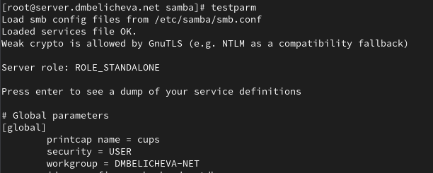
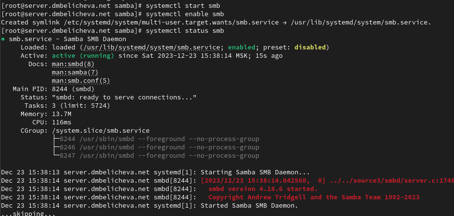
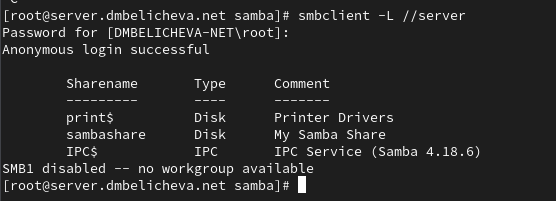
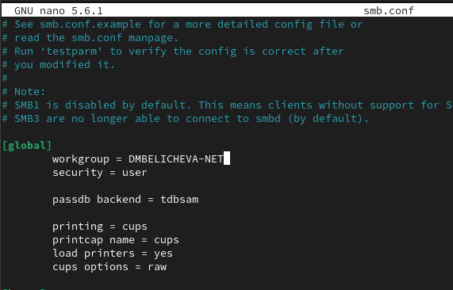

---
## Front matter
title: "Лабораторная работа №14"
subtitle: "Настройка файловых служб Samba"
author: "Беличева Дарья Михайловна"

## Generic otions
lang: ru-RU
toc-title: "Содержание"

## Bibliography
bibliography: bib/cite.bib
csl: pandoc/csl/gost-r-7-0-5-2008-numeric.csl

## Pdf output format
toc: true # Table of contents
toc-depth: 2
lof: true # List of figures
lot: false # List of tables
fontsize: 12pt
linestretch: 1.5
papersize: a4
documentclass: scrreprt
## I18n polyglossia
polyglossia-lang:
  name: russian
  options:
	- spelling=modern
	- babelshorthands=true
polyglossia-otherlangs:
  name: english
## I18n babel
babel-lang: russian
babel-otherlangs: english
## Fonts
mainfont: PT Serif
romanfont: PT Serif
sansfont: PT Sans
monofont: PT Mono
mainfontoptions: Ligatures=TeX
romanfontoptions: Ligatures=TeX
sansfontoptions: Ligatures=TeX,Scale=MatchLowercase
monofontoptions: Scale=MatchLowercase,Scale=0.9
## Biblatex
biblatex: true
biblio-style: "gost-numeric"
biblatexoptions:
  - parentracker=true
  - backend=biber
  - hyperref=auto
  - language=auto
  - autolang=other*
  - citestyle=gost-numeric
## Pandoc-crossref LaTeX customization
figureTitle: "Рис."
tableTitle: "Таблица"
listingTitle: "Листинг"
lofTitle: "Список иллюстраций"
lotTitle: "Список таблиц"
lolTitle: "Листинги"
## Misc options
indent: true
header-includes:
  - \usepackage{indentfirst}
  - \usepackage{float} # keep figures where there are in the text
  - \floatplacement{figure}{H} # keep figures where there are in the text
---

# Цель работы

Приобрести навыки настройки доступа групп пользователей к общим ресурсам по протоколу SMB.

# Задание

1. Установите и настройте сервер Samba.

2. Настройте на клиенте доступ к разделяемым ресурсам.

3. Напишите скрипты для Vagrant, фиксирующие действия по установке и настройке сервера Samba для доступа к разделяемым ресурсам во внутреннем окружении виртуальных машин server и client. Соответствующим образом необходимо внести изменения в Vagrantfile.

# Выполнение лабораторной работы

## Настройка сервера Samba

На сервере установим необходимые пакеты:

```
dnf -y install samba samba-client cifs-utils
```

{#fig:001 width=70%}

Создадим группу sambagroup для пользователей, которые будут работать с Samba-сервером, и присвоим ей GID 1010 с помощью команды `groupadd -g 1010 sambagroup`. Затем добавим пользователя eademidova к группе sambagroup командой `usermod -aG sambagroup user`.  И создадим общий каталог в файловой системе Linux, в который предполагается монтировать разделяемые ресурсы:

{#fig:001 width=70%}

В файле конфигурации /etc/samba/smb.conf изменим параметр рабочей группы и в конец файла добавим раздел с описанием общего доступа к разделяемому ресурсу /srv/sambashare:

{#fig:002 width=70%}

Убедимся, что не сделали синтаксических ошибок в файле smb.conf и запустим демон Samba:

{#fig:003 width=70%}

Запустим демон Samba и посмотрим его статус:

{#fig:003 width=70%}

Для проверки наличия общего доступа попробуем подключиться к серверу с помощью smbclient:

{#fig:004 width=70%}

Посмотрим файл конфигурации межсетевого экрана для Samba:

{#fig:005 width=70%}

Настроим межсетевой экран и права доступа для каталога с разделяемым ресурсом:

{#fig:006 width=70%}

Посмотрим контекст безопасности SELinux и настроим его для каталога с разделяемым ресурсом. 
Затем проверим, что контекст безопасности изменился и резрешим экспортировать разделяемыйе ресурсы для чтения и записи:

{#fig:007 width=70%}

Посмотрим UID нашего пользователя и в какие группы он включён:

{#fig:008 width=70%}

Затем под пользователем dmbelicheva попробуем создать файл на разделяемом ресурсе.
Добавим пользователя dmbelicheva в базу пользователей Samba:

{#fig:009 width=70%}

## Монтирование файловой системы Samba на клиенте

На клиенте установим необходимые пакеты. 

{#fig:009 width=70%}


Затем посмотрим файл конфигурации межсетевого экрана для клиента Samba.

{#fig:009 width=70%}


Настроим межсетевой экран и создадим группу sambagroup, добавим в неё пользователя dmbelicheva:

{#fig:011 width=70%}


{#fig:011 width=70%}

На клиенте в файле конфигурации /etc/samba/smb.conf изменим параметр рабочей группы:

{#fig:012 width=70%}

Для проверки наличия общего доступа попробуем подключиться с клиента к серверу с помощью smbclient. Затем подключимся к клиенту с сервера под учётной записью нашего пользователя.

{#fig:013 width=70%}

{#fig:013 width=70%}

Теперь создадим точку монтирования с помощью команды `mkdir /mnt/samba` и на клиенте получим доступ к общему ресурсу с помощью `mount`

{#fig:014 width=70%}

Безуспешно.

Убедимся, что user может записывать файлы на разделяемом ресурсе

{#fig:015 width=70%}

Отмонтируем каталог /mnt/samba и для настройки работы с Samba с помощью файла учётных данных на клиенте создадим файл smbusers в каталоге /etc/samba/ с содержанием следующего формата:

```
username=<username>
password=<password>
```

{#fig:016 width=70%}

На клиенте в файле /etc/fstab добавим следующую строку.

{#fig:018 width=70%}

Подмонтируем общий ресурс `mount -a`.

Перезапустим клиента и проверим, что ресурс монтируется и после перезагрузки, а у пользователя есть доступ к разделяемым ресурсам.

## Внесение изменений в настройки внутреннего окружения виртуальных машины

На виртуальной машине server перейдем в каталог для внесения изменений в настройки внутреннего окружения /vagrant/provision/server/, создадим в нём каталог smb, в который поместим в соответствующие подкаталоги конфигурационные файлы, а также создадим исполняемый файл smb.sh:

```
cd /vagrant/provision/server
mkdir -p /vagrant/provision/server/smb/etc/samba
cp -R /etc/samba/smb.conf /vagrant/provision/server/smb/etc/samba/

touch smb.sh
chmod +x smb.sh
```

В каталоге /vagrant/provision/server создадим исполняемый файл  smb.sh и внесем скрипт:

{#fig:021 width=70%}

На виртуальной машине client перейдем в каталог для внесения изменений в настройки внутреннего окружения /vagrant/provision/client/, создадим в нём каталог smb, в который поместим в соответствующие подкаталоги конфигурационные файлы, а также создадим исполняемый файл smb.sh:

```
cd /vagrant/provision/client
mkdir -p /vagrant/provision/client/smb/etc/samba
cp -R /etc/samba/smb.conf /vagrant/provision/client/smb/etc/samba/
cp -R /etc/samba/smbusers /vagrant/provision/client/smb/etc/samba/

touch smb.sh
chmod +x smb.sh
```

В каталоге /vagrant/provision/client создадим исполняемый файл smb.sh и внесем скрипт:

{#fig:022 width=70%}

Затем для отработки созданных скриптов в конфигурационном файле Vagrantfile необходимо добавить в соответствующих разделах конфигураций для сервера и клиента:

```
server.vm.provision "SMB server",
  type: "shell",
  preserve_order: true,
  path: "provision/server/smb.sh"
client.vm.provision "SMB client",
  type: "shell",
  preserve_order: true,
  path: "provision/client/smb.sh"

```

# Выводы

В процессе выполнения данной работы я приобрела практические навыки настройки доступа групп пользователей к общим ресурсам по протоколу SMB.
