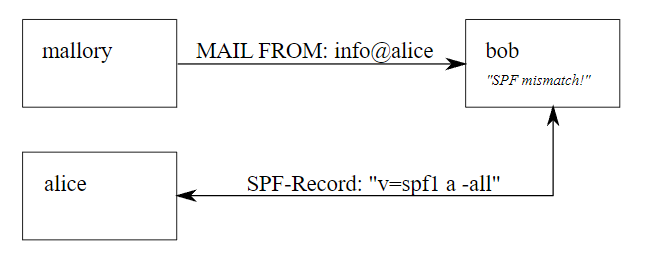
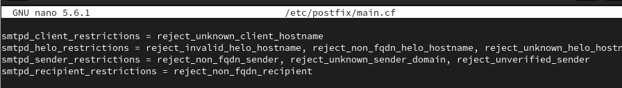

---
## Front matter
lang: ru-RU
title: Доклад
subtitle: Фильтрация спама
author:
  - Беличева Дарья Михайловна
institute:
  - Российский университет дружбы народов, Москва, Россия
  - Объединённый институт ядерных исследований, Дубна, Россия
date: 25 декабря 2023

## i18n babel
babel-lang: russian
babel-otherlangs: english

## Formatting pdf
toc: false
toc-title: Содержание
slide_level: 2
aspectratio: 169
section-titles: true
theme: metropolis
header-includes:
 - \metroset{progressbar=frametitle,sectionpage=progressbar,numbering=fraction}
 - '\makeatletter'
 - '\beamer@ignorenonframefalse'
 - '\makeatother'
---


# Введение

## Цель

Рассмотреть эффективные методы фильтрации спама на уровне SMTP протокола.

## Задачи

- Изучить основы SMTP протокола и его ключевые этапы передачи почты.

- Рассмотреть основные технологии фильтрации спама на уровне SMTP,таких как SPF, Greylisting И SpamAssassin.

- Предоставить практическую реализации фильтрации. 


# Основы SMTP протокола

SMTP – это простой протокол передачи почты.

SMTP-операция состоит из трёх последовательностей команда/ответ:

- MAIL FROM — устанавливает обратный адрес.

- RCPT TO — устанавливает получателя данного сообщения.

- DATA — для отправки текста сообщения. 

# Технологии фильтрации спама на уровне SMTP

Многие входящие SMTP-соединений блокируются при реверсном DNS-запросе по их IP-адресу:

- если IP-адрес отправитель не имеет reverse DNS-записи в своём блоке IP-адресов;

- обратная запись DNS содержит неправильные имена;

- несовпадение DNS-имён в прямой и обратной зонах.

## Использование технологии Sender Policy Framework 

SPF - это стандарт безопасности, который разработан для проверки подлинности отправителя электронной почты. 

{#fig:001 width=70%}

## Использование технологии Sender Policy Framework 

Преимущества использования SPF в фильтрации спама:

- Отсев поддельных отправителей;

- SPF позволяет серверу получателя проверить, подлинный ли IP-адрес отправителя.

- SPF помогает предотвращать атаки фишинга, где злоумышленники могут подделывать отправителей для мошеннических целей.

## Greylisting и его применение

Greylisting — методика отброса спама, основанная на том, что спам-программы хотят разослать как можно больше спама здесь и в данную секунду.

## Greylisting и его применение

Серый список был разработан с самого начала, чтобы соответствовать определенным критериям:

- минимальное влияние на пользователей

- ограничение возможности спамеров обходить блокировку

- минимальное обслуживание как на уровне пользователя, так и на уровне администратора

## Greylisting и его применение

Просматривается только три фрагмента информации о любой конкретной попытке доставки почты.:

- IP-адрес хоста, пытающегося выполнить доставку

- Адрес отправителя конверта

- Адрес получателя конверта

## SpamAssassin

SpamAssassin — программное обеспечение для фильтрации спама, основанное на взаимодействии ключевых компонентов — оценочного сервиса, транспортного агента и базы шаблонов писем.

SpamAssassin использует байесовскую фильтрацию, Sender Policy Framework и другие методы распознавания спама.

## Практическая реализация фильтрации

Чтобы включить проверку PTR, нужна опцию

`reject_unknown_client_hostname`

## Практическая реализация фильтрации

**Проверка приветствия**

```
reject_invalid_helo_hostname
reject_non_fqdn_helo_hostname
```

Первая запрещает приём писем от хостов, передающих приветствие с некорректным синтаксисом, вторая — от хостов, передающих не FQDN в HELO запросе.

## Практическая реализация фильтрации

Чтобы запретить приём писем от серверов, представляющихся адресом, для которого не существует A или MX записи нужна опция:

`reject_unknown_helo_hostname`

## Практическая реализация фильтрации

**Адрес отправителя**

```
reject_non_fqdn_sender
reject_unknown_sender_domain
```

## Практическая реализация фильтрации

Запрос сервера, обслуживающий указанный адрес отправителя, на предмет существования на нём пользователя с этим адресом.

За такую проверку обратного адреса отвечает опция:

`reject_unverified_sender`

## Практическая реализация фильтрации

{#fig:001 width=70%}

## Выводы

В докладе были рассмотрены методы фильтрации спама на уровне SMTP протокола.

## Список литературы{.unnumbered}

1. Klensin J. Энциклопедия сетевых протоколов. 2008. 40 с.

2. Технологии предварительной антиспам-защиты на корпоративном почтовом хостинге [Электронный ресурс]. 2016. URL: https://tendence.ru/articles/antispam-tech.

3. The Next Step in the Spam Control War: Greylisting by Evan Harris [Электронный ресурс]. 2003. URL: http://projects.puremagic.com/greylisting/whitepaper.html.
