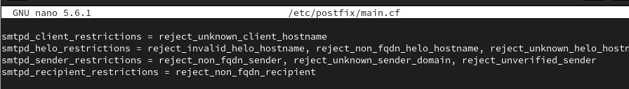

---
## Front matter
title: "Доклад"
subtitle: "на тему Фильтрация спама"
author: "Беличева Дарья Михайловна"

## Generic otions
lang: ru-RU
toc-title: "Содержание"

## Bibliography
bibliography: bib/cite.bib
csl: pandoc/csl/gost-r-7-0-5-2008-numeric.csl

## Pdf output format
toc: true # Table of contents
toc-depth: 2
lof: true # List of figures
lot: false # List of tables
fontsize: 12pt
linestretch: 1.5
papersize: a4
documentclass: scrreprt
## I18n polyglossia
polyglossia-lang:
  name: russian
  options:
	- spelling=modern
	- babelshorthands=true
polyglossia-otherlangs:
  name: english
## I18n babel
babel-lang: russian
babel-otherlangs: english
## Fonts
mainfont: PT Serif
romanfont: PT Serif
sansfont: PT Sans
monofont: PT Mono
mainfontoptions: Ligatures=TeX
romanfontoptions: Ligatures=TeX
sansfontoptions: Ligatures=TeX,Scale=MatchLowercase
monofontoptions: Scale=MatchLowercase,Scale=0.9
## Biblatex
biblatex: true
biblio-style: "gost-numeric"
biblatexoptions:
  - parentracker=true
  - backend=biber
  - hyperref=auto
  - language=auto
  - autolang=other*
  - citestyle=gost-numeric
## Pandoc-crossref LaTeX customization
figureTitle: "Рис."
tableTitle: "Таблица"
listingTitle: "Листинг"
lofTitle: "Список иллюстраций"
lotTitle: "Список таблиц"
lolTitle: "Листинги"
## Misc options
indent: true
header-includes:
  - \usepackage{indentfirst}
  - \usepackage{float} # keep figures where there are in the text
  - \floatplacement{figure}{H} # keep figures where there are in the text
---

# Введение

Цель данного доклада - рассмотреть эффективные методы фильтрации спама на уровне SMTP протокола.

В соответсвии с целью в работе поставлены следующие задачи:

- Изучить основы SMTP протокола и его ключевые этапы передачи почты.

- Рассмотреть основные технологии фильтрации спама на уровне SMTP,таких как SPF, Greylisting И SpamAssassin.

- Предоставить практическую реализации фильтрации. 


# Основы SMTP протокола

SMTP (Simple Mail Transfer Protocol) — это широко используемый сетевой протокол, предназначенный для передачи электронной почты в сетях TCP/IP.

Протокол SMTP обеспечивает транспортировку объектов электронной почты. Каждый объект состоит из конверта (envelope) и содержимого [@smtp:bash].
Конверт SMTP передается как серия протокольных элементов SMTP. Конверт содержит адрес
отправителя (по которому должны возвращаться отчеты об ошибках) и один или более адресов получателей, а также дополнительную информацию для расширений протокола. В силу исторических причин возможно использование вариаций задания адреса возврата (адреса отправителя) в команде MAIL для указания альтернативных режимов
доставки.

SMTP — требующий соединения текстовый протокол, по которому отправитель сообщения связывается с получателем посредством выдачи командных строк и получения необходимых данных через надёжный канал, в роли которого обычно выступает TCP-соединение (Transmission Control Protocol — протокол управления передачей). SMTP-сессия состоит из команд, посылаемых SMTP-клиентом, и соответствующих ответов SMTP-сервера. Когда сессия открыта, сервер и клиент обмениваются её параметрами. Сессия может включать ноль и более SMTP-операций (транзакций).

SMTP-операция состоит из трёх последовательностей команда/ответ. Описание последовательностей:

MAIL FROM — устанавливает обратный адрес. Это адрес для возвращённых писем.

RCPT TO — устанавливает получателя данного сообщения. Эта команда может быть дана несколько раз, по одной на каждого получателя. Эти адреса также являются частью оболочки.

DATA — для отправки текста сообщения. Это само содержимое письма, в противоположность его оболочке. Он состоит из заголовка сообщения и тела сообщения, разделённых пустой строкой. DATA, по сути, является группой команд, а сервер отвечает дважды: первый раз на саму команду DATA, для уведомления о готовности принять текст; и второй раз после конца последовательности данных, чтобы принять или отклонить всё письмо.

# Технологии фильтрации спама на уровне SMTP

Сейчас повсеместно распространен широкополосный доступ, поэтому применение rDNS-запросов в начале SMTP-сессии дают весьма положительные результаты. Так, до 85% входящих SMTP-соединений блокируются при реверсном (обратном) DNS-запросе по их IP-адресу [@antispam:bash]:

- если IP-адрес отправитель не имеет reverse DNS-записи в своём блоке IP-адресов: легитимные почтовые серверы обязаны иметь такую запись;

- обратная запись DNS содержит неправильные имена. Например, имя localhost или domain.local не могут быть использованы в интернете и, следовательно, такой отправитель с крайне высокой степенью вероятности является спамером;

- обратная запись DNS содержит данные, позволяющие предполагать, что отправитель является частным абонентом провайдера. Например, присутствие словосочетаний типа broadband-17-26.provider.com, 192.168.pppoe.telecom.net и 17-public-234.172.telco.net говорит о том, что подключение производится не с почтового хостинга или выделенного почтового сервера, а с домашнего компьютера частного пользователя. Общая практика заключается в том, что пользователи не поддерживают почтовые SMTP-серверы на своих компьютерах и передают почту для отправки на почтовые серверы своим провайдерам. Поэтому попытка отправить почту с пользовательского компьютера напрямую на почтовый сервер получателя явно свидетельствует о заражении вирусом, включившим данный компьютер в бот-сеть, используемую для рассылки спама;

- несовпадение DNS-имён в прямой (имя-в-IP-адрес) и обратной (IP-адрес-в-имя) зонах: здесь необходимо быть аккуратным - в некоторых случаях вполне легитимные корпоративные почтовые серверы могут иметь такое несоответствие по различным причинам или из-за неправильной настройки администраторами.

## Использование технологии Sender Policy Framework 

SPF - это стандарт безопасности, который разработан для проверки подлинности отправителя электронной почты. Он использует DNS-записи, чтобы указать, какие серверы имеют право отправлять сообщения от имени конкретного домена.

Настройка DNS-записей SPF:

Владельцы доменов определяют SPF записи в своих DNS настройках, указывая список IP-адресов или доменов, которые имеют право отправлять почту от их имени.

Проверка SPF на стороне получателя:

SPF позволяет владельцу домена в Интернете указывать, каким компьютерам разрешено отправлять почту с адресов в конверте в этом домене, используя записи системы доменных имен (DNS). Получатели, проверяющие информацию SPF в текстовых записях, могут отклонять сообщения из неавторизованных источников до получения основного текста сообщения. Таким образом, принципы работы аналогичны принципам работы списков черных дыр на основе DNS (DNSBL), за исключением того, что SPF использует схему делегирования полномочий Системы доменных имен.

Решение на основе проверки SPF:

Если IP-адрес отправителя соответствует разрешенным адресам в SPF записи, сообщение считается подлинным. В противном случае, оно может быть помечено как подозрительное или отклонено.

Преимущества использования SPF в фильтрации спама:

- Отсев поддельных отправителей:

- SPF позволяет серверу получателя проверить, подлинный ли IP-адрес отправителя. Это снижает вероятность получения писем от поддельных источников.

- SPF помогает предотвращать атаки фишинга, где злоумышленники могут подделывать отправителей для мошеннических целей.

SPF следует использовать совместно с другими технологиями, для более надежной фильтрации спама. Комплексный подход к безопасности почты с использованием этих технологий повышает эффективность защиты от нежелательной почты и повышает безопасность электронной коммуникации.

## Greylisting и его применение

Greylisting — методика отброса спама, основанная на том, что спам-программы хотят разослать как можно больше спама здесь и в данную секунду.

Серый список был разработан с самого начала, чтобы соответствовать определенным критериям [@greylisting:bash]:

- Оказать минимальное влияние на пользователей

- Ограничить возможности спамеров обходить блокировку

- Требовать минимального обслуживания как на уровне пользователя, так и на уровне администратора

Метод серого списка очень прост. Он просматривает только три фрагмента информации о любой конкретной попытке доставки почты.:

- IP-адрес хоста, пытающегося выполнить доставку

- Адрес отправителя конверта

- Адрес получателя конверта

Из этого у нас теперь есть уникальный триплет для идентификации почтовой "связи". С этими данными мы просто следуем базовому правилу:

При каждой первой попытке соединения с незнакомого хоста наш сервер будет отправлять сообщение о временной ошибке, а пропускать письмо только со второго раза. 

Поскольку SMTP считается ненадежным средством передачи данных, возможность временных сбоев заложена в спецификацию ядра (см. RFC 821). Таким образом, любой хорошо работающий агент передачи сообщений (MTA) должен предпринимать повторные попытки, если ему присвоен соответствующий код временного сбоя для попытки доставки.

Минусом применения является небольшая (обычно не более получаса) задержка в доставке писем при первом соединении от неизвестного хоста. То есть если ещё не известный нашему постфиксу сервер хочет передать письмо, то при первой попытке соединения ему отправляется ошибка о временной недоступности. Если сервер повторил попытку соединения — то письмо принимается, а сервер заносится в надёжные узлы и в дальнейшем письма от него принимаются без задержек.

## SpamAssassin

SpamAssassin — программное обеспечение для фильтрации спама, основанное на взаимодействии ключевых компонентов — оценочного сервиса, транспортного агента и базы шаблонов писем.

SpamAssassin использует байесовскую фильтрацию, обработку DNSBL, Sender Policy Framework, DomainKeys, DKIM, Razor и другие методы распознавания спама.

SpamAssassin написан на языке Perl (модуль Mail::SpamAssassin в CPAN). Обычно он используется для фильтрации входящей почты одному или нескольким пользователям. Он может быть запущен как отдельное приложение, как часть другой программы, либо как клиент (spamc), который взаимодействует с демоном (spamd). Последний способ имеет более высокое быстродействие, но в некоторых условиях может создать угрозу для безопасности.

SpamAssassin поставляется с большим набором правил, которые определяют, какие письма являются спамом, а какие нет. Большинство правил основано на регулярных выражениях, которые сопоставляются телу или заголовку сообщения, но SpamAssassin также использует и другие методики. В документации SpamAssassin эти правила называются «tests».

Каждый тест имеет некоторую «стоимость». Если сообщение успешно проходит тест, эта «стоимость» добавляется к общему баллу. Стоимость может быть положительной или отрицательной, положительные значения называются «spam», отрицательные «ham». Сообщение проходит через все тесты, подсчитывается общий балл. Чем выше балл, тем больше вероятность, что сообщение является спамом.

У SpamAssassin есть настраиваемый порог, при превышении которого письмо будет классифицировано как спам. Обычно порог таков, что письмо должно подойти по нескольким критериям; срабатывания только одного теста недостаточно для превышения порога.

# Практическая реализация фильтрации

- Для каждой A записи должна существовать зеркальная PTR запись, то есть по имени хоста через DNS получаем IP, а по IP — обратно то же имя хоста.

- В качестве адреса в MX записи всегда должно стоять имя хоста, для которого существует A запись. То есть нельзя, чтобы в MX записи стоял IP или псевдоним (CNAME).

Если одно из этих требований не соблюдается — почта с вашего домена будет может распознаваться как спам. Обусловлено это тем, что благонадёжный отправитель выполняет настройку соблюдая правила, соответственно если правила не соблюдены — то отправителю доверять не следует, а значит и принимать от него почту — тоже.

Чтобы включить проверку PTR у себя, используйте опцию

`reject_unknown_client_hostname`

Эта опция отклоняет запрос, когда 

1) происходит сбой сопоставления IP-адреса клиента с именем, или 

2) происходит сбой сопоставления имени с адресом, или 

3) сопоставление имени с адресом не совпадает с IP-адресом клиента.

Перейдем к проверке приветствия.

Итак, кто-то захотел передать вашему серверу письмо. Передача начинается с приветствия — заголовка HELO. В HELO должно быть указано полное доменное имя (FQDN) отправителя, соответственно если это не так — можете смело сразу же отказывать в принятии. В Postfix для этого служат две опции:

```
reject_invalid_helo_hostname
reject_non_fqdn_helo_hostname
```

Первая запрещает приём писем от хостов, передающих приветствие с некорректным синтаксисом, вторая — от хостов, передающих не FQDN в HELO запросе.

Однако передать FQDN не составляет труда (например, представиться gmail.com). Поэтому надо ещё немного присмотреться к HELO. Для этого служат опция:

`reject_unknown_helo_hostname`

Она запрещает приём писем от серверов, представляющихся адресом, для которого не существует A или MX записи.

Итак, сервер успешно представился, далее идёт адрес отправителя. Из него тоже можно извлечь полезную информации.

Если в адресе отправителя указан домен, который вовсе не существует, то письмо принимать не стоит. Также не стоит принимать письмо, в котором в качестве обратного адреса указано то, что вообще адресом не является. За отказ в принятии для таких писем отвечают две опции:

```
reject_non_fqdn_sender
reject_unknown_sender_domain
```

Первая — отклоняет запрос, когда в адресе MAIL FROM указан домен, который не указан в полной форме домена, как того требует RFC, вторая — отклоняет запрос, если Postfix не является конечным пунктом назначения для адреса отправителя, а почта из домена имеет 

1) запись no DNS MX и no DNS A или 

2) искаженную запись MX, такую как запись с именем хоста MX нулевой длины.

Еще можно запросить сервер, обслуживающий указанный адрес отправителя, на предмет существования на нём пользователя с этим адресом.

Наш сервер открывает встречную SMTP сессию, пытаясь послать письмо по адресу отправителя. Если удаётся успешно пройти этап посылки RCPT TO с этим адресом, то есть если принимающий сервер не заявляет, что указанного ящика на нём нет, то считается, что присланный нам обратный адрес существует. Данные (письмо) при проверке не передаются, сессия прерывается после RCPT TO.

За такую проверку обратного адреса отвечает опция:

`reject_unverified_sender`

Опция отклоняет запрос, когда известно, что почта, отправленная на адрес MAIL FROM, перескакивает, или когда адрес назначения отправителя недоступен

{#fig:001 width=70%}

# Выводы

В докладе были рассмотрены методы фильтрации спама на уровне SMTP протокола.

# Список литературы{.unnumbered}

::: {#refs}
:::
